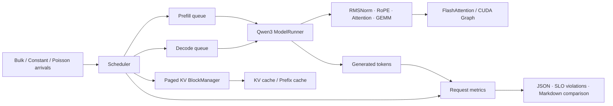

<p align="center">

</p>

# learn-nano-vllm: SLO-aware inference lab

这是一个基于
[GeeeekExplorer/nano-vllm](https://github.com/GeeeekExplorer/nano-vllm)
构建的单卡 LLM 推理实验项目。它保留了小型、可读的推理引擎主体，并围绕
在线请求调度、流式尾延迟、prefix cache 和 Triton kernel 建立了一条
可复现的 RTX 5090 实验链。

项目目标不是堆叠功能，而是回答三个可以被数据验证的问题：

1. 长 prefill 如何导致正在生成的请求发生 decode starvation？
2. 调度器如何在 TTFT、流式平滑度和吞吐之间做明确的 SLO 权衡？
3. 一个更快的 GPU kernel，最终能在端到端 TPOT 中贡献多少？

v3 实验分支进一步加入统一 mixed-batch 调度、16/32/64-token Triton
PagedAttention，以及以 greedy 无损为目标的 n-gram / Qwen3 draft 推测解码
MVP（固定 100 请求 token 全等尚未验收）。实现与
5090 验收命令见 [`docs/v3-design-zh.md`](docs/v3-design-zh.md)。截至当前，
PagedAttention general correctness 已验证；page32 首轮配对 A/B 达到 Flash
eager 吞吐的 84.1%，后续 general 重跑若复用旧 Flash 基线则约为 83.0%，并非
第二次配对 A/B。split-K 在 batch8、context 2048/4096
的 micro 更快，但 eager E2E 回退，CUDA Graph 路径仍待服务器 smoke。完整
问题、实现和证据口径见
[`docs/project-history-and-incident-audit-zh.md`](docs/project-history-and-incident-audit-zh.md)。

## 核心结果

| 实验 | Baseline | 改造后 | 结论 |
|---|---:|---:|---|
| 8B held-out Max ITL P95 | 259.21ms | 68.23ms | 降低 73.7% |
| 8B 请求发生 Max ITL > 75ms | 93.8% | 0.6% | 约 300/320 降至 2/320 |
| 8B output tok/s | 255.56 | 255.16 | 下降 0.16% |
| 8B E2E P95 | 2180.29ms | 2353.69ms | 为流式平滑度付出 8.0% |
| 8B prefix-cache TTFT P95 | 211.59ms | 95.14ms | 50% cache hit 下缩短 55.0% |
| KV-store microbenchmark | PyTorch | Triton 1.73--2.90x | 端到端 TPOT 改善 1.52% |
| RMSNorm microbenchmark | eager | Triton 3.2--8.7x | 未稳定胜过原有 torch.compile |

最终选择不是“所有指标都更低”，而是在固定验收阈值下：

- TTFT 违反率保持 0%；
- Max ITL 违反率从 93.8% 降至 0.6%；
- 吞吐基本不变；
- 明确记录 E2E P95 增加的代价。

完整数据、负实验和限制见
[`docs/slo-v2-results-zh.md`](docs/slo-v2-results-zh.md)。

## 系统结构



一次请求的指标生命周期覆盖 arrival、queue、prefill chunks、first token、
decode steps 和 finish。调度器使用同一套运行时指标估算 prefill 与 decode
成本，而 benchmark 使用请求级时间戳计算 TTFT、TPOT、Max ITL 和违反率。

## 主要改造

### SLO-aware scheduler v2

原始 `prefill_first` 保留为 baseline，失败的 `slo_aware` v1 也保留为
ablation。v2 的核心机制包括：

- 使用 TTFT/TPOT deadline 的归一化 slack 选择 prefill 或 decode；
- waiting 请求采用 least-laxity-first；
- 根据 decode slack 动态决定 prefill chunk，而不是固定切成小块；
- 使用运行时 EWMA 估计 prefill token cost 和 decode step cost；
- decode 请求 round-robin，避免单个请求长期占用执行机会。

入口代码：

- [`nanovllm/engine/scheduler.py`](nanovllm/engine/scheduler.py)
- [`nanovllm/engine/metrics.py`](nanovllm/engine/metrics.py)
- [`nanovllm/config.py`](nanovllm/config.py)

### 可复现的在线 benchmark

[`benchmarks/benchmark_slo.py`](benchmarks/benchmark_slo.py) 支持：

- bulk、constant-rate 和 seeded Poisson arrivals；
- 固定长度、重复次数、随机种子与 shared prefix；
- TTFT、TPOT、ITL、Max ITL、queue、chunks、吞吐和显存；
- 独立的配置 SLO 与固定验收阈值；
- KV-store 和 RMSNorm 后端 A/B。
- mixed-length 输入、逐步阶段耗时、KV 尾块浪费和推测接受率；
- schema、Git commit、依赖版本、模型摘要和输出 token IDs；temperature=0 时可
  作为 greedy 金标候选。

[`benchmarks/compare_results.py`](benchmarks/compare_results.py) 将多个 JSON
结果整理成可直接放进报告的 Markdown 表格。

### Kernel 路线

KV-cache 写入实验形成了完整的 micro-to-macro 证据：

1. 逐元素正确性检查；
2. 支持 `D` 不是 2 的幂的 masked Triton block；
3. PyTorch 与 Triton 微基准；
4. 按 36 层预测每个 decode step 的节省；
5. 端到端 A/B 验证预测。

RMSNorm/Add+RMSNorm 则是一项有意保留的负实验：Triton 在大 prefill
形状上最高比 `torch.compile` 快约 1.5 倍，但 decode 关键形状胜负混合，
端到端 TPOT 反而变化 +0.35%。因此默认实现继续使用 `torch.compile`，
Triton 只作为实验后端。

入口代码：

- [`nanovllm/layers/attention.py`](nanovllm/layers/attention.py)
- [`nanovllm/layers/layernorm.py`](nanovllm/layers/layernorm.py)
- [`benchmarks/kernels/`](benchmarks/kernels/)

## 环境与验证

已验证的主要环境：

```text
GPU             NVIDIA GeForce RTX 5090 32GB
PyTorch         2.8.0+cu128
Triton          3.4.0
FlashAttention  2.8.3
Model           Qwen3-0.6B / Qwen3-8B
```

克隆实验分支：

```bash
git clone https://github.com/YukiSama0714/learn-nano-vllm.git
cd learn-nano-vllm
git switch codex/slo-aware-scheduler
```

Hugging Face 网络受限时可优先指定镜像：

```bash
export HF_ENDPOINT=https://hf-mirror.com
.venv/bin/hf download Qwen/Qwen3-8B \\
  --local-dir /YOUR/MODEL/PATH \\
  --max-workers 2
```

运行完整测试：

```bash
.venv/bin/python -m unittest discover -s tests -v
```

复现实验前先阅读：

- [`docs/rtx5090-experiments.md`](docs/rtx5090-experiments.md)
- [`docs/learning-guide-zh.md`](docs/learning-guide-zh.md)
- [`docs/slo-v2-results-zh.md`](docs/slo-v2-results-zh.md)
- [`docs/interview-guide-zh.md`](docs/interview-guide-zh.md)
- [`docs/project-baseline-to-v3-zh.md`](docs/project-baseline-to-v3-zh.md)
- [`docs/project-history-and-incident-audit-zh.md`](docs/project-history-and-incident-audit-zh.md)
- [`docs/v3-design-zh.md`](docs/v3-design-zh.md)
- [`docs/course/00-syllabus.md`](docs/course/00-syllabus.md)

## Quick start

```python
from nanovllm import LLM, SamplingParams

llm = LLM(
    "/YOUR/MODEL/PATH",
    scheduling_policy="slo_aware_v2",
    prefill_chunk_size=1024,
    ttft_slo_ms=500,
    tpot_slo_ms=75,
    max_num_seqs=8,
)
outputs = llm.generate(
    ["Explain why a long prefill can stall decode."],
    SamplingParams(temperature=0.6, max_tokens=128),
)
print(outputs[0]["text"])
print(outputs[0]["metrics"])
```

原始 `prefill_first` 仍是默认策略；实验策略必须显式开启。RMSNorm 默认
后端也仍是原有的 `compiled`。

## 诚实边界

- 只验证了单张 RTX 5090 和 Qwen3 模型族；
- benchmark 不包含 HTTP、tokenization 和真实生产流量；
- Poisson offered load 下的 tok/s 不等于峰值离线吞吐；
- mixed-length、长上下文和多卡通信尚未形成同等强度的证据；
- Triton microbenchmark 的倍数不能直接当作端到端加速。

## Upstream

本项目基于
[GeeeekExplorer/nano-vllm](https://github.com/GeeeekExplorer/nano-vllm)
进行学习与实验。上游项目提供了精简的 vLLM-style 推理主体、Paged KV
cache、prefix caching、Tensor Parallelism、CUDA Graph 和
FlashAttention 集成；本 fork 的重点是可观测的在线调度与 RTX 5090
实验方法。
