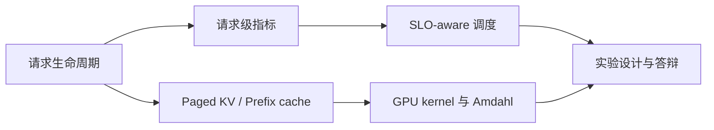

# 从源码到独立答辩：learn-nano-vllm

## Design basis

- **真实任务**：在没有提示答案的面试或代码评审中，独立追踪一次请求，
  解释调度选择，判断 kernel 优化是否值得，并设计能证伪自己的实验。
- **起点假设**：你能运行 Python、单元测试和 benchmark，知道 Transformer
  与 KV cache 的基本名词，但还不能脱离讲稿解释推理系统。
- **目标表现**：面对一个未见过的 arrival pattern、prompt 长度分布和 SLO，
  能画生命周期、选择指标、预测瓶颈、提出 A/B 与停止条件；关键数字和代码
  路径无明显错误。
- **知识形式**：请求生命周期、调度判断、缓存/算子机制和实验推理的组合技能。
- **事实边界**：课程只使用本仓库代码及已记录的 RTX 5090 实验；混合长度和
  多卡结论属于待验证假设。
- **约束**：目标是面试迁移，不要求先掌握完整 CUDA 编程或 vLLM 上游源码。
- **最终证明**：完成模块 4 的 changed-surface 设计题，并进行一次 15 分钟
  无稿讲解。

## 先做低风险诊断

在看答案前，用 10 分钟写下：

1. TTFT、TPOT 和 Max ITL 分别覆盖请求时间线的哪一段？
2. 一个 running decode 和一个 waiting prefill 同时存在时，你会比较什么？
3. 为什么 kernel 快 2 倍不等于请求快 2 倍？
4. 什么结果会让你停止采用一项优化？

不会答不影响学习；答案用于决定在哪个模块多停留。
完成后查看 [诊断参考](answers/00-prerequisites.md)，只补最低分对应的前置知识。

## 依赖关系

只有箭头表示前置依赖。调度与 kernel 可以在掌握生命周期后分别学习，最终在
实验推理中组合。

## 四个模块

1. [请求生命周期与指标](modules/01-lifecycle/01-lesson.md)
2. [SLO-aware 调度决策](modules/02-scheduler/01-lesson.md)
3. [KV cache、prefix cache 与 kernel](modules/03-kernels/01-lesson.md)
4. [证据链、边界与迁移答辩](modules/04-evidence/01-lesson.md)

每个模块先独立作答，再查看对应 answer 文件。不要边看答案边写。

## 通过标准

- 生命周期：能从 arrival 追到 finish，并正确区分平均指标与单次 tail。
- 调度：能计算 normalized slack，说明 activation cue 与失效条件。
- 缓存/kernel：能把逻辑 block、物理 slot、微基准和端到端比例连起来。
- 证据：能为新 workload 写出 hypothesis、controls、metrics、held-out 和
  stop/switch condition。

最终证明要求达到四项中的三项“独立完成”，且不能漏掉停止条件。若只会复述
本项目数字，不算通过。
