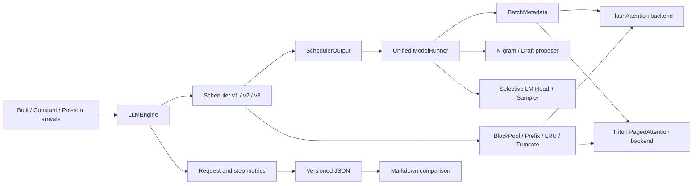

# 从 nano-vLLM baseline 到推理系统实验平台：项目改造复习手册

> 本文用于源码复习、项目答辩和求职面试。它描述的是当前
> `codex/slo-aware-scheduler` 分支相对 `origin/main` 的真实改造状态。
> 文中的“已实现”不自动等于“性能已达标”；每项能力都会分别标注实现、
> 正确性和端到端验证状态。

## 0. 项目结论先行

这个项目不是“重新实现一个完整 vLLM”，而是基于可读性较高的 nano-vLLM，
围绕在线推理的三个核心问题建立实验闭环：

1. 调度器如何在 TTFT、流式卡顿和吞吐之间做明确权衡；
2. KV cache 的分页、prefix reuse、回滚和 attention backend 如何协同；
3. 一个局部更快的 kernel，是否真的能改善端到端请求指标。

相对 `origin/main`，当前分支改动约为：

```text
60 files changed
7751 insertions
349 deletions
```

最成熟的产出是 `slo_aware_v2`：在 Qwen3-8B、RTX 5090 的 held-out
320 请求实验中，将 Max ITL P95 从 259.21ms 降到 68.23ms，吞吐仅下降
0.16%。v3 的 mixed batch、细粒度 Triton PagedAttention 和 greedy
speculative decoding 已完成主要实现与正确性测试，但当前最佳的 page32
PagedAttention 端到端吞吐只有 FlashAttention 的 84.1%，仍属于待优化能力。

### 0.1 当前能力状态

| 能力 | 已实现 | 正确性验证 | 端到端结论 |
|---|---|---|---|
| 请求级 TTFT/TPOT/ITL/queue 指标 | 是 | 单元测试 + JSON 检查 | 已用于全部实验 |
| `slo_aware` v1 | 是 | 是 | 负实验，全面弱于 baseline |
| `slo_aware_v2` | 是 | 是 | held-out 达标，当前最强证据 |
| `slo_aware_v3` mixed batch | 是 | 单元测试、attention reference | 性能仍需继续调优 |
| 多请求 partial chunked prefill | 是 | 调度与 mixed batch 测试 | v3 中生效 |
| O(1) BlockPool、LRU、truncate | 是 | 单元测试 | 细 page E2E 仍在验收 |
| Triton KV-store | 是 | micro + E2E A/B | TPOT 改善约 1.52% |
| Triton RMSNorm | 是 | micro + E2E A/B | 未优于 compiled，默认关闭 |
| Triton PagedAttention 16/32/64 | 是 | GPU matrix 通过 | page32 只有 Flash 的 84.1% |
| split-K PagedAttention decode | 是，实验性 | correctness + hot micro + E2E | E2E 吞吐下降 8.4%，默认关闭 |
| n-gram speculative decoding | 是 | 接受/拒绝/回滚测试 | 完整 5090 A/B 待完成 |
| Qwen3-0.6B draft decoding | 是 | 单元测试与显存规划路径 | TP=1 MVP，性能待验收 |

## 1. Baseline 已经有什么

上游 nano-vLLM 并不是一个从零开始的玩具。它已经提供：

- Qwen3 模型加载与推理；
- prefill/decode 两阶段执行；
- paged KV cache 和 block table；
- 基于完整 block hash 的 prefix cache；
- chunked prefill；
- FlashAttention prefill 与 paged decode；
- decode CUDA Graph；
- Tensor Parallel 和多进程通信；
- temperature sampling。

因此，本项目不能把这些上游能力写成自己的新增功能。我们的改造重点是：
**调度决策、请求可观测性、mixed batch、细粒度 page、自研 kernel、推测解码
以及可复现实验方法。**

### 1.1 Baseline 请求生命周期

```text
prompt
  -> Sequence(WAITING)
  -> Scheduler 选择 prefill
  -> 写入 paged KV cache
  -> prompt 完成后生成首 token，转入 RUNNING
  -> Scheduler 反复选择 decode
  -> EOS / max_tokens
  -> 释放 KV blocks，FINISHED
```

baseline 的 `Scheduler.schedule()` 返回：

```python
tuple[list[Sequence], bool]
```

其中全局 `bool` 表示整个 step 是 prefill 还是 decode。这个接口隐含了一个
重要限制：**同一个 model forward 不能同时包含 prefill 和 decode 请求。**

### 1.2 Baseline 调度策略

baseline 每个 step 先扫描 waiting queue。只要能调度至少一个 prefill，就立即
返回 prefill batch；只有本轮没有 prefill 时才执行 decode。

这带来两个效果：

- 优点：新请求容易较快进入 prefill，TTFT 通常较低；
- 缺点：持续到达的长 prompt 可以反复阻塞 running decode，制造流式卡顿。

baseline 已支持 chunked prefill，但只有 batch 中第一个请求可以 partial
prefill：

```python
if remaining < num_tokens and scheduled_seqs:
    break
```

因此“已有 chunked prefill”与“可以把多个 partial prefill 和 decode 统一装入
一个 token budget”是两种不同能力。

### 1.3 Baseline KV 管理

baseline `BlockManager` 已经具备：

- logical block 到 physical block 的映射；
- block refcount；
- chained prefix hash；
- 空闲 block 队列；
- 请求结束后的 block 释放。

但它有几个不适合 v3 的限制：

- `hash -> block_id` 只能保存一个物理 block；
- cached block 重新激活需要 `deque.remove()`，不是稳定 O(1)；
- 没有为 speculative lookahead 提供统一 reservation；
- 没有拒绝后释放多余完整 block 的 `truncate()`；
- 缺少 allocated/reserved/computed/tail waste 的分层统计。

## 2. 改造后的整体架构



核心变化是把“一个 step 的全局 phase”改成“每个请求独立描述本 step 的工作”。
调度器、batch preparation、attention、sampling 和 postprocess 都围绕这一点
重构。

## 3. 第一层改造：请求可观测性

代码入口：

- [`nanovllm/engine/metrics.py`](../nanovllm/engine/metrics.py)
- [`nanovllm/engine/llm_engine.py`](../nanovllm/engine/llm_engine.py)
- [`benchmarks/benchmark_slo.py`](../benchmarks/benchmark_slo.py)

### 3.1 为什么先做指标

如果只有总吞吐，就无法回答：

- 请求慢在 queue、prefill 还是 decode？
- 平均 TPOT 很低时，用户是否仍经历了一次 300ms 卡顿？
- chunk 变小以后，TTFT 是改善还是因额外 launch 变差？
- prefix cache 命中以后，实际减少了多少 prefill work？

所以本项目先给每个 `Sequence` 绑定 `RequestMetrics`，再修改策略和 kernel。

### 3.2 请求时间线与指标定义

```text
arrival
  |<----------- TTFT ----------->| first token
  |<---------------- E2E --------------------->| finish
       queue + one/more prefill       decode
                                    |<- ITL ->|
```

主要指标：

- **TTFT**：`first_token_time - arrival_time`；
- **TPOT**：首 token 后到完成之间的平均 token 间隔；
- **ITL**：相邻输出 token 的真实时间间隔；
- **Max ITL**：一个请求中最差的一次 ITL；
- **queue time**：请求多次进入 waiting 状态的累计时长；
- **prefill/decode time**：请求经历的对应 model step 时间；
- **prefill chunks**：prompt 被调度了几次；
- **preemptions**：KV 被释放并重新排队的次数。

这里的 `prefill_ms` 和 `decode_ms` 是“该请求经历了多少 step wall time”，不是
把 GPU 时间按 batch 中请求数做独占分摊。这个定义更适合解释用户延迟。

### 3.3 step 级拆分

`LLMEngine.step()` 将一个 step 拆为：

```text
scheduler_ms
input_prep_ms
model_ms
sampling_ms
```

同时记录：

- prefill/decode token 数；
- 是否 mixed step；
- KV allocated/reserved/computed/uncomputed/tail waste；
- proposed/accepted speculative tokens。

这个拆分在 PagedAttention 诊断中非常关键：page16 的纯 prefill 和 mixed
`model_ms` 几乎等于 Flash，真正落后的部分是 decode step 和随后形成的排队
反馈，而不是“TTFT 很大，所以 prefill kernel 一定很慢”。

## 4. 第二层改造：SLO-aware 调度器

代码入口：[`nanovllm/engine/scheduler.py`](../nanovllm/engine/scheduler.py)

### 4.1 v1：固定交错的负实验

`slo_aware` v1 的思路是：

- prefill 和 decode 交错；
- decode 连续执行达到上限后允许 prefill；
- TTFT 等待过久时强制 prefill；
- 有 running decode 时，把 prefill 限制成较小 chunk。

它的问题是把“公平”近似成“固定小 chunk”。在 0.6B bulk 实验中：

| 指标 | prefill_first | v1 |
|---|---:|---:|
| TTFT P95 | 602.08ms | 1101.29ms |
| Queue P95 | 582.85ms | 1081.60ms |
| Chunks P95 | 1 | 4 |
| E2E P95 | 2061.78ms | 2351.17ms |
| Output tok/s | 2064.04 | 1765.36 |

结论：chunked prefill 是一种机制，不是自动优化。chunk 太小会增加 model
forward、kernel launch 和调度轮次，还会推迟后续 waiting 请求完成 prompt。

### 4.2 v2：deadline slack + 在线成本估计

v2 仍然保持 phase-exclusive batch，但不再固定交错，而是比较两类请求的
normalized slack。

waiting 请求：

```text
predicted_prefill = remaining_prompt_tokens * prefill_seconds_per_token
slack = arrival + TTFT_target - now - predicted_prefill
normalized_slack = slack / TTFT_target
```

running 请求：

```text
slack = last_token + TPOT_target - now - predicted_decode_step
normalized_slack = slack / TPOT_target
```

选择 normalized slack 更小的一侧。归一化的意义是：TTFT 和 TPOT 的预算
尺度不同，不能直接比较绝对毫秒。

waiting queue 内部采用 least-laxity-first。长 prompt 即使和短 prompt 同时
到达，也可能因为剩余工作更多而更早开始；这不是 shortest-job-first。

成本使用 EWMA 在线更新：

```text
estimate = alpha * latest_sample + (1 - alpha) * old_estimate
```

动态 chunk 大致为：

```text
safe_tokens = positive_decode_slack / prefill_seconds_per_token
```

然后受最大 chunk、token budget 和对齐约束限制。

### 4.3 v2 held-out 结果

Qwen3-8B、Poisson 2 req/s、新 seed 4242、64 请求 × 5 次：

| 指标 | prefill_first | v2 / 75ms |
|---|---:|---:|
| TTFT P95 | 156.27ms | 213.56ms |
| TTFT > 500ms | 0.0% | 0.0% |
| Max ITL P95 | 259.21ms | 68.23ms |
| 请求发生 Max ITL > 75ms | 93.8% | 0.6% |
| E2E P95 | 2180.29ms | 2353.69ms |
| Output tok/s | 255.56 | 255.16 |

正确的项目结论不是“v2 所有指标都更好”，而是：

- 保持 TTFT SLO 和吞吐；
- 显著降低流式尾部卡顿；
- 代价是 TTFT P95 上升约 57ms、E2E P95 上升 8%。

### 4.4 v3：统一 token 调度

v2 的上限是一个 step 仍只能二选一：prefill 或 decode。v3 新增两个内部
数据结构：

```python
@dataclass
class ScheduledRequest:
    sequence: Sequence
    num_scheduled_tokens: int
    is_prefill: bool
    needs_sampling: bool

@dataclass
class SchedulerOutput:
    scheduled_requests: list[ScheduledRequest]
```

关键点：`is_prefill` 和 `needs_sampling` 属于每个请求，而不是整个 batch。
旧策略通过 `SchedulerOutput.from_phase()` 进入兼容路径，原 CLI 和默认行为
保持不变。

v3 每步的决策顺序是：

1. 为 running 请求计算 TPOT slack；
2. 优先为可容纳的 running 请求各分配一个 decode token；
3. 将剩余 sequence slots 和 token budget 分给 waiting/partial prefill；
4. waiting 请求仍按 normalized TTFT slack 排序；
5. 多个请求可以在同一步进行 partial prefill；
6. KV 不足时抢占 normalized decode slack 最大、即最不紧急的请求。

### 4.5 mixed step 成本预测

纯 prefill 的 `seconds/token` 不能准确描述“512 prefill tokens + 8 decode
requests”的成本。v3 为 mixed step 建立二维 power-of-two bucket：

```text
key = (
    next_power_of_two(prefill_tokens),
    next_power_of_two(decode_requests),
)
```

已观测 bucket 使用 EWMA 实测值；未观测 bucket 回退为：

```text
prefill_tokens * prefill_seconds_per_token + decode_step_seconds
```

这是一个低成本在线模型，不是离线训练的性能预测器。它的优势是简单、可解释；
限制是没有把 context length、head shape 等维度纳入特征。

### 4.6 prefill granularity 与 KV page 解耦

早期实现错误地使用 `kvcache_block_size` 作为 v3 prefill chunk 的最小粒度。
这会导致 Flash block256 与 Triton page16 的 A/B 同时改变两件事：attention
backend 和调度粒度。

现在单独提供：

```text
prefill_chunk_size         最大 chunk，例如 1024
prefill_chunk_granularity  调度对齐，例如 256
kvcache_block_size         KV page，例如 16/32/64/256
```

解耦以后，page16 仍可能出现更多 prefill chunks，因为 SLO 调度器观察到其
decode 更慢后，会主动选择更多个 256-token chunk；这与“重新按 16 token
切块”不是一回事。

## 5. 第三层改造：统一 mixed batch

代码入口：

- [`nanovllm/engine/model_runner.py`](../nanovllm/engine/model_runner.py)
- [`nanovllm/engine/outputs.py`](../nanovllm/engine/outputs.py)
- [`nanovllm/utils/context.py`](../nanovllm/utils/context.py)

### 5.1 BatchMetadata

`BatchMetadata` 统一携带：

| 字段 | 含义 |
|---|---|
| `cu_seqlens_q/k` | varlen query/key 的累计边界 |
| `max_seqlen_q/k` | attention kernel 的最大序列长度 |
| `slot_mapping` | 本 step token 写入物理 KV 的位置 |
| `context_lens` | 每个请求当前可见上下文长度 |
| `block_tables` | logical page 到 physical page 映射 |
| `logits_indices` | 真正需要 LM Head 的 hidden-state 行 |
| `query_to_request` | 每个 query token 属于哪个请求 |
| `query_positions` | 每个 query token 的绝对位置 |

为了兼容旧代码，原来的 `Context` 保留为 `BatchMetadata` 的 alias。

### 5.2 统一 packing

`prepare_batch()` 逐请求计算：

```text
start = num_cached_tokens
query_length = num_scheduled_tokens
end = start + query_length
```

不同请求可同时拥有不同 query length：

- 普通 decode：1；
- chunked prefill：真实 chunk 长度；
- speculative verify：`1 + K`。

所有 token 被压成一个连续 `input_ids/positions`，再用 `cu_seqlens_q` 恢复
请求边界。这就是 mixed varlen forward。

### 5.3 selective logits

partial prefill 只需要更新 KV，不需要对每个 prompt token 计算完整词表 logits。
只有以下位置写入 `logits_indices`：

- 完成 prompt 的 prefill 最后位置；
- 普通 decode 位置；
- speculative proposals 的验证位置和 bonus 位置。

模型先输出 hidden states，`compute_logits(hidden_states, logits_indices)` 再只对
这些行运行 LM Head。这个优化同时减少算力和显存带宽。

### 5.4 CUDA Graph 边界

当前 CUDA Graph 只用于：

```text
FlashAttention + pure decode + no speculative proposals
```

mixed batch、Triton PagedAttention 和 speculative verify 首版走 eager。
不过当前 Flash/page16/page32 A/B 都显式使用了 `--enforce-eager`，所以 CUDA
Graph 不解释这组实验中的差距。它是未来把 Triton backend 接入默认在线路径时
仍需解决的系统问题，不能与本轮 eager kernel 差距混为一谈。

## 6. 第四层改造：BlockPool、prefix cache 与回滚

代码入口：[`nanovllm/engine/block_manager.py`](../nanovllm/engine/block_manager.py)

### 6.1 O(1) intrusive free/LRU queue

每个 `Block` 内嵌：

```text
prev_free
next_free
in_free_queue
```

`FreeBlockQueue` 因此可以 O(1) 完成：

- `append`：放到空闲/LRU 尾部；
- `remove`：cached block 被命中后重新激活；
- `popleft`：分配空闲 block 或淘汰最旧 cached block。

refcount 为 0 的完整 cached block仍保留 hash 和 token IDs，并待在 free queue
中；真正被复用为新内容时才移除旧 hash。

### 6.2 hash collision 与重复物理块

baseline 使用：

```text
hash -> one block_id
```

现在改为：

```text
hash -> set[block_id]
```

查找时除了 hash，还逐一比较完整 `token_ids`。这样既支持同一 prefix 的重复
物理副本，也不会把 hash collision 当作命中。

prefix hash 是链式的：

```text
H_i = hash(H_{i-1}, tokens_of_block_i)
```

因此相同 token block 出现在不同前缀后，不会错误复用。

### 6.3 只 hash committed full blocks

`hash_blocks()` 的上界是：

```python
end = min(committed_tokens, len(seq)) // block_size
```

这保证：

- partial block 不进入 prefix cache；
- 尚未真正计算的 prompt token 不进入 cache；
- speculative rejected token 不污染 prefix hash。

### 6.4 reserve 与 truncate

decode 或 speculative verify 前先调用 `reserve(total_tokens)`，避免 model
forward 运行到一半才发现没有 KV page。

speculative 拒绝后调用：

```python
truncate(seq, len(seq))
```

这里的 `len(seq)` 包含本步真正输出的 accepted token 与 replacement/bonus，
但 `num_cached_tokens` 只推进到已经作为模型输入提交的长度。完全位于 rejected
lookahead 之外、且不再覆盖逻辑输出序列的 page 会被释放；尾 page 中残留的
无效 KV 不必清零，下一步会覆盖它。逻辑长度、computed length 和 block
table，而不是显存中的旧比特，决定可见性。

### 6.5 KV 统计语义

需要区分：

```text
allocated：物理 page 总容量
reserved：逻辑 token 和 lookahead 需要的容量
computed：已经完成 forward 的 token
uncomputed：已预留但还未计算的 token
tail waste：allocated - reserved
```

未计算的 prompt 和 speculative lookahead 是有效 reservation，不是尾块浪费。
早期统计把它们算成 waste，已经修正。

## 7. 第五层改造：AttentionBackend 与 Triton PagedAttention

代码入口：[`nanovllm/layers/attention.py`](../nanovllm/layers/attention.py)

### 7.1 backend 抽象

最小接口为：

```python
class AttentionBackend:
    def forward(attention, query, key, value, metadata): ...
    def store(attention, key, value, metadata): ...
```

当前实现：

- `FlashAttentionBackend`：保留上游 reference 和 CUDA Graph 路径；
- `TritonPagedAttentionBackend`：支持 16/32/64-token page。

FlashAttention 当前要求 block size 是 256 的倍数；Triton backend 在启动时
只接受 `{16, 32, 64}`，非法组合尽早报错。

### 7.2 logical token 到 physical slot

给定逻辑 token 位置 `t`：

```text
logical_block = t // PAGE_SIZE
block_offset  = t % PAGE_SIZE
physical_block = block_table[request, logical_block]
```

K/V 地址由：

```text
physical_block * block_stride
+ block_offset * token_stride
+ kv_head * head_stride
+ dim_offset
```

组成。attention 不要求请求的 KV 在物理显存中连续。

### 7.3 GQA head 映射

Qwen3-8B 有 32 个 query heads 和 8 个 KV heads。每 4 个 Q heads 共享一个
KV head：

```text
group_size = num_query_heads / num_kv_heads
kv_head = query_head // group_size
```

当前 kernel 的 grid 是 `(query_token, query_head)`。实现简单，但同一 GQA
group 的 4 个 program 仍会分别遍历共享 K/V；这正是下一步值得优化的 decode
瓶颈之一。

### 7.4 causal online softmax

每个 query 的可见上下文是：

```text
context_length = query_position + 1
```

kernel 每次处理 `BLOCK_N=32` 个历史 token，使用 FP32 online softmax：

```text
new_max = max(running_max, block_max)
correction = exp(running_max - new_max)
new_sum = running_sum * correction + sum(exp(scores - new_max))
acc = acc * correction + sum(probabilities * value)
```

最后输出：

```text
acc / running_sum
```

输入输出为 BF16，score、归一化分母和 value accumulator 使用 FP32。在线
softmax 避免保存完整 attention score matrix，并能处理长 context。

### 7.5 正确性结果

GPU 测试覆盖：

- page 16/32/64；
- batch 1/8/32/128；
- context 128/512/2048/4096；
- GQA head mapping；
- 非整 page context；
- mixed query positions。

微基准 observed max error 为 `0.001953`，低于 BF16 验收阈值 `2e-2`。

### 7.6 当前性能结论

Qwen3-8B、mixed input 128/512/2048、Poisson 2 req/s：

| 指标 | Flash block256 | Triton page16 | Triton page32 |
|---|---:|---:|---:|
| Mixed steps | 8.0% | 12.3% | 12.3% |
| TTFT P95 | 5428.97ms | 12481.60ms | 11998.74ms |
| Queue P95 | 5360.43ms | 12271.46ms | 11826.53ms |
| TPOT P95 | 27.92ms | 38.19ms | 37.89ms |
| Max ITL P95 | 126.93ms | 542.31ms | 537.99ms |
| E2E P95 | 8935.55ms | 16226.45ms | 15699.97ms |
| Output tok/s | 267.24 | 222.37 | 224.66 |
| Peak GiB | 27.52 | 27.54 | 27.54 |

page16 和 page32 分别只有 Flash 吞吐的：

```text
222.37 / 267.24 = 83.2%
224.66 / 267.24 = 84.1%
```

page32 相对 page16 只提高 1.0% output tok/s；TTFT、queue 和 E2E 分别改善
3.9%、3.6% 和 3.2%，但两者的 mixed rate 与 Chunks P95 完全相同。说明
page-size lookup 有影响，却不是足以关闭性能差距的主杠杆，也证明调度粒度
解耦后没有隐藏地改变 chunk 行为。

phase 分解显示：

```text
pure prefill model step：25.730ms vs Flash 25.649ms
mixed model step：       25.148ms vs Flash 25.129ms
pure decode model step： 24.040ms vs Flash 21.784ms
```

因此当前根因不是 prefill，而是 decode 单步慢约 10.4%，再叠加：

- GQA KV 读取没有按 group 复用；
- max batch 只有 8，长 context 的单程序遍历没有充分占满 5090；
- 细 page 增加 block-table lookup；
- 服务能力低于 offered load 后，queue 形成非线性放大。

Poisson 2 req/s、每请求 128 输出 token 的 offered output load 约为
`256 tok/s`。Flash 只有少量余量，而 page16/page32 都低于输入负载，
因此此时 TTFT 主要表示队列不稳定，不能直接当作单次 attention latency。

不再继续测试 page64：已有 microbenchmark 显示它与 page32 基本相同，却会
增加尾块浪费。当前已按既定设计加入 split-K decode：把长 context 划分为多个
partition，第一阶段分别计算 FP32 partial max/sum/accumulator，第二阶段归并。
这会把 batch≤8 时的并行 program 数从 `batch * query_heads` 扩大到
`batch * query_heads * partitions`。每层使用 grow-only workspace 缓存 partial
buffer，避免逐 step 重复分配；`auto` 只在 context 超过 512 token 且基础
program 少于 1024 时启用。microbenchmark JSON 还记录 `resolved_kernel` 和
`speedup_vs_general`，便于判断 auto 路由及收益。

5090 的热缓存 microbenchmark 显示 batch=8、context=2048/4096 分别加速
1.52 倍和 2.13 倍。加入 256MiB cache flush 后仍有 1.90 倍和 1.99 倍，说明
split-K 的 GPU kernel 并行化确实有效，而不只是重复读取同一 KV cache 导致的
L2 假象。这里的 3TB/s 以上是按每个 Q head 重复读取 KV 计算的“有效带宽”；
GQA 的四个 Q head 会在同一次 launch 中通过 cache 复用同一个 KV head，不能把
它当成物理 HBM 带宽。尽管 kernel micro 获益，eager 端到端 A/B 仍然回退：

| 指标 | page32 general | page32 split-K auto | 变化 |
|---|---:|---:|---:|
| Output tok/s | 221.81 | 203.20 | -8.4% |
| TPOT P95 | 38.06ms | 41.38ms | +8.7% |
| TTFT P95 | 12477.93ms | 16814.19ms | +34.8% |
| E2E P95 | 16205.63ms | 21050.43ms | +29.9% |
| Peak GiB | 27.54 | 27.66 | +0.12GiB |

两边 mixed-step rate 都约为 12%，Chunks P95 都是 5，说明回退不是调度差异。
split-K 运行中 pure-decode 平均为 28.053ms；其中 batch=8 占 pure-decode
step 的 89.0%，平均为 28.071ms。该 A/B 使用 `--enforce-eager`，split-K 将
每层一次 attention launch 变成 partial/reduce 两次，36 层的 Python/Triton
启动开销会逐 token 累积；micro 的 CUDA event 只测设备执行，不包含这部分 host
launch 成本。吞吐低于约 256 output tok/s 的 offered load 后，又进一步放大
queue、TTFT 和 E2E。

因此 `general` 恢复为 PagedAttention decode 的安全默认值，split-K 保留为
opt-in 失败实验。microbenchmark 默认在每次计时前冲刷 256MiB cache buffer；
下一步先把 `triton_paged` pure decode 接入 CUDA Graph，捕获 36 层的
partial/reduce launch，再做 graph-general/graph-auto A/B。只有 graph E2E 也
获益时才允许重新推荐 split-K；若仍回退，再进入 GQA group KV 共享 traversal。

## 8. 第六层改造：Greedy 无损推测解码

代码入口：

- [`nanovllm/engine/spec_decode.py`](../nanovllm/engine/spec_decode.py)
- [`nanovllm/engine/model_runner.py`](../nanovllm/engine/model_runner.py)
- [`nanovllm/engine/scheduler.py`](../nanovllm/engine/scheduler.py)

### 8.1 为什么 MVP 只支持 greedy

greedy 下，target 的正确 token 是 `argmax(logits)`。draft proposal 与 target
argmax 相等即可无损接受。

随机采样需要 rejection sampling、概率修正和共享随机语义，不能简单比较 token
是否相等。因此当前 speculative MVP 强制：

```text
temperature == 0
```

随机采样请求仍走原始非 speculative 路径。

### 8.2 n-gram proposer

算法从最长 n-gram 开始：

1. 取当前 token 序列的长度为 `n` 的 suffix；
2. 在历史中从近到远寻找相同 n-gram；
3. 找到后把历史匹配位置之后的 token 作为 proposals；
4. 没有匹配则回退普通 decode，不额外运行 target verify。

它不需要额外模型显存，适合重复文本或代码场景，但普通对话接受率可能较低。

### 8.3 Qwen3-0.6B draft

draft 模型和 target 在 KV profile 之前全部加载。每个逻辑 block 的规划字节数为：

```text
target_block_bytes + draft_block_bytes
```

然后 target 和 draft 分配相同数量的逻辑 KV blocks，避免 target 先占满 32GB
显存，最后才发现 draft 无法分配。

当前 draft MVP 只支持 TP=1，并且 proposal 仍是逐 token draft forward，没有
实现 persistent async pipeline。

### 8.4 target verify

若提出 K 个 token，target 一次输入：

```text
[last_committed_token] + K proposals
```

得到 K 个 proposal 验证 logits 和 1 个 bonus logits。

接受规则：

- 全部相等：输出 K 个 accepted tokens，再输出 bonus token；
- 第 j 个首次不一致：输出前 j 个 accepted tokens，再输出 target replacement；
- 遇到 EOS/max_tokens：立即截断后续输出。

### 8.5 KV 提交与回滚

“本步验证长度”不等于“最终提交的 KV 长度”。

```text
committed KV tokens = 1 + accepted_proposals
```

其中 `1` 是进入本 step 的上一个输出 token。首次 mismatch 的 replacement 是
本步输出，但尚未作为输入进入 KV；它会在下一 step 被消费。

回滚过程：

1. 只对 committed full blocks 计算 prefix hash；
2. `num_cached_tokens` 增加 committed 长度；
3. draft cached length 回退到 target committed length；
4. `truncate()` 释放完全落在 rejected 区间的 lookahead blocks；
5. 尾 block 中的残留数据留待覆盖。

单元测试覆盖全接受、首 token 拒绝、部分接受、EOS、max_tokens 和跨 block
rollback。完整 5090 acceptance/TPOT A/B 尚未完成，所以目前不能在简历中写
“推测解码提升 10%”。

## 9. 第七层改造：两个 Triton 算子实验

### 9.1 KV-store kernel

baseline kernel 假设：

```text
D = num_kv_heads * head_dim
```

可以直接作为 Triton block 宽度。改造后使用：

```text
BLOCK_SIZE = next_power_of_two(D)
mask = offsets < D
```

因此支持 `D=768` 等非 2 的幂宽度。

microbenchmark 相对 PyTorch advanced indexing 快 `1.73x～2.90x`。Qwen3-8B
单 token、D=1024 时每层约节省 7.011us，乘 36 层预测：

```text
7.011us * 36 = 0.2524ms / decode step
```

端到端实测 TPOT 从 17.71ms 降到 17.44ms，改善 0.27ms，与预测相差约 7%。
这是项目中“microbenchmark 能解释 macro 收益”的正例。

### 9.2 RMSNorm / Add+RMSNorm

实现包括：

- FP32 variance/reduction；
- BF16 输入输出；
- RMSNorm；
- residual add + RMSNorm fusion；
- 对非连续 batch stride 的支持；
- `eager/compiled/triton` 三后端 A/B。

Triton 相对 eager 可快 `3.2x～8.7x`，但真实 baseline 已是 `torch.compile`。
相对 compiled：

- 大 prefill 形状最高约 1.5x；
- decode 小 batch 胜负混合；
- 端到端 TPOT 变化 `+0.35%`，落在噪声内。

因此默认保持 `compiled`，Triton 只作为实验 backend。这是“不能挑一个弱
baseline 宣称加速”的负例。

## 10. 正确性：为什么 token IDs 不总是 bit-exact

项目曾用 100 个动态 Poisson 请求比较 v2 Flash 和 v3 Flash 的 greedy token
IDs，发现 51 个请求出现差异。但进一步排查得到：

1. baseline 在相同配置下自我重跑也有 9/100 请求不同；
2. 单请求隔离运行时 v2/v3 token IDs 完全一致；
3. mixed FlashAttention 与 FP32 reference 的 attention 输出通过；
4. 大部分首个差异位置的 top-2 logit margin 为 0 或非常小；
5. 19/20 个诊断样本具有相同 top-2 token 集合，只是顺序翻转。

原因是 BF16 reduction 会随 batch shape 和 kernel 路径改变舍入顺序。当 top-2
logits 近乎相等时，极小数值差异可能翻转 argmax，并在自回归生成中持续放大。

因此正确性采用分层标准：

- kernel 输出对 FP32 reference 使用明确 `atol/rtol`；
- 单请求 greedy 验证语义一致；
- 检查 committed token/KV、causal mask、block mapping 和 rollback 不变量；
- 动态批处理 exact-token 比较必须同时报告 baseline 自身稳定率；
- 可选记录 top-2 token、logits、margin、query/context length 和 mixed 状态。

不能把“动态 batch 下 greedy token 不完全相同”直接判定为 KV corruption，也
不能因此忽略真正的错误；需要用隔离实验逐层缩小范围。

## 11. Benchmark 与可复现性

代码入口：

- [`benchmarks/benchmark_slo.py`](../benchmarks/benchmark_slo.py)
- [`benchmarks/compare_results.py`](../benchmarks/compare_results.py)
- [`benchmarks/compare_greedy_outputs.py`](../benchmarks/compare_greedy_outputs.py)
- [`benchmarks/kernels/`](../benchmarks/kernels/)

### 11.1 workload

支持：

- bulk：请求同时到达；
- constant：固定间隔到达；
- Poisson：seeded exponential inter-arrival；
- fixed input length；
- mixed input lengths，例如 `128,512,2048`；
- shared prefix；
- 固定输出长度、seed、repeats 和 max concurrency。

输入长度列表会按 seed 打乱后均匀分配，避免不同 policy 得到不同长度构成。

### 11.2 配置 SLO 与验收阈值分离

调度器的 `tpot_slo_ms` 会改变策略行为；报告中的“请求是否超过 75ms”应该是
固定验收标准。否则把配置从 50ms 调成 150ms 后，违反率会因移动球门而失去
可比性。

因此 `compare_results.py` 使用独立参数：

```text
--eval-ttft-slo-ms
--eval-itl-slo-ms
```

### 11.3 JSON provenance

schema v3 记录：

- Git commit；
- PyTorch/CUDA/Triton/FlashAttention 版本；
- GPU 名称；
- target/draft 模型结构摘要；
- 完整 CLI config；
- 每次 repeat 结果；
- 请求级 metrics；
- step metrics；
- greedy token IDs；
- 可选 token diagnostics。

这使未来可以回答“这个表格究竟是哪份代码、哪个模型、哪个 seed 跑出来的”。

### 11.4 正确的实验顺序

```text
单元正确性
  -> kernel reference test
  -> microbenchmark
  -> 端到端 A/B
  -> load sweep
  -> tuning split
  -> held-out seed
```

需要避免：

- 用 microbenchmark 直接宣称端到端加速；
- 在同一个 seed 上调参并作为最终结果；
- 用 offered-load tok/s 当峰值服务能力；
- 只报告平均 TPOT，不报告 Max ITL；
- 同时改 scheduler、page size 和 backend 后仍声称单变量归因。

## 12. Baseline 到当前版本的改造映射

| 层次 | Baseline | 当前版本 | 主要价值 |
|---|---|---|---|
| Scheduler API | `(seqs, global_phase)` | per-request `SchedulerOutput` | mixed batch 基础 |
| Prefill | 仅首请求 partial | 多请求 partial prefill | 更完整 token budget |
| 策略 | prefill-first | v1/v2/v3 可 A/B | SLO 权衡可解释 |
| 成本模型 | 无 | pure EMA + 2D mixed buckets | 在线预测 step 成本 |
| 指标 | 总吞吐为主 | request + step lifecycle | 可定位 queue/starvation |
| LM Head | 对全部 hidden states | `logits_indices` | 避免 partial prefill 浪费 |
| KV free list | deque + set | intrusive O(1) LRU | 稳定 touch/evict |
| Prefix hash | hash 对单 block | hash 对 block set + token check | collision/副本安全 |
| KV 分配 | append | reserve + truncate | speculative rollback |
| page size | Flash block256 | Triton page16/32/64 | 降低尾块浪费 |
| Attention | 固定 Flash | backend 抽象 | reference 与自研并存 |
| Decode | 单 token | normal/ngram/draft | 可验证多 token |
| Sampling | temperature > 0 | temperature=0 greedy 语义 | 无损 speculative 基础 |
| Benchmark | 简单吞吐 | arrivals/SLO/schema/provenance | 可复现实验链 |

## 13. 面试时如何讲

### 13.1 60 秒版本

我基于 nano-vLLM 做了一个单卡在线推理实验平台。上游已经有 paged KV、
FlashAttention、CUDA Graph 和 chunked prefill，我主要补齐了请求级指标，
实现了基于 TTFT/TPOT normalized slack 和 EWMA 成本估计的 SLO-aware 调度器。
在 Qwen3-8B、RTX 5090 的 held-out 320 请求实验中，Max ITL P95 从
259ms 降到 68ms，吞吐下降 0.16%，但 E2E P95 增加 8%，我把这个权衡完整
保留下来。之后我进一步把调度接口重构为 per-request token budget，实现
mixed prefill/decode、细粒度 Triton PagedAttention 和 greedy speculative
decoding。PagedAttention 正确性已通过，但当前最佳 page32 端到端只有 Flash
的 84.1%，目前在沿 split-K occupancy 和 GQA KV 复用继续优化 decode。

### 13.2 推荐的 15 分钟展开顺序

1. 画 arrival → queue → prefill → first token → decode → finish；
2. 解释为什么平均 TPOT 会掩盖 Max ITL；
3. 讲 v1 固定小 chunk 为什么失败；
4. 推导 v2 normalized slack 和动态 chunk；
5. 用 held-out 结果说明收益与代价；
6. 讲 v3 为什么需要 per-request `SchedulerOutput`；
7. 画 mixed batch 的 `cu_seqlens/logits_indices/block_tables`；
8. 讲 online softmax 和 GQA head mapping；
9. 用 KV-store 正例和 RMSNorm/PagedAttention 负例讲 Amdahl 定律；
10. 主动说明单卡、无 HTTP、page16/page32 未达标等边界。

### 13.3 可使用的简历 bullet

- 基于 nano-vLLM 实现 deadline-driven SLO-aware 调度器，结合 TTFT/TPOT
  normalized slack、least-laxity-first、EWMA 成本估计与动态 chunked
  prefill；在 RTX 5090 + Qwen3-8B 的 320 请求 held-out 实验中，将 Max
  ITL P95 降低 73.7%，吞吐下降 0.16%。

- 将 phase-exclusive scheduler 重构为 per-request token scheduler，设计
  `ScheduledRequest/BatchMetadata/logits_indices`，支持同一 varlen forward
  混合 decode 与多个 partial prefill，并保持旧策略和 CLI 兼容。

- 实现支持 GQA、16/32/64-token page 和 FP32 online softmax 的 Triton
  PagedAttention，构建 batch/context/page GPU correctness matrix；识别当前
  最佳 page32 在在线负载中仅达到 Flash 84.1% 吞吐，并通过 step breakdown
  将瓶颈收敛到小 batch 长 context occupancy 与 GQA KV reuse。

- 构建支持 bulk/constant/Poisson arrivals 的版本化 benchmark，采集 TTFT、
  TPOT、Max ITL、KV fragmentation、prefix hit 与阶段耗时，并以固定验收阈值、
  tuning/held-out 分离和 greedy margin diagnostics 保证实验可解释性。

注意：在 speculative decoding 完成正式 5090 A/B 之前，不要把预测收益写成
已经取得的性能结果。

## 14. 高频面试追问

### 14.1 为什么看 Max ITL，而不只看 TPOT？

TPOT 是首 token 后的平均间隔。一次 300ms 卡顿会被后续 100 个正常 token
稀释；Max ITL 直接描述用户最差的一次流式停顿。

### 14.2 为什么 normalized slack？

TTFT budget 可能是 500ms，TPOT budget 可能是 75ms。直接比较绝对 slack
会让大 budget 天然占优；归一化比较的是预算消耗比例。

### 14.3 为什么固定小 chunk 可能更差？

它增加 forward 和 kernel launch 次数；还会让一个 prompt 更晚完成，从而延迟
采样首 token和后续请求准入。chunk 大小必须结合当前 decode slack 和实际
GPU 成本决定。

### 14.4 mixed batch 为什么需要 logits_indices？

partial prefill 只需要更新 KV。如果对所有 prompt token 都运行 LM Head，巨大
词表投影会浪费算力和显存带宽。`logits_indices` 只选择真正要采样的位置。

### 14.5 PagedAttention 为什么节省显存？

它允许 KV 以固定 page 非连续分配，避免为每个请求预留最大上下文的连续显存。
细 page 主要减少每个请求最后一个 page 的内部碎片，但 page 越细，block table
更长、lookup 更多，性能与碎片之间存在权衡。

### 14.6 为什么 Peak GiB 没随 page16 明显下降？

引擎会按 `gpu_memory_utilization` 预分配整个 KV pool，所以 peak reserved memory
基本固定。细 page 的收益应看可容纳逻辑 tokens、tail waste 和 prefix hit，
不能只看 PyTorch peak GiB。

### 14.7 online softmax 为什么数值稳定？

每个 block 使用新的最大值重标定旧累计量，避免直接计算很大指数。running
max、running sum 和 accumulator 都使用 FP32，最终再写回 BF16。

### 14.8 speculative 为什么还会输出 replacement？

首次 proposal 不等于 target argmax 时，target 已经计算出正确 token。输出这个
replacement 才能保证结果与普通 greedy target 一致；replacement 在下一 step
进入 KV。

### 14.9 为什么 kernel 快 2 倍，端到端只快 1.5%？

局部 kernel 只占每个 token 总时间的一小部分。必须用 Amdahl 定律看占比，并
乘模型层数预测绝对节省，再用 TPOT A/B 验证。

### 14.10 为什么 page16 正确但更慢？

正确性只说明地址映射、causal mask 和 softmax 语义正确。性能还受 page lookup、
GQA 重复加载、occupancy、kernel launch、CUDA Graph 和负载饱和反馈影响。

## 15. 推荐源码复习顺序

第一次复习不要从 Triton kernel 开始。按请求生命周期阅读：

1. [`nanovllm/engine/sequence.py`](../nanovllm/engine/sequence.py)：请求状态；
2. [`nanovllm/engine/metrics.py`](../nanovllm/engine/metrics.py)：时间线与指标；
3. [`nanovllm/engine/outputs.py`](../nanovllm/engine/outputs.py)：调度契约；
4. [`nanovllm/engine/scheduler.py`](../nanovllm/engine/scheduler.py)：v1/v2/v3；
5. [`nanovllm/engine/block_manager.py`](../nanovllm/engine/block_manager.py)：KV 所有权；
6. [`nanovllm/engine/model_runner.py`](../nanovllm/engine/model_runner.py)：batch packing；
7. [`nanovllm/utils/context.py`](../nanovllm/utils/context.py)：metadata；
8. [`nanovllm/layers/attention.py`](../nanovllm/layers/attention.py)：KV store 与 attention；
9. [`nanovllm/engine/spec_decode.py`](../nanovllm/engine/spec_decode.py)：proposal/verify；
10. [`benchmarks/benchmark_slo.py`](../benchmarks/benchmark_slo.py)：证据如何产生；
11. [`tests/`](../tests/)：每个设计承诺如何被固定下来。

### 15.1 每次复习都要能回答的十个问题

1. `num_tokens`、`num_cached_tokens`、`num_scheduled_tokens` 有什么区别？
2. partial prefill 为什么不能采样？
3. `slot_mapping` 和 `block_tables` 分别解决什么问题？
4. v2 为什么仍然不能做 true mixed batch？
5. v3 如何保证 running decode 先获得 token budget？
6. prefix hash 为什么只覆盖 committed full block？
7. speculative mismatch 后哪些 token 在 KV，哪些只在输出序列？
8. GQA 中 query head 如何映射到 KV head？
9. offered load 超过 service rate 时，为什么 TTFT 会非线性恶化？
10. 如何证明一个 microbenchmark 收益值得进入默认路径？

## 16. 可复现入口

主要验证环境：

```text
GPU             NVIDIA GeForce RTX 5090 32GB
PyTorch         2.8.0+cu128
CUDA runtime    12.8
Triton          3.4.0
FlashAttention  2.8.3
Models          Qwen3-0.6B / Qwen3-8B
```

在已安装 CUDA、Triton 和 FlashAttention 的服务器环境运行完整测试：

```bash
.venv/bin/python -m unittest discover -s tests -v
```

开启完整 PagedAttention GPU matrix：

```bash
NANOVLLM_RUN_EXTENDED_KERNEL_TESTS=1 \
  .venv/bin/python -m unittest -v tests.test_paged_attention
```

查看 baseline 到当前分支的代码差异：

```bash
git diff --stat origin/main...HEAD
git log --oneline origin/main..HEAD
```

完整实验命令见：

- [`rtx5090-experiments.md`](rtx5090-experiments.md)
- [`slo-v2-results-zh.md`](slo-v2-results-zh.md)
- [`v3-design-zh.md`](v3-design-zh.md)

## 17. 当前边界与后续路线

当前项目的诚实边界：

- 只完成单张 RTX 5090、Qwen3 模型族的主要验证；
- Tensor Parallel 是上游能力，本项目没有形成多卡通信优化结果；
- benchmark 不包含 HTTP server、tokenization 和网络排队；
- v2 的固定长度 held-out 证据强于 v3 mixed-length 证据；
- page16/page32 PagedAttention 正确但端到端未达 95% 目标；
- speculative decoding 尚无完整 acceptance/TPOT 结果；
- 动态 BF16 batching 不保证跨 batch shape bit-exact token IDs。
- kernel 模块目前 eager import Triton；未安装 Triton 的 CPU-only 开发机无法
  直接完成 `unittest discover`，需要安装依赖或只运行纯调度/指标测试。

推荐后续顺序：

1. 在 5090 上完成 split-K correctness 和 page32 general/split-K micro A/B；
2. 运行 split-K page32 端到端 A/B；若仍不达标再融合 GQA KV traversal；
3. 用 bulk A/B 验证峰值服务能力，再为 Triton decode 接入 CUDA Graph；
4. 完成 n-gram 与 0.6B draft 的 acceptance/TPOT/显存验收；
5. 加入 CPU/GPU async overlap；
6. 再考虑 FP8 KV、fused sampler、HTTP 服务与 Prometheus；
7. 最后扩展到多卡 TP 通信与 overlap。

项目最值得保留的思维方式是：

```text
先定义用户可见问题
  -> 建立请求级指标
  -> 提出可回退的机制
  -> 单元正确性
  -> microbenchmark
  -> 端到端 A/B
  -> held-out
  -> 如实保留失败结果
```

这条证据链比单独展示一个漂亮的 kernel speedup 更接近真实推理系统工程。
