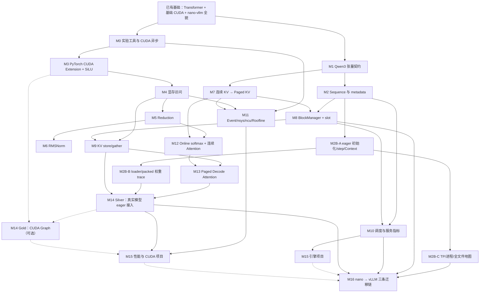

# nano-vllm 学习手册 v2：从“看懂全貌”到“能实现、能验证、能优化”

> 适用对象：完成过 CS336 Assignment 1，理解 Transformer，具备基础 C++/CUDA 编程经验，已经跑通 nano-vllm，并大致完成旧版 P0 的学习者。
>
> 本文按 nano-vllm 提交 `bb823b3e06983d71485a8e1f23715ebd87d98ef8` 组织。源码更新后请按类名和函数名搜索，不要依赖行号。
>
> 本次技术复核日期：2026-08-08；现代 vLLM 迁移章节固定在 v0.26.0，不把未来路径变化写成永久事实。
>
> 你的当前起点：**旧版 P0 的核心目标已经完成**。你不需要重新通读仓库，也不需要现在就解释所有 `slot_mapping`、prefix sharing 或 preemption 细节。请从 [M0：补齐实验工具](#m0) 直接继续。

---

## 快速导航

- [0. 先读这一页：新版如何使用](#0)
- [1. 完整知识依赖图](#1)
- [2. 路线总览、工时与出关层级](#2)
- [3. 固定基线、目录和实验纪律](#3)
- [M0：P0 收尾——正确性与 CUDA Event 工具](#m0)
- [M1：Qwen3 一层的张量契约](#m1)
- [M2：从全局控制流到单请求 metadata](#m2)
- [M2B：初始化、模型执行与 nano-vllm 源码全景](#m2b)
- [M3：第一个 PyTorch CUDA Extension 与 SiLU](#m3)
- [M4：显存访问、尾部与合并访问](#m4)
- [M5：Reduction Ladder](#m5)
- [M6：用 Reduction 实现 RMSNorm](#m6)
- [M7：从连续 KV Cache 到 Paged KV](#m7)
- [M8：BlockManager 与 slot mapping](#m8)
- [M9：KV scatter/store 与 gather](#m9)
- [M10：Serving 调度、chunk、prefix 与 preemption](#m10)
- [M11：性能模型与工具分工](#m11)
- [M12：稳定 softmax、online softmax 与连续 Attention](#m12)
- [M13：Paged Decode Attention correctness](#m13)
- [M14：真实模型 eager 接入与 CUDA Graph](#m14)
- [M15：两个毕业项目（Research 优化选做）](#m15)
- [M16：从 nano-vllm 迁移阅读现代 vLLM](#m16)
- [附录 A：调试决策树](#appendix-a)
- [附录 B：公式与形状速查](#appendix-b)
- [附录 C：实验记录模板](#appendix-c)
- [附录 D：可选分支与后续路线](#appendix-d)
- [附录 E：M0 参考答案与保底实现](#appendix-e)
- [附录 F：一周后复盘题](#appendix-f)
- [附录 G：你的实际起跑清单](#appendix-g)

---

<a id="0"></a>

## 0. 先读这一页：新版如何使用

### 0.1 为什么重构

旧路线的技术主线是合理的，但有四类问题会降低初学阶段的效率：

1. **依赖倒置**：P0 已要求手算物理 slot、解释 prefix/preemption，但这些机制直到旧 P3/P4 才正式学习。
2. **一次引入太多变量**：第一个 CUDA 算子同时要求 FP32、BF16、非默认 stream、向量化、Graph、nsys、ncu 和引擎接入。
3. **任务多、脚手架少**：经常从两段概念说明直接跳到“从零实现生产级 kernel”。
4. **把优化当成入门门槛**：正确性尚未稳定，就要求证明带宽瓶颈或接近成熟库。

新版仍然以 Paged Decode Attention 为 CUDA 与推理引擎的合流点，但统一采用下面的学习阶梯：

```text
看见它在哪里
  → 用自己的话解释
  → 跟着一个小例子手算
  → 补完给定 scaffold 中的少量 TODO
  → 独立迁移到改变后的输入
  → 与 reference 验证
  → 接入引擎
  → 有证据时再优化
```

### 0.2 你现在算不算通过旧 P0

只要你可以完成下面四件事，就把旧 P0 标记为通过：

- 跑通一次 eager 生成；
- 画出 `generate → schedule → run → sample → postprocess`；
- 知道 `Scheduler / Sequence / ModelRunner / BlockManager` 各自大致负责什么；
- 观察到一次 prefill 输入多个 token、后续 decode 每条序列每步输入一个 token。

以下内容**不再属于 P0 出关条件**：

- 从 block table 推导所有 slot；
- 解释 `cu_seqlens` 的每个值；
- 解释为什么只切第一条 chunked prefill；
- 构造 prefix hit 或 preemption；
- 写完 nsys/ncu 报告。

你剩下的旧 P0“动手三”会在 M0 中完成。M0 给出 API、测试、失败表现和参考实现，不要求你面对五个函数名从零猜接口。

对你当前最友好的**实际执行顺序**不是机械地把长章节一次读完：

```text
M0 → M1 → M2
→ M3 核心 A（尽快得到第一个 CUDA 成功反馈）
→ M2B 第一遍（eager 初始化/step/Context）
→ M4 → 按 §1.1 的 CUDA×引擎交错主路径继续
→ M14 Silver 前回访 M2B loader
→ 选择 M14 Gold 时再回访 Graph capture
→ M16 前回访 M2B TP/进程/全文件地图
```

编号表达知识归属，不代表所有章节必须一次线性读完。M3 只依赖 M0/M1，因此你不需要先读完 TP 与 loader 才能写第一个 kernel。

### 0.3 四种任务等级

每个模块都把要求分层。推进主线时，只看“核心必做”。

| 标记 | 含义 | 阻塞规则 |
|---|---|---|
| 核心必做 | 核心结业所需能力 | 只阻塞把它列为“直接前置/闸门”的节点，不自动阻塞数字上的下一章 |
| 回访/当前闸门 | A/B/C 分层中指定时点前必须补齐的部分 | 只阻塞文字明确点名的 M14/M16 等节点 |
| 巩固练习 | 加深熟练度 | 不阻塞 |
| 性能挑战 | correctness 稳定后再做 | 不阻塞 |
| 可选分支 | 不在核心硬依赖链 | 不阻塞 |

例如 M3 核心 A 通过即可进入 M4，M3 核心 B 只在真实模型接入前成为闸门；M2B-B/C 分别在 M14/M16 前回访。判断能否前进时看当前节点的“依赖/闸门”，不要只看章节数字。

不要因为一个“性能挑战”尚未完成而停在原地。例如 SiLU 没有打败 Inductor，并不意味着你不能学习 Reduction；一个正确、能解释边界的 scalar kernel 已经完成了它的教学任务。

### 0.4 每次学习的最小闭环

一次 60–120 分钟的学习只完成一个小闭环：

1. 写下今天唯一要回答的问题；
2. 阅读不超过 2–4 个相关函数；
3. 手算一个最小例子；
4. 只改一处机制；
5. 运行最小测试；
6. 记录第一个错误和修复原因；
7. 写一句“何时适用、哪里会错”。

如果连续 30 分钟没有缩小错误范围，不继续盲改。把输入缩到：

```text
1 个序列
1 个 head
1 个 block
FP32
eager
连续地址
```

然后一次只恢复一个维度。

---

<a id="1"></a>

## 1. 完整知识依赖图

### 1.1 两条主线在哪里合流



这张图里有两个关键事实：

- **引擎分支**解决“该读写哪个 token、哪个 block、哪个物理 slot”。
- **CUDA 分支**解决“怎样让线程正确、高效地完成读写、归约和 online softmax”。

在 M13 之前，不需要强行把每个 CUDA 练习接入引擎；在 M9 之前，也不需要用 CUDA 重写 BlockManager。`Scheduler` 和 `BlockManager` 保留 Python 正是合理的工程边界。

为了同时保持 CUDA 与引擎两条线的反馈节奏，M4 之后推荐按下面的交错顺序学习，而不是先学完所有 CUDA 再回到引擎：

```text
M4 → M7 → M5-A → M8 →（M6 与 M9 交错）
→ M10 → M5-B → M11 → M12
```

### 1.2 核心知识点的直接前置

| 知识点 | 直接前置 | 它解锁什么 |
|---|---|---|
| shape/dtype/device/stride 契约 | PyTorch 基础 | CUDA extension、所有 reference |
| CUDA 异步与 Event | 基础 CUDA | 正确计时、current stream |
| QKV/GQA 形状 | Transformer | KV 布局、attention head 映射 |
| Sequence 计数器 | prefill/decode、控制流 | chunk、prefix、preemption |
| 初始化/Context/加载/LM head | shape、Sequence metadata | 完整模型执行链、vLLM 迁移阅读 |
| PyTorch CUDA extension | tensor 契约、current stream | 所有自定义 kernel |
| block/warp reduction | extension、同步 | RMSNorm、online softmax |
| 连续 KV 生命周期 | QKV、decode | Paged KV 容量和地址 |
| logical→physical→slot | 连续 KV、分页 | KV store、paged attention |
| BlockManager | Sequence、slot | prefix/refcount/preemption |
| stable/online softmax | reduction、attention 数学 | 连续 decode attention |
| contiguous decode attention | online softmax、GQA | paged attention 的数值部分 |
| paged KV store/gather | extension、slot | paged attention 的地址 reference |
| CUDA Graph | current stream、静态 buffer、metadata | 最后阶段 replay 集成 |

### 1.3 明确不在核心前置链上的内容

这些内容有价值，但不会阻塞核心结业：

- Sampler RNG / Philox；
- CUDA RoPE；
- CUDA inverse gather（Python/PyTorch reference 已足够）；
- 自写 GEMM；
- 自己实现 Tensor Parallel / NCCL（M2B 仍要求理解 nano 的 TP 数据流）；
- varlen prefill FlashAttention；
- GQA shared-memory 复用；
- split-KV / persistent kernel；
- 修改 Scheduler 策略。

把它们放到附录 D，避免“每个有趣方向都变成必修”。

---

<a id="2"></a>

## 2. 路线总览、工时与出关层级

### 2.1 五个里程碑

| 里程碑 | 模块 | 你将获得的能力 | 核心工时 |
|---|---|---|---:|
| A. 把全貌落到可观察细节 | M0–M2 + M2B-A | 工具、形状、metadata、eager 初始化与 step/Context | 14–21h |
| B. 建立 CUDA 实现阶梯 | M3–M6 | extension、memory、reduction、RMSNorm | 30–50h |
| C. 掌握推理引擎内存与调度 | M7–M10 | Paged KV、BlockManager、store、scheduler | 28–46h |
| D. 在 Attention 处合流 | M11–M14 Silver + M2B-B | 性能方法、online/paged attention、loader 回访、eager 接入 | 54–99h |
| E. 用项目证明并迁移 | M15–M16 + M2B-C | 分级项目、TP/全文件回访、nano→vLLM 三条核心链 | 20–37h（扩展另加 4–6h） |

里程碑 A/B 在 M3 核心 A 处有意交叠：M3-A 的工时计入里程碑 B，但执行上先做 M3-A，再完成 M2B-A 并关闭里程碑 A。这是为了尽早获得一次 CUDA 成功反馈，不是新的隐藏前置。

核心 Silver + vLLM 三条迁移链约 **146–253 小时**；完成 M16 扩展后为 **150–259 小时**；Graph Gold 另计约 **8–20 小时**。范围较大，是因为这是一条同时覆盖 CUDA、推理引擎和源码迁移的完整路线，而不是只读 nano-vllm 的目录导览。第一次调试本机 CUDA extension 时可再预留 20% 环境缓冲。

- 每周 8–10 小时：约 16–32 周；
- 每周 15–20 小时：约 8–18 周；
- 跳过所有性能挑战时，会更接近区间下限。

### 2.2 建议周节奏

```text
第 1 次（60–90 分钟）：概念 + 源码问题
第 2 次（90–120 分钟）：worked example + scaffold TODO
第 3 次（90–120 分钟）：边界测试 + debug
第 4 次（60–120 分钟）：独立迁移 + 复盘
```

不要把“看了四小时视频”计为完成。每周至少留下一个可运行测试、一张状态表或一个可复现测量。

### 2.3 两种结业标准

**核心结业（推荐先达到）**：

- 能追踪和解释引擎的请求、KV 与调度；
- 能解释 nano 的 Config→初始化→Context→model body→LM head/Sampler 全执行链，并追踪一项 packed weight；
- 能写并接入正确的 PyTorch CUDA extension；
- 能完成 Paged Decode Attention Version A，并在真实模型 eager 路径通过 attention/logits 对比；
- 能用 Event 与 nsys 解释一次性能现象；
- 能完成 vLLM 的 Request/Scheduler、KV lifecycle、Runner/Attention backend 三张迁移证据卡。

**进阶结业**：

- 在 CUDA Graph bucket/padding 下正确 replay；
- 用少量 ncu 指标验证一个瓶颈假设；
- 完成一次有数据依据的优化，优化失败但诊断正确也算合格。

“打败 cuBLAS/FlashAttention/Inductor”从来不是出关条件。

---

<a id="3"></a>

## 3. 固定基线、目录和实验纪律

### 3.1 源码和模型锚点

- 仓库：[GeeeekExplorer/nano-vllm](https://github.com/GeeeekExplorer/nano-vllm)
- 教学基线：[提交 `bb823b3e06983d71485a8e1f23715ebd87d98ef8`](https://github.com/GeeeekExplorer/nano-vllm/tree/bb823b3e06983d71485a8e1f23715ebd87d98ef8)
- 主模型：Qwen3-0.6B
- `hidden_size = 1024`
- `num_hidden_layers = 28`
- `num_attention_heads = 16`
- `num_key_value_heads = 8`
- `head_dim = 128`
- `intermediate_size = 3072`
- `vocab_size = 151936`
- 教学默认 `block_size = 256`
- CUDA/Paged Attention 核心主线固定 `tensor_parallel_size = 1`

本文 M1/M7 的 QKV 宽度与 KV 容量默认都是 **单卡 TP=1** 的全模型口径。TP>1 时，固定提交会把每 rank 的 Q/KV heads 按 world size 切分；每 rank 的 KV block bytes 也相应缩小。完整 TP shape 在 M2B 的并行线性层微课中单独推导。

源码更新后用下面的方式定位，不依赖旧行号：

```bash
rg "class LLMEngine|def step|def generate" nanovllm/engine
rg "class Scheduler|def schedule|def postprocess" nanovllm/engine
rg "class BlockManager|def allocate|def free" nanovllm/engine
rg "prepare_prefill|prepare_decode|capture_cudagraph" nanovllm/engine/model_runner.py
rg "class Attention|store_kvcache|flash_attn" nanovllm/layers
rg "class SiluAndMul|class RMSNorm" nanovllm/layers
```

### 3.2 推荐实验目录

```text
nano-vllm/
├── nanovllm/                         # 官方实现；通过 backend flag 保留 reference
├── labs/
│   ├── common/
│   │   ├── correctness.py
│   │   ├── benchmark.py
│   │   └── test_common.py
│   ├── m1_shapes/
│   ├── m2_metadata/
│   ├── m2b_runtime_map/
│   ├── m3_extension/
│   │   ├── 00_vector_add/
│   │   └── 01_silu_and_mul/
│   ├── m4_memory/
│   ├── m5_reduction/
│   ├── m6_rmsnorm/
│   ├── m7_kv_model/
│   ├── m8_block_manager/
│   ├── m9_kv_store/
│   ├── m10_scheduler/
│   ├── m11_perf/
│   ├── m12_contiguous_attention/
│   ├── m13_paged_attention/
│   ├── m14_graph/
│   ├── m15_capstone/
│   └── m16_vllm_transfer/
└── reports/
    ├── environment.md
    ├── experiments.md
    ├── m2b-runtime-map.md
    ├── nano-to-vllm-map.md
    └── final-report.md
```

不直接删除成熟实现。所有替换都使用显式 backend：

```text
activation_backend = "reference" | "cuda"
decode_backend     = "flash" | "cuda_paged"
```

### 3.3 在写任何 kernel 前固定环境

至少记录：

```bash
python -V
python -c "import torch; print(torch.__version__); print(torch.version.cuda); print(torch.cuda.get_device_name())"
nvcc --version
nvidia-smi
git rev-parse HEAD
```

重点检查 `torch.version.cuda` 与 `nvcc --version` 的 **CUDA major version**。例如 PyTorch 是 `cu130` 而本地 nvcc 是 12.0 时，PyTorch CUDA extension 很可能因 major mismatch 构建失败。解决思路二选一：

1. 安装与 PyTorch 对应 major 的 CUDA Toolkit，并让 `CUDA_HOME/PATH` 指向它；或
2. 安装与当前 nvcc major 匹配的 PyTorch CUDA wheel。

不要用软链接伪装版本，也不要因为 `torch.cuda.is_available()` 为 True 就认为 extension 工具链一定匹配；预编译 PyTorch 能运行和本机 nvcc 能为它编译扩展是两件事。

### 3.4 一次只建立一种正确性证据

正确性由近到远分四层：

1. **数学 reference**：小输入的 Python/PyTorch 明确实现；
2. **standalone tensor**：随机与边界 shape 对比；
3. **组件接入**：比较某层输出或 logits；
4. **端到端生成**：最后才比较 token。

端到端 token 不一致不自动等于 kernel 错误：采样随机源的微小差别也会放大。优先找“第一个数值分叉层”。

### 3.5 性能工具的使用顺序

```text
reference/assert
  → CUDA Event：到底多慢
  → compute-sanitizer（怀疑越界/竞态时）
  → nsys：时间线、launch gap、同步、Graph replay
  → ncu：已经锁定某个 kernel 后，回答为什么慢
```

早期模块只要求 CUDA Event。不要在第一个 kernel 上运行 `ncu --set full`；它慢、信息过载，在 WSL 或受限环境中还可能没有所需权限。

### 3.6 每个实验都记录的六行

```text
问题：我想验证什么？
输入：shape / dtype / device / commit
预测：正确结果、可能瓶颈和一个边界
变化：这次只改了什么？
证据：reference 误差 / 时间 / trace
结论：何时成立，什么条件下不成立？
```

---

<a id="m0"></a>

## M0：P0 收尾——正确性与 CUDA Event 工具（3–5 小时）

### M0.1 为什么现在学

你已经知道引擎大致在做什么，接下来所有 CUDA 实验都需要回答两个基础问题：

- 输出究竟错了多少、错在哪里？
- 测到的是 GPU 执行时间，还是仅仅 CPU 提交时间？

这正是你尚未完成的旧 P0 动手三。它现在有明确接口和分步 TODO，不再混入 slot、prefix 或 Graph。

**依赖**：PyTorch 基础、会运行 CUDA tensor。  
**解锁**：M3 之后的所有 correctness/benchmark。  
**本章不学**：nsys、ncu、Roofline、Graph、BF16 容差矩阵。

### M0.2 先修检查

尝试口头回答：

1. `torch.add(x, y)` 返回后，GPU 一定已经完成了吗？
2. 为什么在 GPU 操作前后直接用 `time.perf_counter()` 往往偏小？
3. `torch.allclose` 为 True 时，是否仍可能包含你关心的局部大误差？

答案要点：CUDA 调用通常异步；CPU 计时若无同步主要测提交；`allclose` 是布尔结论，还应报告 max/mean error、NaN 和首个错误位置。

### M0.3 异步队列的最小心智模型

```text
CPU：提交 kernel A ─ 提交 kernel B ─ 继续执行 Python
GPU：              执行 A ─────── 执行 B ───────
```

`perf_counter` 放在两个“提交”之间，未必覆盖 GPU 真正执行。CUDA Event 被记录到同一个 GPU stream 中，结束 event 只有在此前工作完成后才完成，因此可以测 stream 上的 GPU elapsed time。

### M0.4 先建立文件和测试契约

创建：

```text
labs/common/correctness.py
labs/common/benchmark.py
labs/common/test_common.py
```

`correctness.py` 的目标接口：

```python
from dataclasses import dataclass
import torch

@dataclass
class CompareResult:
    max_abs: float
    max_rel: float
    mean_abs: float
    nan_count_ref: int
    nan_count_out: int
    first_bad_index: tuple[int, ...] | None

def compare_tensors(
    ref: torch.Tensor,
    out: torch.Tensor,
    *,
    atol: float = 1e-5,
    rtol: float = 1e-5,
    check_dtype: bool = True,
) -> CompareResult:
    assert ref.shape == out.shape
    assert ref.device == out.device
    if check_dtype:
        assert ref.dtype == out.dtype, (ref.dtype, out.dtype)

    # TODO 1：转成 FP32 后计算 abs_diff。
    # TODO 2：rel_diff 的分母使用 abs(ref).clamp_min(一个很小的数)。
    # TODO 3：bad = ~isclose(..., equal_nan=True)，找到第一个 bad index。
    # TODO 4：分别统计 ref/out 的 NaN。
    raise NotImplementedError

def clone_inputs(*xs: torch.Tensor) -> tuple[torch.Tensor, ...]:
    return tuple(x.detach().clone() for x in xs)

def assert_no_input_mutation(
    before: tuple[torch.Tensor, ...],
    after: tuple[torch.Tensor, ...],
) -> None:
    assert len(before) == len(after)
    for i, (old, new) in enumerate(zip(before, after)):
        try:
            torch.testing.assert_close(
                old, new, rtol=0, atol=0, equal_nan=True
            )
        except AssertionError as exc:
            raise AssertionError(f"input {i} was mutated") from exc

def seed_all(seed: int) -> None:
    import random
    random.seed(seed)
    torch.manual_seed(seed)
    torch.cuda.manual_seed_all(seed)
```

先写测试，再补 TODO：

默认检查 dtype，因为“错误地返回 FP32”即使数值接近也违反多数算子契约。只有明确进行高精度数学诊断时才传 `check_dtype=False`，并在实验记录中同时写两侧 dtype。

```python
import torch
from labs.common.correctness import (
    compare_tensors,
    clone_inputs,
    assert_no_input_mutation,
)

def test_equal():
    x = torch.tensor([1.0, 2.0], device="cuda")
    r = compare_tensors(x, x.clone())
    assert r.max_abs == 0.0
    assert r.first_bad_index is None

def test_finds_error():
    ref = torch.zeros(8, device="cuda")
    out = ref.clone()
    out[5] = 0.1
    r = compare_tensors(ref, out, atol=1e-4, rtol=1e-4)
    assert r.first_bad_index == (5,)

def test_counts_nan():
    ref = torch.tensor([1.0, float("nan")], device="cuda")
    out = torch.tensor([1.0, 2.0], device="cuda")
    r = compare_tensors(ref, out)
    assert r.nan_count_ref == 1
    assert r.nan_count_out == 0

def test_out_of_place_example_does_not_mutate():
    x = torch.randn(17, 64, device="cuda")
    before = clone_inputs(x)
    _ = x + 1                         # 已知 out-of-place 的完整小算子
    assert_no_input_mutation(before, (x,))
```

以后在每个 kernel test 中按这个模板替换算子；下面是**模板，不放进首轮 `test_common.py`**：

```python
x = torch.randn(17, 6144, device="cuda")
before = clone_inputs(x)
_ = operator_under_test(x)
assert_no_input_mutation(before, (x,))
```

首次运行：

```bash
python -c "import pytest; print(pytest.__version__)"
python -m pytest -q labs/common/test_common.py
```

若第一条提示没有安装 pytest，再在当前虚拟环境执行 `python -m pip install pytest`；不要混用系统 Python 的 pip。

#### 提示阶梯

- Hint 1：`torch.nonzero(bad, as_tuple=False)` 返回二维坐标表。
- Hint 2：空坐标表意味着没有 bad index。
- Hint 3：统计前可使用 `torch.isnan(t).sum().item()`。

### M0.5 实现一个只承诺“平均 GPU 时间”的 bench

不要一开始同时实现 mean、median、p95。第一版契约非常简单：在一个 Event 区间内运行 `iters` 次，返回每次平均毫秒数。

```python
import torch

@torch.no_grad()
def bench_cuda(fn, *, warmup: int = 20, iters: int = 100) -> float:
    for _ in range(warmup):
        fn()

    # 保证 warmup 完成，且计时区间从干净边界开始。
    torch.cuda.synchronize()
    start = torch.cuda.Event(enable_timing=True)
    end = torch.cuda.Event(enable_timing=True)

    # TODO 1：在当前 stream 记录 start。
    # TODO 2：调用 fn 共 iters 次。
    # TODO 3：记录 end，并只等待 end 完成。
    # TODO 4：返回 start.elapsed_time(end) / iters。
    raise NotImplementedError
```

计时 Hint：`start.record()`/`end.record()` 默认记录到调用时的 current stream；`end.synchronize()` 只等待结束 Event 达成，随后 `start.elapsed_time(end)` 才有完整区间。不要在每次 `fn()` 后同步。

验证：

```python
x = torch.randn(1_000_000, device="cuda")
out = torch.empty_like(x)

def work():
    torch.relu(x, out=out)   # timed loop 内不分配，不打印

print(f"relu mean GPU time: {bench_cuda(work):.4f} ms")
```

然后独立迁移到矩阵乘：

```python
a = torch.randn(1024, 1024, device="cuda")
b = torch.randn(1024, 1024, device="cuda")
c = torch.empty(1024, 1024, device="cuda")

def work_mm():
    torch.mm(a, b, out=c)
```

你只需解释：ReLU 主要搬运元素，而矩阵乘对每个输出做大量乘加，所以两者随 shape 变化的规律不同。精确 Roofline 在 M11 再学。

### M0.6 常见失败与第一检查点

| 现象 | 第一检查点 |
|---|---|
| 时间接近 0 | 是否只测了 CPU 提交；end event 是否同步 |
| 每次差异巨大 | 是否在 timed loop 分配、首次编译或打印 |
| `first_bad_index` 崩溃 | `bad` 是否为空；坐标是否转成 tuple[int] |
| 相对误差巨大但绝对误差小 | reference 是否接近 0；同时看 atol |
| NaN 被误判相等 | 是否明确记录两侧 NaN 数和你的 NaN 契约 |

### M0.7 出关

**核心必做**：

- 三个 correctness 测试通过；
- ReLU 和 GEMM Event 计时可重复；
- 能解释“CPU 提交”与“GPU 完成”的差别；
- timed loop 内没有张量分配、打印和显式同步。

**独立迁移**：故意把 `out[5]` 改坏、注入 NaN、原地修改输入，证明三类问题都能被工具发现。

**现在不要做**：p50/p95、nsys、ncu、Graph。M11 会把此工具升级为多样本统计。

---

<a id="m1"></a>

## M1：Qwen3 一层的张量契约（4–6 小时）

### M1.1 为什么现在学

你理解 Transformer 结构，但写引擎 kernel 时必须把“多头注意力”落到精确的 shape、布局和 GEMM 参数。否则后面很容易把 `hidden_size`、Q 投影宽度、KV head 数、head_dim 混为一谈。

**依赖**：Transformer、基础线性代数。  
**解锁**：KV 容量、GQA 映射、SiLU/RMSNorm 接入、Attention。  
**本章不学**：物理 block、CUDA kernel、Graph。

### M1.2 一组必须稳定的模型事实

对 Qwen3-0.6B、`tensor_parallel_size=1`：

```text
hidden_size = 1024
Hq = 16
Hkv = 8
head_dim = 128
intermediate_size = 3072
```

输入 `x.shape = (B, S, 1024)` 时：

```text
Q projection: (B, S, 16 × 128) = (B, S, 2048)
K projection: (B, S,  8 × 128) = (B, S, 1024)
V projection: (B, S,  8 × 128) = (B, S, 1024)
fused QKV:    (B, S, 4096)
```

reshape 后：

```text
Q: (B, S, 16, 128)
K: (B, S,  8, 128)
V: (B, S,  8, 128)
```

GQA ratio 为 `16 / 8 = 2`：q head 0–1 使用 kv head 0，q head 2–3 使用 kv head 1，以此类推。通用公式：

```python
group_size = num_q_heads // num_kv_heads
kv_head = q_head // group_size
```

GQA 的目标是减少 KV 参数和 decode 时的 KV cache/读取量。它可能相对 MHA 牺牲一部分模型容量，但不是简单地“两个 Q head 只能学到同一信息”：Q 仍然不同，每个 Q 会用不同 score 从共享 K/V 中选择和组合信息。模型质量是架构设计与训练结果的问题；kernel 层还要注意，**语义上共享 KV 不代表你的实现自动只从 DRAM 加载一次 KV**。

### M1.3 worked example：把一个 token 走完一层

为简化，先令 `B=1,S=3`，nano-vllm 常把新 token 展平为 `T=3`：

| 位置 | 输入/输出 shape | 说明 |
|---|---|---|
| hidden | `(3, 1024)` | 三个 token |
| input RMSNorm | `(3, 1024)` | shape 不变 |
| fused QKV linear | `(3, 4096)` | GEMM |
| split/reshape Q | `(3, 16, 128)` | 2048 元素/token |
| split/reshape K,V | 各 `(3, 8, 128)` | 各 1024 元素/token |
| attention output | `(3, 16, 128)` | 合并前 |
| output projection | `(3, 1024)` | 回到 residual width |
| post-attn RMSNorm | `(3, 1024)` | shape 不变 |
| gate/up linear | `(3, 6144)` | 两个 3072 合并 |
| SiLU-and-mul | `(3, 3072)` | gate 激活后乘 up |
| down projection | `(3, 1024)` | 回到 residual width |

这里的三个线性层可以写成 GEMM：

```text
X[M,K] @ W[K,N] = Y[M,N]
```

例如 fused QKV：`M=T=3, K=1024, N=4096`；gate/up：`M=3,K=1024,N=6144`。prefill 的 `M` 往往较大，decode 时每序列只有一个新 token，但 continuous batching 可让 `M=batch_size`。

### M1.4 为什么 prefill 可并行、decode 每序列每步只有一个 token

对于给定 prompt，所有 token 已知。使用 causal mask 后，位置 20 不会看未来位置，但它与位置 0–19 的 Q/K/V 可以在一次大张量运算中同时计算；依赖由 mask 表达，不需要 Python 按位置循环。这是 prefill。

生成第一个新 token 后，第二个新 token 的输入取决于第一个新 token 的采样结果；结果产生前它不存在。因此单条序列一次只能向前推进一个 decode token。引擎通过把多条序列各自的一个 token 合批，恢复 GPU 并行度。

prefill 的输出不仅是 logits，还会把 prompt token 的 K/V 存入 KV cache。之后 decode：

```text
新 token → 只算它自己的 Q/K/V
新 K/V → 追加进 cache
新 Q → 读取全部历史 K/V 做 attention
```

不会缓存 Q，因为过去的 Q 不会被未来 token 再次查询；未来查询需要的是过去的 K/V。

### M1.5 跟着源码读，不超过四个位置

按下面的问题阅读，而不是顺序通读整个模型：

1. `models/qwen3.py`：一层的 RMSNorm、Attention、MLP 调用顺序是什么？
2. `layers/linear.py`：权重 shape 和输入最后一维怎样对应？
3. `layers/attention.py`：Q/K/V 在何处 reshape，GQA 参数传给谁？
4. `layers/activation.py`：`SiluAndMul` 为什么把最后一维减半？

在一次 tiny eager 运行中只记录 shape，不打印 tensor 全值。可以临时注册 hook 或在本地调试分支打印：

```text
module_name, input.shape, output.shape, dtype, contiguous, stride
```

只观察第 0 层、前两个 step，避免 28 层日志淹没结论。

### M1.6 独立迁移题

给定合成配置：

```text
hidden=1536, q_heads=24, kv_heads=6, head_dim=64, intermediate=4096
T=7
```

不用代码，推导：

- Q/K/V 与 fused QKV shape；
- GQA group size 和 `q_head=17` 对应的 kv head；
- gate/up 与 SiLU-and-mul shape；
- fused QKV、gate/up 两个 GEMM 的 M/N/K。

答案检查：Q 为 `(7,1536)`，K/V 各 `(7,384)`，fused 为 `(7,2304)`；group size=4，q head 17→kv head 4；gate/up 为 `(7,8192)`，SiLU 输出 `(7,4096)`。

### M1.7 出关

**核心必做**：

- 不看 Qwen 固定常数，能从任意 config 推导主要 shape；
- 能解释只缓存 K/V；
- 能从数据依赖解释 prefill/decode，而不是只背定义；
- 能解释 GQA 的模型语义和 kernel 数据复用不是同一件事。

**若没过**：回到 worked example，把 `B,S` 先压成 `T=1`，为每个 tensor 写出“每 token 有多少元素”。

---

<a id="m2"></a>

## M2：从全局控制流到单请求 metadata（4–6 小时）

### M2.1 为什么现在学

你已了解 nano-vllm 全貌，本章把全局认识变成一个可验证的单请求状态变化。仍然不解释物理 block 的分配；先把 block id 当成 opaque 编号，避免同时学习调度与内存寻址。

**依赖**：M1、旧 P0 控制流。  
**解锁**：M8 BlockManager、M10 scheduler、M14 Graph metadata。  
**本章不学**：prefix 命中、chunked prefill、preemption、slot 公式。

### M2.2 六个字段先只问“它表示进度的哪一段”

| 字段 | 本章心智模型 |
|---|---|
| `token_ids` / `num_tokens` | prompt 加上已生成 token |
| `num_prompt_tokens` | 初始化后不变的 prompt 长度 |
| `num_cached_tokens` | 已有 KV 可被后续 attention 使用的前缀长度 |
| `num_scheduled_tokens` | 当前 step 计划计算多少 token |
| `positions` | 当前新 token 在各自序列内的逻辑位置 |
| `cu_seqlens` | packed batch 中每条序列的区间边界前缀和 |

不要把 `num_cached_tokens` 理解为“prompt 长度”，也不要把 `num_scheduled_tokens` 理解为“整个请求还剩多少 token”。它们描述 KV residency 和当前 step 的工作。

### M2.3 worked example：一条长度 4 的 prompt

只观察抽象状态，不猜物理 block id：

```text
初始：token_ids=[p0,p1,p2,p3]
      prompt=4, cached=0, scheduled=0

prefill schedule：本 step 选择位置 [0,1,2,3]
                  input_ids.shape=(4,)
                  positions=[0,1,2,3]
                  scheduled=4

prefill run：为四个 prompt token 写入 K/V；最后一个 hidden 产生 logits
postprocess：cached 进度前移，并 append 采样 token g0

第一次 decode：只把 g0（它位于逻辑位置 4）送入模型
               input_ids.shape=(1,)
               positions=[4]
               历史位置 0..3 的 K/V 已存在，无需重算

postprocess：append g1
第二次 decode：input=[g1], positions=[5]
```

真实字段更新的精确时机以当前提交的 `schedule/postprocess` 为准。你的任务是用 trace 验证上面的因果关系，而不是把这段文字当作字段赋值代码。

### M2.4 跟着做：从最简单 trace 逐步增加一个变量

只打印结构化摘要：

```text
step_id, phase
seq_id, status
num_tokens, num_prompt_tokens, num_cached_tokens, num_scheduled_tokens
input_ids.tolist(), positions.tolist()
cu_seqlens_q (如果存在)
sampled_token
```

按顺序做四次实验：

1. 一条 4-token prompt，生成 2 token；
2. 一条 6-token prompt，生成 2 token；
3. 两条 prompt，长度 3 和 5；
4. 只对第 3 个实验手算 packed offsets。

两条序列本 step 分别贡献 3、5 个 token 时：

```text
packed tokens length = 8
cu_seqlens = [0, 3, 8]
sequence 0 → packed[0:3]
sequence 1 → packed[3:8]
```

下一次 decode 若两条都运行，每条贡献 1：

```text
packed tokens length = 2
cu_seqlens（若该路径需要）= [0, 1, 2]
```

### M2.5 源码阅读问题

精读这些函数附近，不看模型内部：

- `LLMEngine.add_request/step/generate`：谁创建、谁循环、谁 append？
- `Scheduler.schedule/postprocess`：哪些字段在 GPU 前后更新？
- `ModelRunner.prepare_prefill/prepare_decode`：Python 状态怎样变成 tensor metadata？
- `Sequence.append_token`：总 token 数在哪里改变？

对每个函数写四格卡：

```text
输入已知什么？
返回什么？
修改了谁？
下一步依赖哪个字段？
```

### M2.6 常见混淆

| 混淆 | 修正 |
|---|---|
| “decode 输入永远是整个上下文” | 模型输入是每序列一个新 token；attention 通过 KV cache 读历史 |
| “prefill 只是提前算 QKV” | 它也完成 prompt attention，并用最后有效位置产生首个生成 logits |
| “packed 后序列边界消失” | `cu_seqlens`/length metadata 恢复边界 |
| “block id 就是 token position” | 本章暂把 block id 当 opaque；M8 才学地址映射 |

### M2.7 出关

**核心必做**：

- 能预测单请求 prefill 和两个 decode step 的 inputs/positions；
- 能解释 cached/scheduled/total 三者不是同一个计数；
- 能从 `[0,3,8]` 恢复两条 packed 序列；
- 能指出 metadata 是 `Sequence/Scheduler` 状态与 GPU kernel 之间的接口。

**现在不要做**：三序列 shared-prefix trace、chunk budget、preemption。它们在 M10 有固定实验驱动器。

---

<a id="m2b"></a>

## M2B：初始化、模型执行与 nano-vllm 源码全景（分三次，共 7–10 小时）

### M2B.1 为什么必须补这一章

只追踪 `generate → schedule → run`，容易形成一个缺口：知道请求被调度了，却不知道模型如何初始化、metadata 怎样进入每层、checkpoint 怎样装进 fused/TP 参数、为什么 prefill 只取最后一个 query 的 logits，以及多卡时每个 rank 到底持有什么。

这些不是 CUDA kernel 的前置，却是“真正理解 nano-vllm”与后续阅读 vLLM 的前置。本章不写新 kernel，只完成四张 trace 和两张 shape 表。

**依赖**：M1 张量形状、M2 Sequence/metadata。  
**解锁**：M6/M14 的真实模型接入、M16 的 vLLM 迁移阅读。  
**本章不学**：NCCL 编程、自己实现 tokenizer/loader、量化、异步服务端。

本章刻意分三次回访，不把它变成开始 CUDA 前的“大阅读墙”：

| 回访 | 何时做 | 内容 | 工时 | 是否阻塞下一步 |
|---|---|---|---:|---|
| A. 运行时核心 | M3 核心 A 后 | 产品边界、Config、eager 初始化、step、Context、LM-head、RoPE/Sampler | 3–4h | 进入真实框架理解前完成 |
| B. 真实接入桥 | M14 Silver 前 | checkpoint packing 与权重 trace | 2–3h | 阻塞 M14 Silver，不阻塞 M4–M13 standalone |
| C. vLLM/多卡桥 | M16 前 | TP shape、控制/数据通信、全文件覆盖地图 | 2–3h | 阻塞 M16，不阻塞单卡 CUDA |

完成回访 A 后，你应该能从空进程讲到一个 token 被 append：

```text
公开 API / Config
→ 每 rank 构造并加载模型
→ warmup、测可用显存、分配 KV、可选 Graph capture
→ Scheduler 选请求
→ ModelRunner 生成 tensor metadata 并 set_context
→ Embedding / Qwen layers / Attention / LM head
→ rank 0 Sampler
→ Scheduler.postprocess
→ append token 或结束并释放 blocks
```

### M2B.2 先认清 nano 的产品边界

固定提交中的 `LLM` 直接继承 `LLMEngine`，没有额外逻辑。它提供的是**同步、离线**生成接口：一次把 prompts 加入本地引擎，然后循环 `step()` 直到结束。

```text
它有：tokenize、continuous step scheduling、Paged KV、prefix cache、TP、Graph
它没有：OpenAI HTTP API、async/streaming、在线请求队列、生产级监控、容错、多模型注册
```

因此看到 `generate(prompts)` 时，不要把它自动等同于在线 serving。M10 若要表达“请求稍后到达”，必须显式调用内部 `add_request/step` 驱动，而不是把所有 prompt 一开始传入 `generate`。

先执行这组只读定位：

```bash
rg "class LLM\b|class LLMEngine|def generate|def step|def add_request" nanovllm
rg "class Config|class SamplingParams" nanovllm
sed -n '1,220p' example.py
sed -n '1,260p' bench.py
```

写下答案：

1. `LLM` 是否另有一套 engine？——没有，它只是最薄的公开入口。
2. `generate` 是否逐 token yield？——没有，它最终返回完成的请求。
3. 固定提交的 `step()` 返回什么？——`(finished_outputs, signed_num_tokens)`；outputs 只含已完成请求，正/负 token 数用于区分 prefill/decode。

#### Tokenizer 是字符串世界与 block 世界的边界

```text
prompt 字符串
→ AutoTokenizer.encode
→ token id 列表
→ Sequence / block hash / KV
→ completion token ids
→ tokenizer.decode
→ 最终文本
```

`max_model_len`、chunk size、block size、throughput 的“token”都不是字符数。两个肉眼相似的字符串，若空格、Unicode 归一化、special token 或 chat template 不同，token ids 就可能不同，prefix cache 也不会命中。可控 prefix 实验优先直接传 `list[int]`，真实应用实验才使用字符串并保存 tokenizer 输出。

固定提交在 runner 初始化后创建 tokenizer，再把 `eos_token_id` 回填到 Config；`generate` 最终同时返回 decode 后的文本与 completion token ids。对 correctness，token ids 比文本更适合定位；对用户体验，仍需看 detokenized text。

### M2B.3 Config 不是“常量袋”，而是初始化契约

先画 Config 的来源与去向：

```text
用户参数 + Hugging Face config
           ↓
      nanovllm.Config
       ├─ 模型 shape / dtype / eos
       ├─ max_model_len / batch token budget / max seqs
       ├─ TP world size
       ├─ KV block size / memory utilization
       └─ eager 或 Graph
           ↓
 Scheduler       ModelRunner       Sequence.block_size
```

固定提交中需要特别记住的事实：

- `max_model_len = min(用户上限, HF 模型上限)`，它表达声明的支持/Graph 容量上限；但固定提交没有在 add/schedule 路径显式校验 `prompt_len + max_tokens`，实验 driver 必须主动断言总长不超过它；
- `kvcache_block_size` 默认 256，且实现要求是 256 的倍数；
- `tensor_parallel_size` 默认 1；本文 CUDA 主线固定 TP=1；
- `gpu_memory_utilization` 决定可用于 KV cache 的预算，不是“进程永远只使用这个比例”；
- `num_kvcache_blocks` 不是用户预先知道的固定常数，而是在 warmup/显存测量后回填；
- `LLMEngine` 会把 `Sequence.block_size` 这个**类变量**设置为当前 KV block size。

最后一点解释了 M8 的陷阱：只写 `BlockManager(block_size=4)` 并不会自动让 `Sequence.num_blocks` 按 4 计算；toy 测试必须同步设置并在结束后恢复 `Sequence.block_size`。

**动手 A：配置传播表**

在 `reports/m2b-runtime-map.md` 画表，不改源码：

| 字段 | 用户/HF 来源 | 第一个消费者 | 运行期是否回填 | 错了会怎样 |
|---|---|---|---|---|
| `max_model_len` | 用户+HF | Runner warmup/Graph table 宽度；实验 driver 校验 | 否 | 越界可能晚失败，尤其 Graph shape/copy |
| `max_num_batched_tokens` | 用户 | Scheduler | 否 | chunk/吞吐/峰值改变 |
| `kvcache_block_size` | 用户/默认 | Sequence+BlockManager+Runner | 否 | 地址与容量契约错 |
| `num_kvcache_blocks` | 显存测量 | BlockManager | 是 | 可驻留请求数改变 |
| `tensor_parallel_size` | 用户 | engine/runner/layers | 否 | shard shape/进程组改变 |

自己补上 `enforce_eager` 和 `gpu_memory_utilization` 两行。

### M2B.4 初始化链：为什么“第一次 generate 前”已经做了很多事

按下面顺序阅读 `LLMEngine.__init__` 与 `ModelRunner.__init__`，不要一开始深入每个 layer：

```text
LLM(...)
  1. 合并 Config 与 HF model config
  2. 固定 Sequence.block_size
  3. 为 TP ranks 建立执行进程/runner
  4. 每 rank 初始化 distributed group，选择自己的 CUDA device
  5. 每 rank 构造本地 Qwen3 parameter shards
  6. load_model：把 safetensors 直接装入对应 shard/packed parameter
  7. warmup：触发必要初始化并测模型执行峰值
  8. 根据剩余预算计算每 rank 可分配 KV blocks
  9. 分配每层 K/V cache
 10. 非 eager 时为支持的 batch buckets capture CUDA Graph
 11. 创建 Scheduler/BlockManager，开始接收请求
```

进程生命周期也属于正确性：engine 注册退出清理；退出时 rank 0 发送 `exit` 命令、释放本地 runner，并 join 其他 TP worker。若你在 notebook/测试中反复创建 engine 却不结束 worker，后面的“显存泄漏或进程卡住”可能不是 kernel 问题。

这里有三个不同的“内存数字”：

```text
模型参数/常驻运行时内存
一次 forward 的峰值临时内存
剩余预算中可长期分给 KV cache 的内存
```

KV block 数近似由第三项除以每 block bytes 得到。TP>1 时每 rank 只存本 rank 的 KV heads，所以必须用**本地** `Hkv` 计算每 rank block bytes；M7 会完整手算。

**动手 B：初始化时序 trace**

只用断点或临时日志，在 TP=1、`enforce_eager=True` 下记录这些事件的先后：

```text
construct model
load first parameter / load finished
warmup start / finish
KV blocks computed
KV cache allocated
Scheduler ready
first schedule
```

若不熟悉调试器，临时放一个统一 helper，不要散写无法检索的 print：

```python
import json
from time import perf_counter_ns

def init_trace(event, **fields):
    print(json.dumps({
        "at_ns": perf_counter_ns(), "event": event, **fields
    }, ensure_ascii=False))
```

只在下面六个边界各调用一次：

```text
ModelRunner 构造 model 前/后
load_model 前/后
warmup_model 前/后
计算并回填 num_kvcache_blocks 后
allocate_kv_cache 后
LLMEngine 创建 Scheduler 后
```

输出应该是十几行事件，不是每层 28 次日志。先在 TP=1 运行；TP>1 时额外记录 rank，避免多进程 stdout 顺序被误当成真实跨 rank happens-before。

Graph 路径的 `capture start/finish` **不属于 M2B-B 或 M14 Silver**。只有你选择 M14 Gold 时，才在学完 Graph 心智模型后回访本节，补充这两个事件。不要把日志放进计时实验；完成 trace 后删除或置于 debug flag 下。

### M2B.5 一次 step 的完整数据链

M2 只看到 Scheduler 与 metadata。本节把模型中间链补齐：

```text
LLMEngine.step
  → Scheduler.schedule
       选择 seqs、设置 num_scheduled_tokens、准备/扩展 blocks
  → ModelRunner.call("run", seqs, is_prefill)
       prepare_prefill 或 prepare_decode
       生成 input_ids / positions / cu_seqlens / slot_mapping /
            context_lens / block_tables
       set_context(metadata)
  → Qwen3 model-body forward
       VocabParallelEmbedding(input_ids)
       对每层：RMSNorm → QKV projection → Q/K per-head RMSNorm → RoPE → Attention
               → output projection → residual
               → RMSNorm → gate/up → SiLU-and-mul → down → residual
       final norm
  → model.compute_logits / ParallelLMHead
  → Sampler（rank 0）
  → reset_context()
  → Scheduler.postprocess
       cached 进度、hash 完整 block、append token/结束/释放
  → 返回本 step 新工作量；只把 FINISHED 请求放进 outputs
```

`Q/K per-head RMSNorm` 是这个 Qwen3 实现相对最简 Transformer 图的重要细节。另一个边界是：固定提交的 CUDA Graph capture 包住 decoder **model-body forward**，`compute_logits/ParallelLMHead` 与 Sampler 在 Graph 外；M14 会据此核对 capture 范围。

不要把三类“输入”混在一起：

| 层次 | 示例 | 谁消费 |
|---|---|---|
| 请求状态 | `token_ids/cached/scheduled/block_table` | Scheduler/Runner |
| 模型显式 tensor | `input_ids/positions` | Qwen forward |
| attention 隐式 metadata | `slot_mapping/context_lens/cu_seqlens/block_tables` | Context→Attention/LMHead |

### M2B.6 Context 是 Runner 与 layer 之间的桥

固定提交的 `utils/context.py` 保存一次 forward 所需的 attention metadata。ModelRunner 在调用模型前 `set_context(...)`，Attention 和 LM head 在内部读取，forward 后 `reset_context()`。

```text
Scheduler/Sequence（Python 对象）
      ↓ prepare_* 打包
ModelRunner（tensor metadata）
      ↓ set_context
Attention / ParallelLMHead（无需在 28 层间反复传几十个参数）
      ↓ reset_context
下一次 step 不应看到旧 metadata
```

正确心智模型是“**每进程、每次 forward 的临时执行上下文**”，不是全局永恒真相，也不是成熟 vLLM 必须采用的 API。它的简洁适合教学，但 Graph、并发或更复杂 backend 会要求更严格的生命周期与 metadata 类型。

读 `utils/context.py`、`model_runner.py` 的 `set_context/reset_context` 调用点，以及 `layers/attention.py`、`layers/embed_head.py` 的读取点。回答：

1. 如果忘记 reset，为什么下一 step 可能读到陈旧状态？
2. 为什么 `block_tables` 不需要作为 Qwen 每一层 forward 的显式参数？
3. 为什么 Context 中的对象仍要按当前 device/dtype/shape 建立契约？

### M2B.7 为什么 prefill 只为每条序列选一个 LM-head 位置

prefill 时，每个 prompt token 的 hidden state 都要算，因为后面的 prompt token 依赖前面的 K/V；但标准自回归生成在这一 step 只需要“当前已处理前缀之后的下一个 token”分布。

固定提交的 `ParallelLMHead` 在 prefill 路径用：

```text
cu_seqlens_q[1:] - 1
```

选出每条 packed query 区间的最后一个位置，再计算/保留采样所需 logits。worked example：

```text
两条 query 长度 3、5
cu_seqlens_q = [0,3,8]
最后 query 索引 = [2,7]
LM head 的 batch 是 2，而不是 8
```

decode 时每条活跃序列本来就只有一个新 query，所以每行都对应一个采样位置。

chunked prefill 需要再加一个条件：每个 chunk 仍有一个“当前 chunk 尾部”，但若 prompt 尚未完整处理，`Scheduler.postprocess` 不会把它当作真正生成 token append。最终 prompt chunk 完成后才进入生成语义。M10 会用 trace 验证，而不是靠这段文字猜字段。

**独立迁移题**：三条 packed query 长度 `[2,1,4]`，写出 `cu_seqlens_q` 与 LM-head 索引。答案应为 `[0,2,3,7]` 与 `[1,2,6]`。

### M2B.8 checkpoint 怎样进入 fused QKV/gate-up 参数

不要把 `load_model` 想成“先在 CPU 完整加载整个模型，再复制并切分”。固定提交遍历 safetensors 参数名，依据模型的 `packed_modules_mapping` 找到目标 Parameter，再调用 parameter 自己的 `weight_loader` 完成 packed offset 与 TP shard。

Qwen3-0.6B、TP=1 的 worked example（Linear weight 记作 `[out,in]`）：

```text
checkpoint q_proj.weight [2048,1024] ┐
checkpoint k_proj.weight [1024,1024] ├→ qkv_proj.weight [4096,1024]
checkpoint v_proj.weight [1024,1024] ┘   按 q/k/v 三段装入

checkpoint gate_proj.weight [3072,1024] ┐
checkpoint up_proj.weight   [3072,1024] ┴→ gate_up_proj.weight [6144,1024]
```

Qwen3-0.6B 的配置还启用了 `tie_word_embeddings=true`。固定提交让 `lm_head.weight.data` 与 `model.embed_tokens.weight.data` 指向同一底层 storage；每个 TP rank 的 embedding vocab shard 也就是该 rank 的 LM-head shard，不应在容量图里默认再算一份独立 head 权重。

在模型构造/加载后可验证：

```python
assert model.lm_head.weight.data_ptr() == \
       model.model.embed_tokens.weight.data_ptr()
```

Qwen tied-weight checkpoint 通常只保存 embedding key。固定 nano loader 没有额外的 tied-weight skip 机制：若你的 checkpoint 真的同时包含 `lm_head.weight`，它会按 safetensors 遍历顺序再次把该 key copy 到同一共享 storage。先检查 keys，不要假设 loader 会自动忽略第二份；共享运行时 storage 与 checkpoint 命名是两个层次。

为什么 checkpoint 分开、运行参数 packed：

- checkpoint 命名与常见 HF 模型一致，容易复用；
- 运行时一次 fused projection 可减少调度/访存开销；
- loader 知道每个 shard 在 packed tensor 中的目的区间。

**动手 C：追一项权重，不要追全模型**

选第 0 层 `q_proj.weight`：

```text
safetensors key
→ packed_modules_mapping 命中哪一项
→ 目标 parameter 名
→ 调用哪个 weight_loader，传入哪个 shard id
→ TP=1 的目标 offset/shape
```

然后独立迁移到 `up_proj.weight`。如果只能说“loader 会加载”，但说不出目标 packed tensor 与区间，本节尚未完成。

### M2B.9 TP=2：只推 shape 与 collective，不自己写 NCCL

本文所有 CUDA kernel 先在 TP=1 做 correctness；但理解 nano 框架必须知道 TP 分片。本节只做纸面追踪。

Qwen3-0.6B、TP=2，每 rank 的 attention heads：

```text
全局 Hq/Hkv = 16/8
每 rank Hq/Hkv = 8/4
每 rank Q/K/V width = 1024/512/512
每 rank fused QKV width = 2048
```

主要层的规则：

| 层类型 | 参数切分 | 本 rank forward | collective |
|---|---|---|---|
| ColumnParallelLinear | output 维切分 | 产生本地输出 features | 通常立即不通信 |
| Merged/QKV Column | 每个 packed 分段按 output 切 | 本地 Q/K/V 或 gate/up | 通常立即不通信 |
| RowParallelLinear | input 维切分 | 产生完整 output shape 的 partial sum | `all_reduce` 求和 |
| VocabParallelEmbedding | vocab 行切分 | 非本 rank token mask；本地查表 | `all_reduce` 合成 embedding |
| ParallelLMHead | vocab 行切分 | 本地 vocab logits | gather 到 rank 0 |

两条具体链：

```text
attention：本地 QKV → 本地 heads attention
          → o_proj 的 input 维已分片
          → 每 rank 得到 hidden_size=1024 的 partial
          → all_reduce 得完整 hidden output

MLP：gate/up 各从 3072 切为每 rank 1536
    → 本地 SiLU-and-mul [T,1536]
    → down_proj row-parallel 得 [T,1024] partial
    → all_reduce
```

若 row-parallel 有 bias，只能在归约语义中加一次；固定实现避免每 rank 重复叠加同一 bias。LM head 只在 rank 0 聚合并采样，其他 ranks 不各自决定 token。

**动手 D：TP=2 shape 表**

先令 model-body 的 packed token 数 `T=7`，填出每 rank：embedding 输出、Q/K/V、attention output、gate/up、SiLU output、down partial。再分别填写两种 LM-head 场景：

```text
A. 单条 7-token prefill：只选该序列最后 query
B. 7 条正在 decode 的序列：每条各一个 query
```

然后回答：哪两处要 all-reduce，哪一处要 gather？

参考核对：embedding/hidden 都是 `[7,1024]`；Q/K/V 为 `[7,1024]/[7,512]/[7,512]`；gate/up 与 SiLU 本地宽分别为 1536。TP=2 时本模型每 rank vocab shard 精确为 `151936/2=75968`，所以 local logits 在 A/B 分别是 `[1,75968]` 与 `[7,75968]`。attention `o_proj` 与 MLP `down_proj` 后各有 all-reduce；LM head logits gather 到 rank 0。

### M2B.10 RoPE 与 Sampler：必须认识，但不升级成 CUDA 作业

#### RoPE 数据链

```text
positions
→ 从预计算 cos/sin cache 取对应行
→ 将 Q/K 的旋转维度成对重排
→ 用较高精度完成旋转
→ 转回模型 dtype
→ Attention
```

你需要能解释为什么 decode 的 `positions` 是当前逻辑位置，而不是永远 0；否则同一 token 在不同位置会获得错误相位。固定提交的 RoPE cache 按 HF 模型位置上限构造，实验仍应主动保证实际 position 落在模型/RoPE 支持范围内；不要误以为 `Config.max_model_len` 已替你做了请求入口校验。本路线不要求自写 CUDA RoPE，因为它不会为 Paged Attention 解锁新的核心模式。

#### Sampler 数据链

固定提交的简化采样大致为：

```text
logits.float()
→ 除以 temperature
→ softmax 得 probs
→ 生成独立 exponential 随机量 E
→ argmax(probs / E)
→ token id
```

这个 exponential-race 形式能产生 categorical sample。它不是 greedy；`SamplingParams` 明确要求 `temperature > 1e-10`。因此做 deterministic correctness 时：

- 首选比较 attention output 或 logits；
- 若必须比较 token，注入确定性 argmax test sampler，或固定外部随机变量；
- 不要假设设置 `temperature=0` 在此提交可用。

nano 的 Sampler 只覆盖一个很小的子集；top-k/top-p、penalty、logprobs、structured output、speculative decoding 等属于 M16 的 vLLM 生产能力边界。

### M2B.11 TP 进程与通信：两条通道不要混淆

TP>1 时，每个 rank 有自己的 ModelRunner、CUDA device、本地参数 shard 与本地 KV shard。固定提交还需要让 rank 0 告诉其他 rank “这一步运行什么”。概念上有两类通信：

```text
控制面：rank 0 → worker 的命令/参数
        固定提交使用共享内存 + Event 等轻量机制

数据面：模型 tensor 的 collective
        例如 row-parallel all-reduce、LM-head gather，使用 NCCL/distributed group
```

不要把共享内存命令通道当成 tensor parallel collective，也不要把 `all_reduce` 当成 Scheduler 通知。nano 把协调、worker、runner 压缩得很紧；现代 vLLM 会把这些职责拆到更多进程和抽象层，M16 再映射。

### M2B.12 全文件覆盖矩阵

下面覆盖固定提交的主要 Python 与入口文件。“认识”不等于逐行背诵；学习深度分为：

- **追踪必读**：至少完成一次输入→输出→mutation 卡；
- **深度实验**：后续模块会写 trace/reference/kernel；
- **库边界认识**：能说清职责与交接点，不重写。

| 文件/目录 | 一句话职责 | 深度 | 主要模块 |
|---|---|---|---|
| `README.md` / `example.py` / `bench.py` | 使用入口、示例 workload、基准口径 | 追踪必读 | M2B/M10 |
| `nanovllm/__init__.py` / `llm.py` | 导出公开 `LLM`；薄封装 engine | 追踪必读 | M2B |
| `config.py` | 合并 HF/用户配置并承载运行契约 | 追踪必读 | M2B/M7/M14 |
| `sampling_params.py` | temperature/max_tokens/eos 行为 | 追踪必读 | M2B |
| `engine/llm_engine.py` | 初始化 runners；add/step/generate；生命周期 | 追踪必读 | M2/M2B/M10 |
| `engine/sequence.py` | token、进度、status、block table 的请求状态 | 深度实验 | M2/M8/M10 |
| `engine/scheduler.py` | 选择 prefill/decode、chunk、抢占、postprocess | 深度实验 | M10 |
| `engine/block_manager.py` | 物理 blocks、hash/refcount、allocate/free/slot | 深度实验 | M8 |
| `engine/model_runner.py` | 进程/rank 初始化、metadata、模型执行、KV/Graph | 追踪必读+实验 | M2B/M9/M14 |
| `models/qwen3.py` | 将 Qwen 层、residual、linear/attention 连接起来 | 追踪必读 | M1/M2B/M6/M14 |
| `layers/linear.py` | TP linear 参数布局、loader、collective | 追踪必读 | M2B |
| `layers/embed_head.py` | vocab-parallel embedding、prefill 尾位置、logits gather | 追踪必读 | M2B |
| `layers/rotary_embedding.py` | position→cos/sin→Q/K 旋转 | 库边界认识 | M2B |
| `layers/attention.py` | KV store；prefill/decode backend 调用 | 深度实验 | M9/M12–M14 |
| `layers/activation.py` | SiLU-and-mul | 深度实验 | M3 |
| `layers/layernorm.py` | RMSNorm/residual 舍入契约 | 深度实验 | M6 |
| `layers/sampler.py` | logits→temperature→categorical token | 追踪必读 | M2B |
| `utils/context.py` | forward 期间传递 attention/LM-head metadata | 追踪必读 | M2B/M14 |
| `utils/loader.py` | safetensors→packed/TP parameter shard | 追踪必读 | M2B |

这张表是覆盖检查，不是新的 19 项作业。后续每个模块回到相关文件时才做深度实验。

### M2B.13 分层交付物与出关

创建 `reports/m2b-runtime-map.md`，只需六部分：

```markdown
# nano-vllm 的产品边界
# Config 来源→消费者表
# 初始化链（标出每 rank 与 rank0-only）
# 一次 step 完整数据链（标出 Context）
# q_proj 与 up_proj 的 packed loading trace
# TP=2 shape/collective 表
```

**回访 A：现在完成（M3 核心 A 后）**：

- 能从 `LLM(...)` 讲到 KV 分配与第一步 schedule；
- 能从 Sequence 状态追到 Context、Attention、LM head、Sampler、postprocess；
- 能解释 prefill 为什么只选每序列最后 query 的 logits；
- 能说明 tokenizer/token ids 是 prefix/block/长度的边界；
- 能指出 nano 是同步 offline 教学实现，不是完整在线 vLLM 服务。

**回访 B：M14 Silver 前完成**：

- 能追踪一项 QKV 和一项 gate/up checkpoint 权重进入 packed parameter；
- 能说明 packed mapping 与 TP shard 发生在哪个 loader/parameter 边界。

**回访 C：M16 前完成**：

- 能完成 TP=2 shape/collective 表；
- 能区分 TP 控制面与 tensor collective；
- 能用覆盖矩阵指出每个主要文件的职责。

**不要求**：运行双卡、自己写 NCCL、重写 loader/tokenizer/RoPE/Sampler、记住所有文件行号。

不要为了把 `reports/m2b-runtime-map.md` 一次写完而暂停 CUDA。第一次只写产品边界、Config、eager 初始化、step/Context、LM-head 五部分；B/C 两次回访再追加，不重写已有内容。

---

<a id="m3"></a>

## M3：第一个 PyTorch CUDA Extension 与 SiLU（10–18 小时）

### M3.1 为什么现在学

nano-vllm 几乎都是 Python，并不意味着“没有 CUDA”：

```text
Python 层 F.linear       → PyTorch dispatcher → cuBLAS CUDA kernel
Python 层 flash_attn     → 编译好的 CUDA extension
Python 层 Triton function→ Triton JIT → GPU kernel
torch.compile            → Inductor/Triton/CUDA codegen
```

Python 负责状态、调度和组合；高成本 tensor 运算仍在 GPU 上。学习 CUDA 不需要把 Scheduler 改写成 C++，而是选择几个有代表性的算子，建立“Python 调用 → binding → launcher → kernel → reference/test”的完整链路。

**依赖**：M0 tensor 工具、M1 shape 契约。  
**解锁**：所有后续自定义 CUDA kernel。  
**本章不学**：CUDA Graph、ncu、极致向量化、打败 Inductor。

### M3.2 编译前闸门

依次确认：

```bash
python -c "import torch; from torch.utils.cpp_extension import CUDA_HOME; print(torch.__version__, torch.version.cuda, CUDA_HOME)"
nvcc --version
c++ --version
ninja --version
```

若 `torch.version.cuda` 和 nvcc major 不一致，先修环境再写 kernel。若失败，只保留第一条真正的编译错误；后面的上百行通常是连锁错误。

### M3.3 先运行完整 vector-add，验证工具链

目录：

```text
labs/m3_extension/00_vector_add/
├── binding.cpp
├── kernel.cu
├── load.py
└── test.py
```

`binding.cpp`：

```cpp
#include <torch/extension.h>

torch::Tensor vector_add_cuda(torch::Tensor a, torch::Tensor b);

PYBIND11_MODULE(TORCH_EXTENSION_NAME, m) {
  m.def("forward", &vector_add_cuda, "vector add (CUDA)");
}
```

`kernel.cu`：

```cpp
#include <torch/extension.h>
#include <ATen/cuda/CUDAContext.h>
#include <c10/cuda/CUDAGuard.h>
#include <c10/cuda/CUDAException.h>

__global__ void vector_add_kernel(
    const float* a, const float* b, float* out, int64_t n) {
  int64_t i = static_cast<int64_t>(blockIdx.x) * blockDim.x + threadIdx.x;
  if (i < n) out[i] = a[i] + b[i];
}

torch::Tensor vector_add_cuda(torch::Tensor a, torch::Tensor b) {
  TORCH_CHECK(a.is_cuda() && b.is_cuda(), "inputs must be CUDA tensors");
  TORCH_CHECK(a.scalar_type() == torch::kFloat32, "FP32 only in this lab");
  TORCH_CHECK(b.scalar_type() == a.scalar_type(), "dtype mismatch");
  TORCH_CHECK(a.sizes() == b.sizes(), "shape mismatch");
  TORCH_CHECK(a.is_contiguous() && b.is_contiguous(), "contiguous required");
  TORCH_CHECK(a.device() == b.device(), "device mismatch");

  c10::cuda::CUDAGuard guard(a.device());
  auto out = torch::empty_like(a);
  int64_t n = a.numel();
  if (n == 0) return out;

  constexpr int threads = 256;
  int blocks = static_cast<int>((n + threads - 1) / threads);
  cudaStream_t stream = at::cuda::getCurrentCUDAStream(a.get_device());
  vector_add_kernel<<<blocks, threads, 0, stream>>>(
      a.data_ptr<float>(), b.data_ptr<float>(), out.data_ptr<float>(), n);
  C10_CUDA_KERNEL_LAUNCH_CHECK();
  return out;
}
```

`load.py`：

```python
from pathlib import Path
from torch.utils.cpp_extension import load

ROOT = Path(__file__).resolve().parent
vector_add_ext = load(
    name="nano_vllm_vector_add_ext",
    sources=[str(ROOT / "binding.cpp"), str(ROOT / "kernel.cu")],
    extra_cuda_cflags=["-O2"],
    verbose=True,
)
```

`test.py`：

```python
import torch
from load import vector_add_ext

for n in [0, 1, 31, 32, 33, 255, 256, 257, 1000]:
    a = torch.randn(n, device="cuda", dtype=torch.float32)
    b = torch.randn(n, device="cuda", dtype=torch.float32)
    out = vector_add_ext.forward(a, b)
    torch.testing.assert_close(out, a + b)
print("vector-add: all cases passed")
```

这一小节不留算法 TODO。目标是先得到一个“已知正确、能编译、能从 Python 调用”的版本。只有它通过后，才开始区分工具链错误与 kernel 逻辑错误。

### M3.4 逐层解释接口，而不是死记代码

| 层 | 责任 | 常见错误 |
|---|---|---|
| Python loader | 编译、加载 `.so` | 源文件路径、CUDA major 不匹配 |
| pybind binding | 暴露 Python 函数 | 声明与实现签名不一致 |
| C++ launcher | 检查 contract、分配输出、选 device/stream | 错 device、默认 stream、错误 dtype |
| CUDA kernel | 将输出元素映射给线程 | 越界、尾部、索引溢出 |
| Python test | reference、边界、mutation | 只测 Qwen 固定 shape |

`CUDAGuard` 解决“当前线程应在哪块 GPU 上发射”；`getCurrentCUDAStream` 解决“应加入调用方当前哪条 stream”。它们是两个不同契约。

### M3.5 第二步：SiLU-and-mul 只留核心 TODO

算子契约：

```text
input:  CUDA, contiguous, FP32，shape [..., 2H]，2H 为偶数
output: CUDA, contiguous, FP32，shape [..., H]
mutation: 不修改 input
第一版：eager scalar，仅一个线程对应一个输出元素
```

reference：

```python
import torch.nn.functional as F

def silu_and_mul_ref(x):
    gate, up = x.chunk(2, dim=-1)
    return F.silu(gate) * up
```

核心 kernel scaffold：

```cpp
__global__ void silu_and_mul_fp32_kernel(
    const float* x, float* out, int64_t rows, int64_t H) {
  int64_t i = static_cast<int64_t>(blockIdx.x) * blockDim.x + threadIdx.x;
  int64_t total = rows * H;
  if (i >= total) return;

  int64_t row = i / H;
  int64_t col = i % H;
  int64_t base = row * (2 * H);
  float gate = x[base + col];
  float up = x[base + H + col];

  // TODO：计算 silu(gate) * up，并写入 out[i]。
}
```

把下面 launcher 直接放在同一个 `kernel.cu` 中，并在头部补 `#include <vector>`。它只留两个与本节目标直接相关的 TODO，其余 contract、device、stream 和 launch check 已给出：

```cpp
torch::Tensor silu_and_mul_cuda(torch::Tensor x) {
  TORCH_CHECK(x.is_cuda(), "x must be CUDA");
  TORCH_CHECK(x.scalar_type() == torch::kFloat32,
              "M3 first version supports FP32 only");
  TORCH_CHECK(x.is_contiguous(), "x must be contiguous");
  TORCH_CHECK(x.dim() >= 1, "x must have at least one dimension");
  int64_t two_h = x.size(-1);
  TORCH_CHECK(two_h > 0 && two_h % 2 == 0,
              "last dimension must be a positive even number");

  c10::cuda::CUDAGuard guard(x.device());
  int64_t H = two_h / 2;

  // TODO 1：复制 x.sizes()，把最后一维从 2H 改为 H。
  std::vector<int64_t> out_sizes = /* ... */;
  auto out = torch::empty(out_sizes, x.options());
  if (out.numel() == 0) return out;

  int64_t rows = x.numel() / (2 * H);
  constexpr int threads = 256;
  // TODO 2：对 rows*H 做 ceiling division，得到 blocks。
  int blocks = /* ... */;
  cudaStream_t stream = at::cuda::getCurrentCUDAStream(x.get_device());
  silu_and_mul_fp32_kernel<<<blocks, threads, 0, stream>>>(
      x.data_ptr<float>(), out.data_ptr<float>(), rows, H);
  C10_CUDA_KERNEL_LAUNCH_CHECK();
  return out;
}
```

`binding.cpp` 也不要自己猜：

```cpp
#include <torch/extension.h>

torch::Tensor silu_and_mul_cuda(torch::Tensor x);

PYBIND11_MODULE(TORCH_EXTENSION_NAME, m) {
  m.def("forward", &silu_and_mul_cuda, "SiLU-and-mul (CUDA)");
}
```

两个 TODO 的提示阶梯：

1. 从 `x.sizes().vec()` 得到输出 shape，并把最后一维减半；
2. `rows = x.numel() / (2 * H)`，计算 grid 后在 current stream 发射。

做完后关键行应具有下面的结构，而不是固定 Qwen 常数：

```cpp
out_sizes.back() = H;
blocks = static_cast<int>((rows * H + threads - 1) / threads);
```

完整 `load_silu.py`：

```python
from pathlib import Path
from torch.utils.cpp_extension import load

ROOT = Path(__file__).resolve().parent
silu_ext = load(
    name="nano_vllm_silu_ext",
    sources=[str(ROOT / "binding.cpp"), str(ROOT / "kernel.cu")],
    extra_cuda_cflags=["-O2"],
    verbose=True,
)
```

完整 FP32 `test_silu.py`：

```python
import torch
import torch.nn.functional as F
from load_silu import silu_ext

def ref(x):
    gate, up = x.chunk(2, dim=-1)
    return F.silu(gate) * up

shapes = [(1,2), (1,6144), (3,6144), (17,6144), (2,3,2000)]
for shape in shapes:
    x = torch.randn(*shape, device="cuda", dtype=torch.float32)
    before = x.clone()
    out = silu_ext.forward(x)
    try:
        torch.testing.assert_close(out, ref(x), rtol=2e-6, atol=2e-6)
        torch.testing.assert_close(x, before, rtol=0, atol=0)
        assert out.shape == (*shape[:-1], shape[-1] // 2)
        assert out.dtype == x.dtype and out.device == x.device
    except Exception:
        print("first failing shape:", shape)
        raise

gate = torch.tensor([[-100., -1., 0., 1., 100.]], device="cuda")
up = torch.ones_like(gate)
x = torch.cat([gate, up], dim=-1)
torch.testing.assert_close(silu_ext.forward(x), ref(x), rtol=2e-6, atol=2e-6)
print("SiLU FP32: all cases passed")
```

时间盒：FP32 的三个 TODO 调试 45 分钟仍无进展时，先与 M3.3 的 vector-add 逐层 diff，再看本节提示；不要在同一时间盒里顺手加入 dtype dispatch。

建议测试顺序：

```text
(1, 2)         # 最小契约
(1, 6144)      # Qwen 单 token MLP
(3, 6144)      # 多 token
(17, 6144)     # 非单 warp/单 block
(2, 3, 2000)   # leading dims flatten，H=1000
```

然后增加人工值：`-100, -1, 0, 1, 100`，并用 M0 的 `compare_tensors` 与 mutation 检查。

### M3.6 独立迁移：不要把 Qwen shape 写进 kernel

将输入改成 `(2,3,2000)`。如果只在该 case 错，检查：

- `rows` 是否错误地只取了 `x.size(0)`；
- 第二半的偏移是否使用 `H` 而不是固定 3072；
- `total` 是否是 `rows*H`；
- grid 是否使用 ceiling division。

通过这个迁移任务，才算证明你实现的是“算子结构”，不是“Qwen3-0.6B 常数表”。

### M3.7 后续必做：BF16/FP16 与非默认 stream

在 FP32 全部通过后，再把一个变量改为 dtype。常用 dispatch 结构：

```cpp
AT_DISPATCH_FLOATING_TYPES_AND2(
    at::ScalarType::Half,
    at::ScalarType::BFloat16,
    x.scalar_type(),
    "silu_and_mul_cuda",
    [&] {
      // kernel<scalar_t><<<..., stream>>>(...)
    });
```

kernel 内把输入转换为 `float` 计算激活，再转换回 `scalar_t`。不要把 `half2` 当作 BF16 packed 类型；向量化留到性能挑战。

从 FP32 版本升级时，只替换数据类型，不改 index/grid。kernel 模板的核心形态如下：

```cpp
template <typename scalar_t>
__global__ void silu_and_mul_kernel(
    const scalar_t* x, scalar_t* out, int64_t rows, int64_t H) {
  int64_t i = static_cast<int64_t>(blockIdx.x) * blockDim.x + threadIdx.x;
  if (i >= rows * H) return;
  int64_t row = i / H, col = i % H;
  int64_t base = row * (2 * H);
  float gate = static_cast<float>(x[base + col]);
  float up = static_cast<float>(x[base + H + col]);
  float y = (gate / (1.0f + expf(-gate))) * up;
  out[i] = static_cast<scalar_t>(y);
}
```

launcher 中原来的“仅 FP32 dtype 检查”和 FP32 发射一起替换为下面的完整 dispatch；此前的 shape/device/current-stream 代码保持不变：

```cpp
TORCH_CHECK(
    x.scalar_type() == torch::kFloat32 ||
    x.scalar_type() == torch::kFloat16 ||
    x.scalar_type() == torch::kBFloat16,
    "supports FP32/FP16/BF16");

AT_DISPATCH_FLOATING_TYPES_AND2(
    at::ScalarType::Half,
    at::ScalarType::BFloat16,
    x.scalar_type(),
    "silu_and_mul_cuda",
    [&] {
      silu_and_mul_kernel<scalar_t><<<blocks, threads, 0, stream>>>(
          x.data_ptr<scalar_t>(), out.data_ptr<scalar_t>(), rows, H);
    });
C10_CUDA_KERNEL_LAUNCH_CHECK();
```

BF16/FP16 的测试先复用同一 shape 列表，将 reference 的最终结果保持同 dtype，并使用合理低精度容差；一次只加一种 dtype。宏/模板调试 60 分钟仍未通过时，先确认 `data_ptr<scalar_t>` 与 kernel 参数类型一致，再回到 FP32 commit，不同时改向量化。

测试时分别与“同 dtype 的仓库 reference”和“全 FP32 数学 reference”比较；前者决定能否接入，后者帮助解释低精度舍入。

非默认 stream 测试：

```python
s = torch.cuda.Stream()
x = torch.empty((17, 6144), device="cuda", dtype=torch.float32)

with torch.cuda.stream(s):
    x.normal_()                 # 在 s 上生产输入
    out = silu_ext.forward(x)   # 必须也进入 s

torch.cuda.current_stream().wait_stream(s)
torch.testing.assert_close(out, silu_and_mul_ref(x))
```

如果 launcher 错用 default stream，消费者可能在输入生产完成前读取。不要通过全局 `torch.cuda.synchronize()` 掩盖这个契约错误。

### M3.8 最小 eager 接入

只在 standalone 通过后修改 `nanovllm/layers/activation.py`，保留显式开关：

```python
class SiluAndMul(torch.nn.Module):
    def __init__(self, backend="reference"):
        super().__init__()
        self.backend = backend

    def forward(self, x):
        if self.backend == "cuda":
            return silu_ext.forward(x)
        gate, up = x.chunk(2, dim=-1)
        return torch.nn.functional.silu(gate) * up
```

第一次接入不要先改 28 层的配置传递。下面的可撤销教学 monkey patch **仅用于 TP=1**，并让 reference/custom 各在独立 Python 进程运行：

```python
# 必须在构造 LLM/model 前执行。
import nanovllm.layers.activation as activation_mod
from load_silu import silu_ext  # M3.5 创建的 loader；将其目录加入 PYTHONPATH

def cuda_silu_forward(self, x):
    return silu_ext.forward(x)

activation_mod.SiluAndMul.forward = cuda_silu_forward
# 之后再构造 LLM；进程退出即恢复 reference。
```

这样教学目标只包含“替换调用点并比较”，不会被配置 plumbing 阻塞。KV store 可采用同类最小接入：在构造模型前替换 `nanovllm.layers.attention` 模块中实际被调用的 `store_kvcache` 符号。

TP>1 使用 multiprocessing `spawn`，主进程运行时 monkey patch 不会自动传播到子 rank；把 patch 随意放在脚本顶层又可能让 spawn 重复执行入口。多卡时必须把 backend 变成可导入的正式配置，让每个 worker 在构造路径中选择同一实现，并用 `if __name__ == "__main__":` 保护创建 engine 的入口。

当最小接入通过后，再做工程化开关：

1. 在项目配置对象中增加 `activation_backend/decode_backend`，默认 `reference/flash`；
2. 用 `rg "SiluAndMul\\(|Attention\\(" nanovllm` 找到唯一构造点；
3. 从 model config 将字段传到模块构造函数并保存为成员；
4. forward 中显式分支；
5. reference 默认路径的现有测试必须零改动通过。

不要用注释/取消注释切换，也不要把 module-global monkey patch 当最终工程接口。验证顺序：

1. 单个 `SiluAndMul` 模块；
2. 第 0 层 MLP 输出；
3. 最终 logits；
4. tiny eager 生成。

若模型 dtype 为 BF16，FP32-only kernel 不能直接接入；先完成 dtype dispatch。

### M3.9 常见失败与提示

| 现象 | 先查什么 |
|---|---|
| 构建阶段失败 | CUDA major、第一条编译错误、声明/定义签名 |
| 只在 257/非整倍数错 | `i < total` 与 ceiling grid |
| 只在三维输入错 | leading dims 是否 flatten |
| FP32 对、BF16 错 | 是否用 FP32 计算；dispatch/data_ptr 类型 |
| 默认 stream 对、自定义 stream 偶发错 | launcher 是否获取 current stream |
| standalone 对、模型错 | dtype/shape/contiguous contract；找到首个分叉层 |

### M3.10 出关

**核心必做 A（可以进入 M4）**：vector-add 工具链通过；FP32 scalar SiLU 在所有 shape 和尾部正确；能解释 Python→binding→launcher→kernel。

**核心必做 B（真实模型接入前完成）**：模型所用 dtype 支持；非默认 stream 正确；tiny eager 的中间输出/logits 对比通过。

**性能挑战**：packed load、空 kernel launch、Inductor 对比、nsys/ncu。统一推迟到 M11 回访。

**不是验收项**：Graph capture、快过 reference。

---

<a id="m4"></a>

## M4：显存访问、尾部与合并访问（4–6 小时）

### M4.1 为什么单独插入这一章

M3 让 kernel 能运行；M4 让你看懂“线程编号如何变成显存事务”。这部分是 KV store 和 Attention 的共同前置，但不需要先学完整 Roofline。

**依赖**：M3 extension。  
**解锁**：Reduction、KV store、Attention tiling。  
**本章不学**：shared-memory attention、ncu stall 分析、架构特定指令。

### M4.2 三个概念

1. **连续逻辑索引**：相邻线程访问相邻元素，硬件更容易合并事务。
2. **对齐**：向量 load/store 对地址和元素数有额外要求；scalar baseline 不应假设对齐。
3. **尾部**：`N` 不一定是 blockDim 或 vector width 的整数倍，快速路径必须有边界或 fallback。

SiLU 第一版中：

```text
thread i 读取 gate[row,col] 和 up[row,col]，写 out[row,col]
```

同一个 warp 的 `col` 连续，因此三个访问流各自是连续的。两个输入段之间距离为 H，不妨碍每一段内部合并。

### M4.3 guided lab：copy 三种映射

复用 M3 binding/launcher，写三个 FP32 copy：

```text
A. contiguous: out[i] = x[i]
B. strided 2D: `x.shape=[R,C*stride]`、`out.shape=[R,C]`，仅对 `0<=col<C` 执行 `out[row,col]=x[row,col*stride]`
C. misaligned slice: 输入从 x[1:] 开始
```

只用 Event 比较相对变化，不急着下“达到峰值带宽”的结论。测试 `N=31,32,33,255,256,257,1_000_003`。

手算每个 kernel 的最小 payload：FP32 copy 每元素读 4B、写 4B，理论最低为 `8N bytes`。Event 时间可算一个简单 effective bandwidth：

```text
GB/s = bytes / time_seconds / 1e9
```

这是请求的有效字节，不等于 ncu 实测 DRAM bytes，也不自动证明带宽饱和。

### M4.4 向量化的决策清单

只有四个问题都回答后才写 `float4`/packed 类型：

- 起始地址满足对齐吗？
- `N` 是 vector width 的整数倍吗？
- 尾部由 scalar cleanup 还是通用 fallback 处理？
- 它减少了真实指令/事务，还是只改变了 C++ 写法？

在 M4，完成 scalar contiguous/misaligned correctness 就够了。向量化结果作为 M11 profiler 回访材料。

### M4.5 出关

**核心必做**：

- 能画出一个 warp 的地址序列；
- copy 在 255/256/257 和 misaligned slice 上有明确契约（支持或主动拒绝）；
- 能计算 copy 的最低读写字节；
- 不把 effective GB/s 直接称为“显存峰值利用率”。

---

<a id="m5"></a>

## M5：Reduction Ladder（10–16 小时）

### M5.1 为什么现在学

RMSNorm 需要对一行做平方和，softmax 需要 max/sum，online attention 需要 warp 协作 dot product。Reduction 是后续 CUDA 主线最重要的共同模式。

**依赖**：M0、M3、M4、`__syncthreads` 基础。  
**解锁**：M6 RMSNorm、M12 online attention。  
**本章不学**：Sampler、151936 宽词表、ncu、跨 block 全局归约。

### M5.2 worked example：8 个数、4 个线程

输入 `[1,2,3,4,5,6,7,8]`，4 个线程：

```text
tid 0: x[0] + x[4] = 1 + 5 = 6
tid 1: x[1] + x[5] = 2 + 6 = 8
tid 2: x[2] + x[6] = 3 + 7 = 10
tid 3: x[3] + x[7] = 4 + 8 = 12
```

写入 shared memory 后：

```text
[6, 8, 10, 12]
__syncthreads()
stride=2: smem[0]=6+10=16, smem[1]=8+12=20
__syncthreads()
stride=1: smem[0]=16+20=36
```

必须理解两点：

- 第一次 barrier 保证所有线程的局部和已写入；
- 每轮 barrier 保证下一轮不会读到尚未更新的 partial。

`__syncthreads()` 不应放在只有部分线程进入的分支中，否则其他线程不抵达 barrier，可能死锁。

### M5.3 scaffold：一行一个 block 的 FP32 row sum

约定 launcher 固定 `blockDim=256`（2 的幂），输入 contiguous `(rows,width)`：

```cpp
__global__ void row_sum_fp32(
    const float* x, float* out, int rows, int width) {
  extern __shared__ float smem[];
  int row = blockIdx.x;
  int tid = threadIdx.x;
  if (row >= rows) return;

  float local = 0.0f;

  // TODO 1：col 从 tid 开始，以 blockDim.x 为步长遍历该行。
  //          每个有效元素恰好由一个线程累加。

  smem[tid] = local;
  __syncthreads();

  // TODO 2：shared-memory tree reduction。
  // for (int stride = blockDim.x / 2; stride > 0; stride >>= 1) { ... }
  // 注意：barrier 要由整个 block 的线程共同执行。

  if (tid == 0) out[row] = smem[0];
}
```

launcher 不应成为额外猜谜。第一版完整 wrapper 如下，只把算法 TODO 留在 kernel；因使用 `INT_MAX`，头部补 `#include <climits>`：

```cpp
torch::Tensor row_sum_cuda(torch::Tensor x) {
  TORCH_CHECK(x.is_cuda() && x.scalar_type() == torch::kFloat32,
              "x must be CUDA FP32");
  TORCH_CHECK(x.is_contiguous() && x.dim() == 2,
              "x must be contiguous [rows,width]");
  TORCH_CHECK(x.size(1) > 0, "empty rows are not supported");
  TORCH_CHECK(x.size(0) <= INT_MAX && x.size(1) <= INT_MAX,
              "teaching kernel uses int rows/width");

  c10::cuda::CUDAGuard guard(x.device());
  int rows = static_cast<int>(x.size(0));
  int width = static_cast<int>(x.size(1));
  auto out = torch::empty({rows}, x.options());
  if (rows == 0) return out;

  constexpr int threads = 256;
  size_t shared_bytes = threads * sizeof(float);
  cudaStream_t stream = at::cuda::getCurrentCUDAStream(x.get_device());
  row_sum_fp32<<<rows, threads, shared_bytes, stream>>>(
      x.data_ptr<float>(), out.data_ptr<float>(), rows, width);
  C10_CUDA_KERNEL_LAUNCH_CHECK();
  return out;
}
```

Python 第一轮测试只需：

```python
for rows, width in [(1,1),(1,31),(1,32),(1,33),(3,1000),(17,129)]:
    x = torch.randn(rows, width, device="cuda", dtype=torch.float32)
    ref = x.sum(dim=1)
    out = reduction_ext.row_sum(x)
    torch.testing.assert_close(out, ref, rtol=2e-5, atol=2e-5)
```

宽度增大后，FP32 加法次序不同可能需要基于误差曲线调整容差；不要一开始把所有宽度固定为 `1e-5`，也不要因此关闭 dtype/shape 检查。

`binding.cpp/load.py` 不再重新设计：复制 M3 vector-add 的两个文件，只改三处——C++ 声明为 `row_sum_cuda`、`m.def` 名为 `row_sum`、loader 的 extension/source 路径改到 `m5_reduction`。若构建失败，先确认这三处签名完全一致。

<details>
<summary>shared-tree 两个 TODO 的保底答案（先独立尝试 30–45 分钟）</summary>

```cpp
for (int col = tid; col < width; col += blockDim.x) {
  local += x[static_cast<int64_t>(row) * width + col];
}

smem[tid] = local;
__syncthreads();
for (int stride = blockDim.x / 2; stride > 0; stride >>= 1) {
  if (tid < stride) smem[tid] += smem[tid + stride];
  __syncthreads();
}
if (tid == 0) out[row] = smem[0];
```

</details>

测试阶梯：

```text
rows = 1；width = 1, 8, 31, 32, 33
rows = 3；width = 1000, 1024
rows = 17；width = 127, 128, 129
```

FP32 reduction 的加法顺序与 PyTorch 可能不同，不要求 bitwise 相等。报告误差随 width 的变化，并使用与规模相称的容差。

### M5.4 独立迁移：row mean square

不要复制一个全新 kernel。只改变局部贡献：

```text
local += value * value
最终 out[row] = sum / width
```

用手算输入 `[1,2,3,4]` 验证：mean square = `(1+4+9+16)/4 = 7.5`。这一步直接为 RMSNorm 铺路。

### M5.5 第二级：warp shuffle，然后多 warp 合并

shared tree 正确后，再减少 shared memory/barrier：

```cpp
__device__ float warp_sum(float v) {
  for (int offset = 16; offset > 0; offset >>= 1) {
    v += __shfl_down_sync(0xffffffff, v, offset);
  }
  return v;
}
```

一个 256-thread block 有 8 个 warp：

```text
每线程 local partial
→ 每个 warp 内 shuffle，lane 0 得到 warp partial
→ 8 个 lane 0 写 shared[warp_id]
→ block barrier
→ 第一个 warp 读取 8 个 partial，其余 lane 读 0
→ 再做一次 warp shuffle
→ lane 0 写结果
```

常见错误是让每个 warp 都写最终输出，或第一 warp 的 lane 8–31 读到未初始化 shared memory。明确给它们赋 0。

下面的 helper 是多 warp 合并的保底脚手架。固定 `blockDim.x<=1024` 且为 32 的倍数；它返回给 block 内**所有线程**同一个总和，便于之后做 RMSNorm 广播：

```cpp
__device__ float block_sum(float v) {
  __shared__ float warp_partials[32];
  int lane = threadIdx.x & 31;
  int warp_id = threadIdx.x >> 5;
  int num_warps = blockDim.x >> 5;

  v = warp_sum(v);
  if (lane == 0) warp_partials[warp_id] = v;
  __syncthreads();

  if (warp_id == 0) {
    float first_warp_v = lane < num_warps ? warp_partials[lane] : 0.0f;
    first_warp_v = warp_sum(first_warp_v);
    if (lane == 0) warp_partials[0] = first_warp_v;
  }
  __syncthreads();
  return warp_partials[0];
}
```

attention 的 dot product通常只需在一个 warp 内共享，写法更短：

```cpp
float score = warp_sum(local_dot);                 // lane 0 有总和
score = __shfl_sync(0xffffffff, score, 0);         // 广播给 32 lanes
```

先解释为什么 `warp_sum` 结束时只有 lane 0 保证拿到完整总和，再使用广播。否则很容易把 lane 1–31 的 partial 当成最终 score。

### M5.6 row max 作为 softmax 前置

row max 不阻塞 M6；在进入 M12 前回访。先用全负数 hand check，防止把 identity 错写为 0：

```text
[-8,-3,-10,-4] → -3
```

第一版只接受有限输入，把 combine 从 `+` 改为 `max`：

- 空行不支持；
- debug test/launcher 拒绝 NaN/Inf；
- 若以后实现 argmax，tie 取最小 index；
- identity 为 `-inf`，不是 0。

warp helper：

```cpp
__device__ float warp_max(float v) {
  for (int offset = 16; offset > 0; offset >>= 1) {
    v = fmaxf(v, __shfl_down_sync(0xffffffff, v, offset));
  }
  return v;
}
```

多 warp 合并沿用 `block_sum` 的两级结构，只作三处替换：

```text
local identity: 0 → -INFINITY
warp_sum → warp_max
第一 warp 无有效 partial 的 lane: 0 → -INFINITY
```

测试 `[[-8,-3,-10,-4], [-100,-20,-30,-40]]`，再跑 width `31/32/33/1000` 与 `torch.max(x,dim=1).values`。本章核心只要求 max 值；argmax 与 Sampler 是可选分支。

### M5.7 debug 提示阶梯

| 失败模式 | 定位顺序 |
|---|---|
| width≤256 对、1000 错 | 每线程是否循环 `col += blockDim.x` |
| 31/33 错、32 对 | 是否错误假定 width 为 warp 倍数 |
| 偶发错 | barrier 是否缺失/位于分支中 |
| 只有多 warp 错 | warp partial 是否写 shared，第一 warp 是否正确读取 |
| 误差随 width 增长 | 检查 FP32 accumulator；理解归约次序差异 |
| row max 全负数时错 | identity 是否误设为 0 |

### M5.8 出关

**核心必做 A（可以进入 M6–M11）**：shared-tree row sum、row mean square 在上述 shape 正确；能解释每个 barrier；使用 FP32 accumulator。

**核心必做 B（进入 M12 前的硬闸门）**：完成 warp/multi-warp sum、row max，能把 lane 0 的结果广播给整个 warp，并在 `width=31/32/33/1000/1024` 上正确。attention dot/max 会直接复用这些能力。

**性能挑战**：扫描 blockDim、packed load、ncu。M11 再做。

**可选分支**：row argmax + 固定外部噪声的 Sampler。不要在此时实现 Philox。

---

<a id="m6"></a>

## M6：用 Reduction 实现 RMSNorm（6–10 小时）

### M6.1 为什么现在学

RMSNorm 是“归约 + 广播归一化”的直接应用，也是一个比 attention 小得多的真实模型接入点。它让你练习 FP32 accumulator、两次逻辑扫描、低精度输入以及 residual 接口。

**依赖**：M5 row mean square、M3 extension。  
**解锁**：复杂 reduction 接入经验；不是 Paged KV 的硬前置，但强化 CUDA 主线。  
**本章不学**：融合收益证明、ncu、Graph。

> 前置闸门：可以先用 FP32 开始本章；完成“模型 dtype/真实接入”小节前，必须先完成 M3 的核心必做 B（dtype dispatch + current stream）。

### M6.2 先手算四维向量

无 residual 的公式：

\[
y_d = w_d x_d \cdot \operatorname{rsqrt}\left(\frac{1}{H}\sum_j x_j^2 + \epsilon\right)
\]

令 `x=[1,-1,3,-3]`、`w=[1,1,1,1]`、`eps=0`：

```text
mean_square = (1+1+9+9)/4 = 5
inv_rms = 1/sqrt(5)
y = x/sqrt(5)
```

先用 Python FP32 reference 打印 `mean_square`、`inv_rms`、`y` 三个中间量。若 CUDA 错误，分别比较它们，不要只看最终 tensor。

### M6.3 实现阶梯

#### A. standalone FP32，无 residual

一个 block 负责一行：

```text
第一遍：每线程读取 x，累加 x²
归约：得到整行 sum_sq
广播：inv_rms = rsqrt(sum_sq/H + eps)
第二遍：每线程 out[col] = x[col] * inv_rms * weight[col]
```

你可以在初版第二遍重新从 global memory 读取 `x`。不要为了“只读一次”立即把整行放进寄存器/shared memory；先做容易证明的版本。

测试：

```text
H = 1, 31, 32, 33, 128, 1000, 1024
rows = 1, 3, 17
全 0、极小值、正负大值
eps = 模型实际配置值，以及一个放大的教学值
```

#### B. 模型 dtype

输入可为 BF16/FP16，平方和与 `inv_rms` 使用 FP32。教学高精度版本可以在 FP32 中完成 `x * inv_rms * weight` 后再 cast；但固定提交的仓库 reference 是：FP32 normalize → 转回原 dtype → 再乘同 dtype weight。两者舍入顺序不同。

因此保留两个 reference：

```text
math_ref：全 FP32 数学参考，用来查公式
repo_ref：严格复刻 layernorm.py 的 cast/weight 顺序，用来做引擎集成
```

standalone 先与 `math_ref` 判断算法，真实接入必须与 `repo_ref` 设定符合 dtype 的容差；不要要求低精度路径 bitwise 相等，也不要把合理的舍入差异误判为索引错误。

#### C. residual 接口

若 nano-vllm 的接口允许 `residual`：

```text
r = x + residual
y = RMSNorm(r)
同时返回或保存 r，供下一个 residual 路径使用
```

在写 kernel 前读取 `layers/layernorm.py`，明确：

- residual 为 `None` 时返回什么；
- residual 存在时返回一个 tensor 还是 tuple；
- 哪个输出允许原地写；
- dtype 是否保持；
- 下游按什么顺序解包。

先在 Python reference 完整复刻接口，再让 CUDA 匹配；不要先猜生产接口。

### M6.4 接入顺序

1. standalone FP32；
2. standalone 模型 dtype；
3. 单独构造 `RMSNorm` 模块；
4. 第 0 层输入 norm 输出；
5. 第 0 层完整 hidden；
6. 最终 logits；
7. tiny eager 生成。

若第 4 步已分叉，不运行 28 层端到端调试。保存首个错误行、`sum_sq` 和对应输入摘要。

### M6.5 两遍扫描并不等于实现失败

RMSNorm 需要先知道全行平方和，再输出归一化值。初版重新读 x 是合理 baseline。是否值得缓存、融合 residual 或 packed load，要看：

- 行宽；
- register/shared memory 占用；
- reference 是否已由 Inductor 融合；
- 实测而非想象的内存事务。

这些问题在 M11 用 profiler 回访。此时只记录理论 payload，不作带宽饱和结论。

### M6.6 出关

**核心必做**：

- FP32 standalone 对 `H=31/32/33/128/1000/1024` 正确；
- 模型 dtype 使用 FP32 accumulator；
- 能解释两次逻辑扫描和 residual 契约；
- 若选择接入，首层 hidden/logits 与 reference 在容差内。

**巩固练习**：合成 `H=1536`，确认没有固定 1024。

**性能挑战**：warp 版、packed load、fused residual 的 bytes/GB/s；M11 后再做。

---

<a id="m7"></a>

## M7：从连续 KV Cache 到 Paged KV（4–6 小时）

### M7.1 为什么现在学

到这里先暂停写复杂 kernel，回到推理引擎最核心的内存对象。你已经知道 decode 会复用历史 K/V，本章只回答三件事：K/V 存什么、占多少、为什么要分页。

**依赖**：M1 QKV/GQA、prefill/decode。  
**解锁**：M8 地址与 BlockManager、M9 store、M12 attention。  
**本章不学**：hash、refcount、scheduler、CUDA scatter。

### M7.2 从一个 token 逐级计算容量

以下数字固定为 Qwen3-0.6B、BF16、TP=1。

单层、单 token 的 K 或 V：

```text
num_kv_heads × head_dim = 8 × 128 = 1024 elements
```

BF16 下，单层单 token 的 K+V：

```text
2(K,V) × 8 × 128 × 2 bytes = 4096 bytes = 4 KiB
```

跨 28 层：

```text
4 KiB × 28 = 112 KiB / token
```

一个 256-token block，跨所有层：

```text
112 KiB × 256 = 28 MiB
```

一条 4096-token 序列：

```text
112 KiB × 4096 = 448 MiB
```

通用公式：

\[
B_{KV/token}=2\times L_{layers}\times H_{kv}\times D\times bytes(dtype)
\]

\[
B_{block}=B_{KV/token}\times block\_size
\]

这解释了 GQA 对 serving 的价值：`Hkv` 从 16 降到 8，KV 容量和理想 KV payload 约减半；Q head 仍可保持 16。TP>1 时，若计算“每 rank 显存”，应使用本 rank 的 `Hkv=total_Hkv/TP`；全系统汇总时再把各 rank 加回。

### M7.3 先画连续布局

对单层，一个容易理解的连续 cache 是：

```text
K: [sequence, position, kv_head, d]
V: [sequence, position, kv_head, d]
```

若给每个请求预留最大长度，会产生内部浪费：一个只生成 20 token 的请求也可能占着 4096-token 的连续区域；请求结束后，不同大小空洞又不容易灵活复用。

### M7.4 再把 position 分成逻辑块

令教学 `block_size=4`：

```text
position:       0 1 2 3 | 4 5 6 7 | 8 ...
logical block:    0     |    1    | 2 ...
offset:         0 1 2 3 | 0 1 2 3 | 0 ...
```

逻辑 block 不要求放进相邻物理 block。序列只保存一个小表：

```text
logical block 0 → physical block 5
logical block 1 → physical block 2
logical block 2 → physical block 9
```

单层真实存储可以画成：

```text
k_cache[num_physical_blocks, block_size, num_kv_heads, head_dim]
v_cache[num_physical_blocks, block_size, num_kv_heads, head_dim]
```

每层通常有自己的 K/V tensor，但共享相同的物理 block id 语义；容量公式把所有层加总。

### M7.5 分页解决什么、不解决什么

Paged KV 让引擎可以：

- 按增长需要分配固定大小 block；
- 请求结束后回收 block；
- 通过 block table 允许物理上不连续；
- 让多个请求引用同一份完整 prefix block。

它不会让“最终必须保存的 K/V”凭空消失。对同样的 token 数和 dtype，核心 KV payload 仍由上面的公式决定，还会有尾 block 内部碎片与 metadata。

### M7.6 Chunked prefill 的显存边界

对很长 prompt，把 prefill 分成多个 chunk 可以降低**单个 step 的临时激活、attention workspace 和一次调度 token 数**，所以可能避免某些临时峰值 OOM。

但每个已处理 prompt token 的 K/V 最终仍要留在 cache 中。若 OOM 原因是：

```text
模型权重 + 最终 KV cache + 必需 runtime 内存 > 可用显存
```

chunking 不能解决。它只把“同时处理多少新 token”的峰值拆小，不减少最终 context 的 KV 容量。它也不会扩大模型/RoPE/Graph 声明支持的长度。注意固定提交缺少干净的请求总长校验，越界可能在 eager 中继续到更晚才出错，或在 Graph table shape/copy 处失败；实验不要把“没有立刻报错”当作支持。

### M7.7 跟着做：容量表

创建一个小脚本，参数化：

```python
def kv_bytes_per_token(layers, kv_heads, head_dim, dtype_bytes):
    return 2 * layers * kv_heads * head_dim * dtype_bytes
```

填写：

| layers | Hkv | D | dtype | context | KV bytes |
|---:|---:|---:|---:|---:|---:|
| 28 | 8 | 128 | BF16 | 256 | 28 MiB |
| 28 | 8 | 128 | BF16 | 4096 | 448 MiB |
| 28 | 16 | 128 | BF16 | 4096 | 自算 |
| 28 | 4 | 128 | BF16 | 4096 | 自算 |
| 28 | 8 | 128 | FP32 | 4096 | 自算 |

再回答：8 GiB GPU 不能直接用 `8GiB / 28MiB` 当 block 数，为什么？因为权重、临时激活、allocator reserve、CUDA context、Graph/static buffers 等也占显存；nano-vllm 会在 warmup/分配阶段估计剩余容量。

### M7.8 出关

**核心必做**：

- 能从单 token 推导到单 block/整条序列容量；
- 能画 `[physical_block, offset, kv_head, d]`；
- 能解释分页、GQA、chunked prefill 分别影响哪类内存；
- 能明确说出“chunking 可能降低临时峰值，但不减少最终 KV”。

---

<a id="m8"></a>

## M8：BlockManager 与 slot mapping（8–12 小时）

### M8.1 为什么现在学

M7 建立了布局，本章才把旧 P0 中过早出现的 `block_table` 和 `slot_mapping` 正式展开。目标不是背公式，而是让“Python 分配状态”和“GPU 地址”在一个小例子中对上。

**依赖**：M2 Sequence、M7 Paged KV。  
**解锁**：M9 KV store、M10 prefix/preemption、M13 paged attention。  
**本章不学**：CUDA attention、Graph、性能优化。

### M8.2 四级地址公式

对序列内逻辑位置 `position`：

```python
logical_block = position // block_size
offset = position % block_size
physical_block = block_table[logical_block]
slot = physical_block * block_size + offset
```

随后，单层 K/V cache 中：

```text
cache[physical_block, offset, kv_head, d]
```

若把后三维中 block/offset 前两维展平成 token slot：

```text
cache_flat[slot, kv_head, d]
```

这两个视图的地址必须完全一致。

### M8.3 worked example：block size 4

假设有 6 个物理 blocks，A 有 6 个 token，分配结果：

```text
A.block_table = [5, 2]
```

逐 token 地址：

| position | logical block | offset | physical block | slot |
|---:|---:|---:|---:|---:|
| 0 | 0 | 0 | 5 | 20 |
| 1 | 0 | 1 | 5 | 21 |
| 2 | 0 | 2 | 5 | 22 |
| 3 | 0 | 3 | 5 | 23 |
| 4 | 1 | 0 | 2 | 8 |
| 5 | 1 | 1 | 2 | 9 |

所以一个 chunk `[start=3,end=6)` 的 slot mapping 是：

```text
position 3 → 23
position 4 → 8
position 5 → 9
slot_mapping = [23, 8, 9]
```

现在将 `block_size=256, block_table=[9,2,17], position=511`：

```text
logical block = 1
offset = 255
physical block = 2
slot = 2*256+255 = 767
```

这正是旧版 P0 不应提前要求、但你现在已经有完整前置后应掌握的推导。

### M8.4 BlockManager 的三本账

BlockManager 至少维护三类状态：

```text
free physical block ids
used physical block ids / ref_count
每条 Sequence 的 block_table
```

Prefix cache 还会维护 hash→block 的查找结构，以及足够的 token 信息用于避免 hash collision 被误当成相同内容。

基础不变量：

```text
len(free) + len(used) == num_physical_blocks
used block 的 ref_count >= 1
free block 的 ref_count == 0
释放共享 block 的一个引用，不得破坏其他引用者
```

### M8.5 worked state trace：分配、共享、追加、释放

仍用 `block_size=4`。为了教学，设 A 和 B 的前四个 token 都是 `[10,11,12,13]`。

#### 事件 1：allocate A

```text
A tokens = [10,11,12,13,14,15]
A table = [5,2]
ref(5)=1, ref(2)=1
```

当第一块已经计算完成并被 prefix cache 注册后，它可成为后续请求候选。

#### 事件 2：稍后提交 B，而不是与 A 同批首次提交

```text
B tokens = [10,11,12,13,99]
B table = [5,4]
ref(5)=2, ref(4)=1
```

B 共享完整 prefix block 5，但不同的 partial suffix 使用独立 block 4。这样避免两个请求继续 append 时互相覆盖；当前最小实现没有完整 copy-on-write 机制。

#### 事件 3：free A

```text
ref(5): 2 → 1，不能回收到 free
ref(2): 1 → 0，可以回收
B.table 仍为 [5,4]
```

#### 事件 4：free B

```text
ref(5): 1 → 0
ref(4): 1 → 0
剩余两块回收；最终物理块 5、2、4 都在 free
```

### M8.6 一个容易写错的仓库事实：最后逻辑 block

在本文固定提交中，prefix 候选逻辑类似 `range(seq.num_blocks - 1)`：**最后一个逻辑 block 被排除，即使它恰好已满**。因此不能笼统写成“所有完整 block 都共享”。

例如 `block_size=256`：

- 512-token prompt 有 2 个逻辑 blocks，当前候选通常只包含第 0 块；
- 600-token prompt 有 3 个逻辑 blocks，前 2 块可作为候选，最后 partial 块被排除。

这是当前简化实现的规则，不是所有 vLLM/prefix cache 的普遍定律。实验必须按实际函数验证。

### M8.7 性质测试：先四项，后进阶

使用独立 toy manager 的 `block_size=4`，不要强行把真实模型 Config 改为 4。固定提交有一个容易漏掉的全局状态：`Sequence.num_blocks/block()` 读取类变量 `Sequence.block_size`，不读取 manager 的字段。因此 fixture 必须同步修改并在 `finally` 恢复，且不可与真实 engine 在同一进程并发运行。

```python
import pytest
from nanovllm.engine.sequence import Sequence
from nanovllm.engine.block_manager import BlockManager

@pytest.fixture
def toy_manager():
    old_block_size = Sequence.block_size
    Sequence.block_size = 4
    manager = BlockManager(num_blocks=6, block_size=4)
    try:
        yield manager
    finally:
        Sequence.block_size = old_block_size

def allocate(manager, token_ids):
    seq = Sequence(token_ids)
    num_cached = manager.can_allocate(seq)
    assert num_cached >= 0
    manager.allocate(seq, num_cached)
    return seq, num_cached

def finish_prefill_for_test(manager, seq):
    """只复刻固定提交 postprocess 中与 prefix 注册有关的顺序。"""
    seq.num_scheduled_tokens = seq.num_tokens - seq.num_cached_tokens
    manager.hash_blocks(seq)  # 先 hash 本轮新完成的 full blocks
    seq.num_cached_tokens += seq.num_scheduled_tokens
    seq.num_scheduled_tokens = 0

def assert_conservation(manager):
    assert len(manager.free_block_ids) + len(manager.used_block_ids) \
           == len(manager.blocks)
```

第一条完整测试：

```python
def test_shared_release(toy_manager):
    bm = toy_manager
    a, hit_a = allocate(bm, [10, 11, 12, 13, 14, 15])
    assert hit_a == 0
    finish_prefill_for_test(bm, a)

    b, hit_b = allocate(bm, [10, 11, 12, 13, 99])
    assert hit_b == 1
    shared = a.block_table[0]
    assert b.block_table[0] == shared
    assert bm.blocks[shared].ref_count == 2

    bm.deallocate(a)
    assert bm.blocks[shared].ref_count == 1
    assert shared in bm.used_block_ids
    assert b.block_table[0] == shared

    bm.deallocate(b)
    assert bm.blocks[shared].ref_count == 0
    assert_conservation(bm)
```

再补三项，只留关系断言，不硬编码物理 id。前文 `[5,2]` 是方便手算的教学分配，不保证真实 allocator 返回相同顺序：

1. **守恒**：free+used 总数不变；
2. **共享释放**：A/B 共享后 free A，B 仍可访问；
3. **尾块隔离**：相同 partial 最后块不共享；
4. **refcount**：allocate/share/free 的每次变化与手算一致。

尾块隔离的关键断言：

```python
a, _ = allocate(bm, [1, 2, 3, 4, 5, 6])
finish_prefill_for_test(bm, a)
b, hit = allocate(bm, [1, 2, 3, 4, 5, 6])
assert hit == 1
assert a.block_table[0] == b.block_table[0]  # full prefix 共享
assert a.block_table[1] != b.block_table[1]  # partial last block 隔离
```

测试结束必须 deallocate 两条序列，避免后一个 test 继承 allocator 状态。

进阶再做：

- hash 相同但 token ids 不同不得命中；
- preempt 后 block table/cached 状态如何重置；
- 随机事件序列的 property-based test。

测试失败时打印状态摘要，不打印对象全部内部字段：

```text
event, seq_id, block_table, free_ids, used_ids, ref_counts
```

### M8.8 block table padding 与 slot sentinel 不要混淆

- `slot_mapping == -1` 在 KV store/Graph padded row 中是明确的“不写”哨兵。
- 固定提交的 eager `prepare_block_tables()` 明确用 `-1` 补齐当前二维表。
- CUDA Graph 预分配的大矩形初始为 0，replay 只覆盖当前有效矩形；矩形外额外列可能仍为 0 或保留历史值。
- 两条路径真正共同的有效性协议仍是 `context_lens`/有效 block 数；attention 不应靠某个 padding 值终止。
- 自己的 standalone test 可以选择 `-1` 作为 debug padding，但必须标成“实验契约”，不能当作仓库事实。

有效 attention 循环若读到了 padding block，优先怀疑 `context_len`/边界计算，而不是依赖某个神奇 padding 值救场。

### M8.9 独立迁移

给定：

```text
block_size=4
block_table=[3,0,5]
positions=[2,3,4,7,8,9]
```

先手算 slot，再写一个 10 行 Python 函数生成，逐项比较。答案：`[14,15,0,3,20,21]`。

然后改 `block_size=3`，证明公式本身不依赖 4 或 256。

### M8.10 出关

**核心必做**：

- 任意 block table/position 可手算 slot；
- 完成四项基础性质测试；
- 能解释完整 prefix、partial 尾块、refcount 与无 COW 边界；
- 能说明 block table padding 与 `slot=-1` 的不同。

**后续闸门**：在 M10.6 内完成 toy preemption；M13 前熟练 255/256/257 边界。

---

<a id="m9"></a>

## M9：KV scatter/store 与 gather（8–14 小时）

### M9.1 为什么现在学

M8 已经给出地址公式，本章让 Python metadata 真正控制 GPU 写入。KV store 是学习“不规则目的地址”的小 kernel；gather 则是后面验证 Paged Attention 最重要的 reference。

**依赖**：M3 extension、M4 memory、M8 slot。  
**解锁**：M13 Paged Attention reference、M14 Graph padding。  
**本章不学**：online softmax、shared-memory GQA、split-KV。

> 前置闸门：可以先做 FP32 store；在模型 dtype/eager 接入前，完成 M3 核心必做 B。第一版 slot index 统一使用 int32，避免同时调试数据 dtype 与索引 dtype。

### M9.2 明确 store 契约

单层：

```text
key/value:    [N, Hkv, D]
k/v_cache:    [num_blocks, block_size, Hkv, D]
slot_mapping: [N], int32（第一版明确限定）
```

对新 token `t`：

```text
slot = slot_mapping[t]
physical_block = slot // block_size
offset = slot % block_size
cache[physical_block, offset, :, :] = key_or_value[t, :, :]
```

`slot == -1` 时跳过，不得修改 cache。这用于 padded row 等无效 token。

第一版额外约定：每个非负 slot 在一次 launch 中唯一，且 `0 <= slot < num_blocks*block_size`。重复非负 slot 会让多个线程并发写同一 cache 行，baseline 不定义 last-writer 语义；launcher/debug test 应主动拒绝或在 Python 侧断言。

### M9.3 先写 PyTorch/Python reference

```python
def store_ref(key, value, k_cache, v_cache, slots, block_size):
    for t in range(key.shape[0]):
        slot = int(slots[t])
        if slot == -1:
            continue
        block = slot // block_size
        offset = slot % block_size
        k_cache[block, offset].copy_(key[t])
        v_cache[block, offset].copy_(value[t])
```

使用很小可视输入：

```text
N=3, Hkv=1, D=2, block_size=4
slots=[5,0,-1]
key rows=[[10,11],[20,21],[30,31]]
```

手算：token0 写 `[block1,offset1]`；token1 写 `[block0,offset0]`；token2 不写。先给整个 cache 填 `-999`，观察只有四个目标 K 元素发生变化。

### M9.4 CUDA scalar baseline

把每个 `(token, inner_element)` 分配给一个线程。令 `inner=Hkv*D`：

```cpp
template <typename scalar_t>
__global__ void store_kv_kernel(
    const scalar_t* key,
    const scalar_t* value,
    scalar_t* k_cache,
    scalar_t* v_cache,
    const int32_t* slots,
    int64_t N,
    int64_t inner) {
  int64_t i = static_cast<int64_t>(blockIdx.x) * blockDim.x + threadIdx.x;
  int64_t total = N * inner;
  if (i >= total) return;

  int64_t token = i / inner;
  int64_t elem = i % inner;
  int32_t slot = slots[token];
  if (slot < 0) return;

  // TODO：源地址为 token*inner+elem；
  //       目的地址为 slot*inner+elem；分别复制 K 与 V。
}
```

这个 flatten 依赖 cache 的 `[block,block_size,Hkv,D]` contiguous 布局，因为 `slot = block*block_size+offset`。在 launcher 中主动检查 contiguous；不要悄悄把非连续 tensor 当连续内存。

第一版 launcher 应检查 `slots.dtype == torch.int32`。若后续确实需要 int64 metadata，再增加独立 index dispatch，并让 kernel 参数与 `data_ptr` 类型一致；不要在契约写“两种都支持”而实现只按 int32 解读。

实现顺序：

1. FP32、连续 slots；
2. FP32、随机 slots；
3. `slot=-1`；
4. 模型所需 BF16/FP16；
5. 与仓库 Triton store 对比；
6. eager 接入 Attention 的 store 调用点。

### M9.5 必测矩阵

至少：

```text
slots = [0]
slots = [3,4]                         # 跨教学 block 边界
slots = [513,12,1024,-1,255,256]     # 乱序、跨真实边界、sentinel
N = 1,3,17
Hkv/D = 1/2, 8/128, 4/64
```

这个 case 的最大有效 slot 是 1024，`block_size=256` 时 cache 至少需要 5 个物理 blocks；通用检查为：

```python
valid = slots[slots >= 0]
assert valid.unique().numel() == valid.numel()
assert valid.numel() == 0 or int(valid.max()) < num_blocks * block_size
```

每个测试都检查：

- 目标位置与 reference 相同；
- `-1` 对应输入未写；
- 所有非目标 sentinel 保持不变；
- key 与 value 没有交换；
- 输入 tensor 未修改。

### M9.6 gather 先保留在 Python/PyTorch

输入：cache、每条序列 `block_tables`、`context_lens`。输出可用 list，或 padding 到 batch 最大长度：

```python
def gather_ref(cache, block_tables, context_lens, block_size):
    # 教学循环先一次性把小 metadata 搬到 CPU，避免每个 pos 都 GPU→CPU 同步。
    tables_cpu = block_tables.detach().cpu()
    lens_cpu = context_lens.detach().cpu()
    rows = []
    for b, length in enumerate(lens_cpu.tolist()):
        seq = []
        for pos in range(length):
            logical = pos // block_size
            offset = pos % block_size
            physical = int(tables_cpu[b, logical])
            seq.append(cache[physical, offset])
        rows.append(torch.stack(seq) if seq else cache.new_empty((0, *cache.shape[2:])))
    return rows
```

这个 reference 足以验证 Paged Attention，不强制写 CUDA inverse gather。它故意只循环到 `context_len`，因此不会读取 block table 的 padding 区。

### M9.7 round trip 是最强的小型不变量

先让每个逻辑 position 的 K/V 都可辨认。若两条序列共享同一物理 prefix，则它们的共享 prefix K/V 必须相同，并且只由已缓存请求写入一次；只让各自 suffix 使用不同值。不能让两组不同 K/V 先后写同一共享 slot，再期待 round trip 同时恢复两者。

```text
sequence A/B 的 prefix K/V 相同
A/B 的 suffix K/V 各不相同
```

然后执行：

```text
logical sequence → 根据 block table 生成 slots
→ store 到随机排列的物理 cache
→ gather 回连续 sequence
→ 只在有效 token 范围比较原始 K/V
```

覆盖：

- `context=1,3,4,5,7,8,9`（教学 block size 4）；
- `context=255,256,257`（真实 block size 256）；
- block table 逆序/随机；
- 两条序列共享一个完整物理 prefix block；
- table 尾部有任意 padding，但 `context_len` 正确。

### M9.8 接入与 debug

接入时保留 `kv_store_backend="triton"|"cuda"`。验证顺序：

1. 只比较一次 store 后的目标 cache；
2. gather 两条 cache 并比较；
3. 第 0 层 attention 输出；
4. logits；
5. tiny eager。

| 现象 | 第一检查点 |
|---|---|
| 每个 block 内正确，跨 block 错 | slot 与 block/offset 的换算 |
| 只在随机 slots 错 | 是否误用 `token` 作为目的 slot |
| `-1` 破坏末尾 cache | 有符号检查是否在地址计算之前 |
| K 对、V 错 | 指针或源 stride 是否复制错 |
| standalone 对、Graph 后错 | 暂停；Graph 在 M14 单独处理 |

### M9.9 出关

**核心必做**：scalar store 支持随机 slot、`-1` 和模型 dtype；sentinel 完整；Python gather 与 store round trip 覆盖跨块边界。

**性能挑战**：packed copy、CUDA inverse gather、ncu load/store efficiency。M11 后按证据选择。

---

<a id="m10"></a>

## M10：Serving 调度、chunk、prefix 与 preemption（8–14 小时）

### M10.1 为什么现在才学

旧 P0 一次要求你解释 chunk、prefix 和 preemption，但这些机制都依赖 Sequence 计数器、Paged KV 与 BlockManager。现在前置已经齐全，可以通过一次只改变一个变量的实验真正理解因果关系。

**依赖**：M2 metadata、M7 KV 布局、M8 BlockManager。M9 自定义 KV store 不是本章前置；M9 与 M10 可以在 M8 后并行。  
**解锁**：引擎 capstone、M14 Graph bucket 的动态输入理解。  
**本章不学**：修改 Scheduler 策略、CUDA attention、ncu。

### M10.2 四个机制不要混成一个词

| 机制 | 它主要控制什么 | 核心代价/收益 |
|---|---|---|
| continuous batching | 每个 step 重新组合活跃请求 | 提高利用率，调度更动态 |
| chunked prefill | 限制一次处理的 prompt suffix token 数 | 降低单步峰值，可能增加轮次/TTFT |
| prefix cache | 复用已有完整前缀的 KV | 减少重复 prefill，受命中规则限制 |
| recompute preemption | KV 不足时释放某请求 blocks，稍后重算 | 腾显存，但丢失 KV residency/增加工作 |

### M10.3 服务指标先定义测量边界

对请求 `r`：

```text
arrival_time      请求加入引擎
first_token_time  第一个输出 token 可用
finish_time       最后一个输出 token 可用
```

- TTFT = `first_token_time - arrival_time`；
- ITL = 相邻输出 token 时间差；
- TPOT 常用“首 token 之后每个输出 token 的平均时间”，必须写清具体公式；
- throughput = 时间窗口内完成的 output tokens 或 requests；
- KV occupancy = used blocks / total blocks。

离线 `generate(prompts)` 的批次总耗时不能直接替代每请求 TTFT/ITL。固定提交的 `step()` 只返回已 FINISHED 请求，不能直接拿它的 `outputs` 记录每步 token；应观察 `Sequence.num_completion_tokens` 的逐 step 增量，或在 `Scheduler.postprocess` 的 `append_token` 后打 hook。

先复制下面的最小 recorder，不要自己设计完整监控系统：

```python
from collections import defaultdict
from dataclasses import dataclass, field
from time import perf_counter_ns

@dataclass
class RequestTiming:
    arrival_ns: int
    token_ns: list[int] = field(default_factory=list)
    finish_ns: int | None = None

class TimingRecorder:
    def __init__(self):
        self.rows: dict[int, RequestTiming] = {}

    def on_add(self, seq_id: int, at_ns: int | None = None):
        self.rows[seq_id] = RequestTiming(
            arrival_ns=perf_counter_ns() if at_ns is None else at_ns
        )

    def on_token(self, seq_id: int, at_ns: int | None = None):
        self.rows[seq_id].token_ns.append(
            perf_counter_ns() if at_ns is None else at_ns
        )

    def on_finish(self, seq_id: int, at_ns: int | None = None):
        self.rows[seq_id].finish_ns = (
            perf_counter_ns() if at_ns is None else at_ns
        )

    def summary_ms(self, seq_id: int):
        r = self.rows[seq_id]
        assert r.token_ns, "request has no output token yet"
        ttft = (r.token_ns[0] - r.arrival_ns) / 1e6
        itl = [
            (b - a) / 1e6
            for a, b in zip(r.token_ns, r.token_ns[1:])
        ]
        total = None if r.finish_ns is None else (r.finish_ns-r.arrival_ns)/1e6
        return {"ttft_ms": ttft, "itl_ms": itl, "total_ms": total}
```

固定提交的 `add_request` 不返回 seq id、`step` 只返回已完成请求。下面的外部 driver 不改引擎源码，直接观察 waiting/running 中的 `Sequence.num_completion_tokens`：

```python
class StepwiseDriver:
    def __init__(self, engine):
        self.engine = engine
        self.recorder = TimingRecorder()
        self.known_completion = {}
        self.step_rows = []

    def add(self, prompt, sampling_params):
        now = perf_counter_ns()
        self.engine.add_request(prompt, sampling_params)
        # 固定提交的 Scheduler.add 会 append 到 waiting 尾部。
        seq = self.engine.scheduler.waiting[-1]
        self.recorder.on_add(seq.seq_id, now)
        self.known_completion[seq.seq_id] = 0
        return seq.seq_id

    def step(self):
        outputs, signed_num_tokens = self.engine.step()
        now = perf_counter_ns()  # 本 step 的 token 在 host 可见的时刻

        active = list(self.engine.scheduler.waiting) + list(self.engine.scheduler.running)
        observed_counts = {
            seq.seq_id: seq.num_completion_tokens for seq in active
        }
        finished_ids = set()
        for seq_id, completion_ids in outputs:
            observed_counts[seq_id] = len(completion_ids)
            finished_ids.add(seq_id)

        for seq_id, count in observed_counts.items():
            old = self.known_completion.get(seq_id, 0)
            delta = count - old
            assert delta in (0, 1), (seq_id, old, count)
            if delta == 1:
                self.recorder.on_token(seq_id, now)
            self.known_completion[seq_id] = count

        for seq_id in finished_ids:
            self.recorder.on_finish(seq_id, now)

        bm = self.engine.scheduler.block_manager
        self.step_rows.append({
            "step": len(self.step_rows),
            "phase": "prefill" if signed_num_tokens > 0 else "decode",
            "num_tokens": abs(signed_num_tokens),
            "waiting": len(self.engine.scheduler.waiting),
            "running": len(self.engine.scheduler.running),
            "free_blocks": len(bm.free_block_ids),
            "used_blocks": len(bm.used_block_ids),
        })
        return outputs
```

建议目录与第一个可运行入口：

```text
labs/m10_scheduler/
├── common_driver.py       # TimingRecorder + StepwiseDriver
├── run_chunk.py
├── run_prefix.py
└── run_preemption_toy.py
```

把上面两个类原样保存到 `common_driver.py`。`run_chunk.py` 完整版本：

```python
import argparse
import json
from nanovllm import LLM, SamplingParams
from common_driver import StepwiseDriver

parser = argparse.ArgumentParser()
parser.add_argument("--model", required=True)
args = parser.parse_args()

engine = LLM(
    args.model,
    enforce_eager=True,
    max_model_len=1024,
    max_num_batched_tokens=256,
    tensor_parallel_size=1,
)
driver = StepwiseDriver(engine)

# 直接使用合法 token ids，避免 tokenizer/chat-template 成为额外变量。
prompt_ids = list(range(1000, 1600))
sp = SamplingParams(max_tokens=1, temperature=1.0, ignore_eos=True)
assert len(prompt_ids) + sp.max_tokens <= 1024  # 固定提交不会替你校验
seq_id = driver.add(prompt_ids, sp)
while not engine.is_finished():
    driver.step()

prefill_sizes = [
    row["num_tokens"] for row in driver.step_rows
    if row["phase"] == "prefill"
]
assert prefill_sizes == [256, 256, 88], prefill_sizes
print("seq_id:", seq_id)
for row in driver.step_rows:
    print(json.dumps(row, ensure_ascii=False))
print(driver.recorder.summary_ms(seq_id))
```

运行：

```bash
python labs/m10_scheduler/run_chunk.py --model /path/to/Qwen3-0.6B
```

脚本进程结束时固定提交注册的 exit handler 会通知并 join TP workers。若把代码改到 notebook 长驻进程，需显式管理 engine 生命周期，避免重复构造残留 worker/GPU memory。

统一吞吐口径可增加：

```python
def completed_token_throughput(recorder):
    finished = [r for r in recorder.rows.values() if r.finish_ns is not None]
    assert finished
    start = min(r.arrival_ns for r in finished)
    end = max(r.finish_ns for r in finished)
    num_tokens = sum(len(r.token_ns) for r in finished)
    return num_tokens / ((end - start) / 1e9)
```

它是“完成请求的 output tokens / 从最早 arrival 到最晚 finish 的窗口”。不要与 prefill input tok/s、瞬时 decode tok/s 混用。

先用纸面时间戳验证 recorder，而不是直接相信统计代码：

```text
arrival=0ms
token timestamps=[40,55,72]ms
finish=73ms

TTFT = 40ms
ITL  = [15,17]ms
total latency = 73ms
若 TPOT 定义为首 token 后平均间隔，则为 (73-40)/(3-1)=16.5ms
```

注意最后一个公式使用 `finish` 还是最后一个 token 时间，会产生不同口径；正式报告必须选一种并写清。对 nano 的 host recorder，最直观的是直接报告 ITL 列表、median/p95，避免一个 TPOT 名词掩盖边界。

这段 driver 依赖本文固定提交的公开对象布局；源码更新后若队列封装改变，使用下面三个 hook 是更稳的工程方式：

```text
请求真正加入 waiting 后          → recorder.on_add(seq_id)
postprocess 中 append 新 token 后 → recorder.on_token(seq_id)
判定 FINISHED 后                 → recorder.on_finish(seq_id)
```

这测量的是 host 观察到 token 可用的服务时间，不是单个 GPU kernel 时间。若当前 `step()` 只返回已完成请求，必须在 `postprocess/append_token` 处记录，不能等最终 output 才倒推首 token。

另建每 step 一行 CSV/JSONL：

```text
step_id, phase, participating_seq_ids, scheduled_tokens,
waiting_count, running_count, free_blocks, used_blocks
```

这样 TTFT/ITL 与 scheduler/KV 状态可以按 `step_id` 关联，而不需要散乱 print。

外部 driver 在 `postprocess` 后只能看到聚合 `num_tokens`；此时每条序列的 `num_scheduled_tokens` 已清零。若实验需要 `participating_seq_ids` 和逐序列 scheduled，必须在固定提交 `LLMEngine.step()` 的下面这个精确位置增加 debug observer：

```python
seqs, is_prefill = self.scheduler.schedule()

# 在 model_runner.call / postprocess 之前复制标量摘要。
observer = getattr(self, "debug_observer", None)
if observer is not None:
    observer({
        "phase": "prefill" if is_prefill else "decode",
        "seqs": [
            {
                "seq_id": s.seq_id,
                "cached": s.num_cached_tokens,
                "scheduled": s.num_scheduled_tokens,
                "total": s.num_tokens,
                "block_table": list(s.block_table),
            }
            for s in seqs
        ],
    })

token_ids = self.model_runner.call("run", seqs, is_prefill)
```

observer 只复制 Python 标量/list，不读取 GPU tensor，也不放进 benchmark timed region。若不想改源码，核心指标仍可由 `StepwiseDriver` 采集；逐序列 scheduled trace 作为需要 observer 的增强证据。

### M10.4 实验 A：只有 chunk，没有 prefix/抢占

直接构造 600 个 token id 的单请求，`block_size=256`：

#### Case A1：token budget ≥ 600

预期：prompt suffix 可以在一个 prefill step 完成。

#### Case A2：`max_num_batched_tokens=256`

在没有 prefix hit 的理想手算中，新 token 数分成：

```text
256 + 256 + 88
```

trace：

```text
step, phase, cached_before, scheduled, positions[min:max], cached_after
```

验证：

- 每个 step 的 `scheduled <= 256`；
- 三个 chunk 合起来覆盖 0..599，既不重复也不缺失；
- 最终 KV token 数与不 chunk 相同；
- 单步临时峰值可能降低；
- 孤立请求通常会增加 prefill 轮次，TTFT 不保证更好。

本文固定提交的调度倾向于 prefill 优先，并不会因为“有 chunk”就自动把正在 decode 的请求穿插进每个 chunk。是否改善混合 workload 公平性必须以实际 timeline 验证，不能从术语推断。

### M10.5 实验 B：先预热，再测 prefix hit

不要把两个共享前缀的请求第一次同时提交，然后期待神奇命中。使用明确协议：

1. 提交 A 并 step 到 prefill 完成，使前缀 block 被注册；
2. 在 A 仍处于 running、blocks 仍被引用时立即提交 B（最稳定）；或者让 A 完成后，在任何其他请求复用这些 free blocks 前立刻提交 B；
3. 预热成本是否计入指标要写清楚。

构造：

```text
A: 600 tokens
B: 前 512 tokens 与 A 完全相同，后 88 tokens 不同
block_size=256
```

根据固定提交“排除最后逻辑 block”的规则，A 有 3 个逻辑 blocks，前两个可成为候选。若实际 cache 注册与容量允许，B 可从 `cached≈512` 开始，只 schedule suffix。记录：

```text
candidate blocks, actual hit blocks
cached_before, scheduled_tokens
ref_count before/after
```

然后做一个反例：只共享前 300 token。第一个完整 256-token block可能命中，剩余 44-token partial prefix 不能按当前无 COW 简化规则直接共享。

若没有命中，按下面顺序检查，不先怀疑 hash 算法：

1. A 是否真的完成了足以注册完整 block 的 prefill；
2. B 是否在 A 注册之后才加入；
3. 两者前缀 **token ids** 是否完全相同，而不只是 decode 后文本相似；
4. 是否误把“最后一个逻辑 block 被排除”的规则算成全部满块；
5. A 完成后到 B lookup 之间，原 free physical block 是否已被其他请求重新分配。

### M10.6 实验 C：可控 preemption，先用 toy 再上真实引擎

先在 M8 的 toy BlockManager 中把物理 block 数限制得很小，构造：

```text
请求 A 已占若干 blocks
请求 B 需要继续增长
free blocks 不足
→ 选择 victim
→ victim blocks 被释放
→ victim 回 WAITING / cached 进度重置
→ token_ids 保留，稍后 recompute
```

必须区分：

- 保留：prompt + 已生成 token ids、请求语义；
- 丢失：被释放 blocks 中的 KV residency；
- 代价：恢复时重新 prefill/recompute。

真实引擎 stress 作为巩固练习：通过测试专用配置或注入较小 block budget，固定请求长度和加入顺序，直到能预测哪个 step 容量不足。不要只写“多加几条请求直到抢占”，那不可复现。

若没有触发 preemption，先打印：

```text
total/free/used physical blocks
每条请求当前 num_blocks 与下一 token 是否需要新 block
Scheduler 本 step 的候选与 victim 顺序
```

只有当下一步实际需要的 blocks 超过 free budget 才会走容量路径；盲目增加短请求可能始终停留在已有尾块中，不能稳定触发抢占。

### M10.7 构造“正在 decode 时到达长 prompt”的正确方式

默认 offline `generate(all_prompts)` 会先把所有请求一起加入，不能自然表达“16 条已经 decode，随后才到一个长 prompt”。使用内部驱动器：

```python
driver = StepwiseDriver(engine)
short_ids = {
    driver.add(prompt, short_sampling_params)
    for prompt in short_prompts
}

def all_short_requests_have_entered_decode():
    active = {
        seq.seq_id: seq
        for seq in list(engine.scheduler.waiting) + list(engine.scheduler.running)
    }
    return all(
        seq_id in active and not active[seq_id].is_prefill
        for seq_id in short_ids
    )

while not all_short_requests_have_entered_decode():
    driver.step()

long_id = driver.add(long_prompt, long_sampling_params)

while not engine.is_finished():             # 固定提交公开 API
    driver.step()
```

让短请求的 `max_tokens` 足够大，避免它们在长请求加入前已经完成。`driver.add()` 给出 seq id，`driver.step()` 通过 completion count 记录每步新 token；不要再从原始 `step()` 的 finished-only outputs 猜 ITL。

若不想调用内部 API，就把这个实验标为选做；不要把一个 offline batch 的结果错误解释成在线到达 workload。

### M10.8 chunked prefill 的性能预期表

| 指标 | 不 chunk | chunk 后可能变化 | 为什么不是定律 |
|---|---|---|---|
| 单步临时显存 | 较高 | 降低 | 取决于 attention/backend/workspace |
| 最终 KV cache | 相同 | 相同 | 每个 prompt token 仍要存 K/V |
| 单请求 TTFT | 较少 step | 可能变差 | 多了轮次/launch |
| 混合 workload ITL | 长 prefill 可能阻塞 | 设计良好时可改善 | 当前调度是否真正 interleave 很关键 |
| 总吞吐 | 大 GEMM 利用率可能好 | 小 chunk 可能下降 | 也可能因避免 OOM/改善 batching 获益 |

因此 chunk size 是延迟、吞吐、峰值和公平性的权衡，不是越小越好。

### M10.9 出关

**核心必做**：

- 单请求 600-token chunk trace 与手算一致；
- 使用“先预热再提交”观察一次 prefix hit；
- 能解释 preemption 保留/丢弃什么；
- 能采集 TTFT/ITL/throughput/KV blocks，并写明时间边界；
- 能解释 chunking 不减少最终 KV。

**巩固练习**：动态加入长 prompt；真实容量压力下的 preemption。

**性能挑战/选做**：修改 Scheduler 允许更复杂的 interleaving。先观察现有策略，不把策略重写当主线门槛。

---

<a id="m11"></a>

## M11：性能模型与工具分工（6–10 小时）

### M11.1 为什么到这里才系统学性能

你现在已有多个正确 kernel 和一个真实引擎 trace，profiler 输出终于有上下文。早期只用 Event 是为了避免在 correctness 尚不稳定时，被几百个 counters 带偏。

**依赖**：M0 Event、M3/M5/M9 至少一个正确 kernel、M7 KV 容量。  
**解锁**：M12/M13 性能解释、M15 证据驱动优化。  
**本章不学**：凭 profiler 猜 correctness、一次收集所有 ncu 指标。

### M11.2 三个工具分别回答一个问题

先做能力检查，尤其是在 WSL：

```bash
nsys --version
ncu --version
compute-sanitizer --version
```

缺少某个工具或权限不足是环境能力，不是学习失败。记录命令与错误后使用替代路线：CUDA Event 仍负责时间；`torch.profiler` 可提供 CPU/CUDA operator 与 kernel 时间线；ncu counters 降为可选，不阻塞核心主线。

| 工具 | 主要问题 | 不适合回答 |
|---|---|---|
| CUDA Event | 这段 GPU work 平均/分布多长？ | CPU launch gap、调用栈 |
| Nsight Systems (`nsys`) | 时间线如何？CPU 是否供不上？哪里同步？Graph 是否减少提交？ | 单个 kernel 每条指令为何 stall |
| Nsight Compute (`ncu`) | 锁定的 kernel 为什么慢？内存事务、occupancy、stall 如何？ | 整个服务请求的 TTFT/调度因果 |

空 kernel 的 CUDA Event 时间主要反映 GPU 时间戳区间和执行，不等价于完整 CPU launch overhead。要看 Python/C++ 提交间隙，用 nsys 时间线。

### M11.3 把 M0 bench 升级为多样本统计

每个 sample 内运行 `iters` 次，再重复 `repeats` 个 sample：

```python
from dataclasses import dataclass
import math
import statistics
import torch

@dataclass
class BenchStats:
    mean_ms: float
    p50_ms: float
    p95_ms: float
    samples_ms: list[float]

@torch.no_grad()
def bench_cuda_samples(fn, *, warmup=20, iters=100, repeats=30):
    for _ in range(warmup):
        fn()
    torch.cuda.synchronize()

    samples = []
    for _ in range(repeats):
        start = torch.cuda.Event(enable_timing=True)
        end = torch.cuda.Event(enable_timing=True)
        start.record()
        for _ in range(iters):
            fn()
        end.record()
        end.synchronize()
        samples.append(start.elapsed_time(end) / iters)

    ordered = sorted(samples)
    assert ordered
    p95_index = math.ceil(0.95 * len(ordered)) - 1
    return BenchStats(
        mean_ms=statistics.fmean(samples),
        p50_ms=statistics.median(samples),
        p95_ms=ordered[p95_index],
        samples_ms=samples,
    )
```

写清测量条件：warmup 是否触发编译、是否固定时钟/后台负载、输入是否复用、是否在同一 stream、是否包括输出分配。reference 和 custom 必须用同样边界。

### M11.4 FLOPs、bytes 与 arithmetic intensity

\[
AI = \frac{FLOPs}{bytes\ transferred}
\]

AI 低意味着“更可能”受数据移动影响，不等于已达到显存带宽。shape 太小、访问不合并、occupancy 低、依赖链长或 launch 占比高，都可能让实际带宽远低于峰值。

#### SiLU-and-mul 最低 payload

每个输出元素：读 gate、读 up、写 out。忽略 cache/额外指令：

```text
bytes ≈ 3 × output_elements × dtype_bytes
```

#### KV store 最低 payload

每个有效 token 的 K/V：读输入一次、写 cache 一次，再读一个小 slot：

```text
bytes ≈ 2(K,V) × 2(read+write) × Hkv × D × dtype_bytes
```

#### GEMM

`A[M,K] @ B[K,N]` 的主要 FLOPs：

```text
2 × M × N × K
```

最小 bytes 估计必须注明权重/输入是否可能被 cache 重用；不要把“每次数学访问”全部当 DRAM 访问。

### M11.5 一个可执行的 profiler 顺序

#### Step 1：Event 建立 shape 曲线

对 SiLU、RMSNorm、KV store 分别扫最有意义的一维：

```text
SiLU rows: 1,2,4,8,16,32,64,128
RMSNorm rows: 同上；H 固定 1024，再扫 H
KV store N: 1,8,32,128,512
```

先画时间，不解释 counters。

#### Step 2：nsys 查看一次真实执行

示意命令：

```bash
nsys profile --trace=cuda,nvtx,osrt --sample=none -o reports/tiny_eager \
  python your_tiny_workload.py
```

只回答：

- reference 实际发射几个 kernel？
- custom kernel 是否出现在预期层？
- kernel 之间有明显 launch gap 或同步吗？
- prefill 与 decode 的 shape/持续时间如何不同？

若 WSL 中 nsys 不可用，使用 PyTorch Profiler：

```python
import torch
from torch.profiler import profile, ProfilerActivity

with profile(
    activities=[ProfilerActivity.CPU, ProfilerActivity.CUDA],
    record_shapes=True,
) as prof:
    run_one_tiny_step()

print(prof.key_averages().table(
    sort_by="self_cuda_time_total", row_limit=30
))
prof.export_chrome_trace("reports/tiny_trace.json")
```

它不能完全替代 Systems 级分析，但足以确认 custom kernel 是否出现、CPU/CUDA operator 的顺序和主要 GPU 时间。需要标记局部区域时，可在调试脚本中使用 `torch.cuda.nvtx.range_push/range_pop`；若 profiler 本身也不可用，保留 Event 曲线与工具不可用记录即可继续。

#### Step 3：怀疑越界/竞态时先 sanitizer

```bash
compute-sanitizer --tool memcheck python minimal_repro.py
compute-sanitizer --tool racecheck python minimal_repro.py
```

先缩到 standalone 小输入。不要直接对 28 层完整生成运行 sanitizer。

#### Step 4：锁定一个 kernel 再用 ncu

选择少量与假设对应的类别：

```text
实际 DRAM/L2 throughput 或 bytes
global load/store efficiency
achieved occupancy
register/shared-memory usage
最主要的 stall 类别
```

具体 metric 名随 GPU 架构和 ncu 版本变化，先用 `ncu --query-metrics` 或 UI section 找对应项。不要把一套硬编码 metric 名当跨 GPU API。

### M11.6 Prefill 与 decode 的性能判断

一般趋势：

- prefill 把很多 token 合成较大的 GEMM/attention，较容易形成计算密集工作；
- decode 每序列每步一个新 token，权重读取、KV 读取和 launch overhead 更容易重要；
- batch 增大可提高 decode GEMM 的 `M`，改变瓶颈；
- context 增长会线性增加 decode attention 的历史 KV 读取。

但不要背成“prefill 一定 compute-bound、decode 一定 bandwidth-bound”。必须对具体 kernel、batch、context、dtype 和 GPU 建立 bytes/FLOPs 预测，再测量。

### M11.7 Roofline 的正确用法

若设备可达计算吞吐为 `P_peak`、可达带宽为 `BW_peak`：

\[
P_{roof}=\min(P_{peak}, AI\times BW_{peak})
\]

这里最好使用同一环境实测的可达值，而不是营销峰值。Roofline 告诉你理论上更接近哪一侧，不告诉你实际为何只达到屋顶的 5%。后者要结合 ncu 的事务、occupancy 与 stall。

### M11.8 一次证据驱动优化模板

```text
1. Event 证明目标 kernel 值得优化。
2. 写下一个可证伪假设，例如“随机写导致事务效率低”。
3. 只选 2–4 个相关 counters。
4. 一次只改一个机制。
5. correctness 全矩阵回归。
6. 比较 before/after 时间和 counters。
7. 若无收益，解释激活条件不成立并保留 baseline。
```

失败的优化也可以是成功实验；只要它有明确预测、证据与结论。

### M11.9 出关

**核心必做**：

- 为 SiLU 或 KV store 算理论 bytes，为一个 GEMM 算 FLOPs；
- 正确选择 Event/nsys/ncu；
- 用 nsys 或 PyTorch Profiler 找到一次 reference/custom kernel；若两者因环境不可用，附能力检查记录并用 Event 完成替代证据；
- 完成一次小型 before/after，哪怕优化无效；
- 不再用“FLOPs 少”直接证明“显存带宽已饱和”。

---

<a id="m12"></a>

## M12：稳定 softmax、online softmax 与连续 Attention（18–30 小时）

### M12.1 为什么先做连续 KV

Paged Attention 同时有两类难点：数值状态与间接寻址。本章只处理数值和 head 映射，K/V 保持连续；M13 再把 load 替换成 paged 地址。这样出现错误时能明确归因。

**依赖**：M1 QKV/GQA、M5 warp reduction、M7 KV 生命周期。  
**解锁**：M13 Paged Attention。  
**本章不学**：block table、Graph、shared-memory GQA 复用、split-KV。

> 进入 CUDA Step D 前的硬闸门：M5 核心必做 B 已通过（warp/multi-warp sum 与结果广播）；进入模型 dtype Step H 前，M3 核心必做 B 已通过。

### M12.2 从普通 softmax 的溢出开始

直接计算 `exp([1000,1001,999])` 会溢出。减最大值：

```text
m = 1001
shifted = [-1,0,-2]
softmax = exp(shifted) / sum(exp(shifted))
```

softmax 对所有 score 加同一常数不变，因此减 max 保持数学结果并改善数值范围。

### M12.3 online 状态的含义

对 score 流维护：

- `m`：已见 score 的最大值；
- `l`：以 `m` 为基准的指数和；
- `o`：同一基准下的加权 value 累计向量。

加入新 `(s,v)`：

\[
m'=\max(m,s)
\]

\[
\alpha=\exp(m-m'),\quad \beta=\exp(s-m')
\]

\[
l'=\alpha l+\beta
\]

\[
o'=\alpha o+\beta v
\]

最后 `output=o/l`。

### M12.4 精确 worked example

令两个 score 为 `s0=0`、`s1=ln(2)`，对应标量 value `v0=10`、`v1=20`。

初始：

```text
m=-inf, l=0, o=0
```

处理第一个：

```text
m'=0
old contribution 为 0，新 beta=1
l=1, o=10
```

处理第二个：

```text
m'=ln(2)
alpha=exp(0-ln2)=1/2
beta=1
l=(1/2)*1+1=1.5
o=(1/2)*10+20=25
output=25/1.5=16.6667
```

直接 softmax 权重为 `[1,2]/3`，输出同样为 `(10+40)/3=16.6667`。这个例子说明：最大值变化后，旧 `l` 和旧 `o` 必须同时重缩放；只缩分母或只缩输出都会错。

### M12.5 两个 tile 的合并公式

若 tile A/B 已各自得到 `(m_a,l_a,o_a)`、`(m_b,l_b,o_b)`：

```text
m = max(m_a, m_b)
l = exp(m_a-m)*l_a + exp(m_b-m)*l_b
o = exp(m_a-m)*o_a + exp(m_b-m)*o_b
```

先用纸笔把上面的两个元素分别当两个 tile 合并，再写 Python 函数。这个合并是后续 split-KV 的数学基础，但 split-KV 本身不是核心必做。

### M12.6 Python streaming reference

```python
import math
import torch

def online_weighted_sum(scores: torch.Tensor, values: torch.Tensor):
    # scores [L]，values [L,D]；教学版在 CPU/FP32 逐项处理
    assert scores.device.type == values.device.type == "cpu"
    m = -float("inf")
    l = 0.0
    o = torch.zeros(values.shape[-1], dtype=torch.float32)
    for i in range(scores.numel()):
        s = float(scores[i])
        m_new = max(m, s)
        alpha = 0.0 if m == -float("inf") else math.exp(m - m_new)
        beta = math.exp(s - m_new)
        l = alpha * l + beta
        o = alpha * o + beta * values[i].float()
        m = m_new
    return o / l
```

对照：

```python
ref = torch.softmax(scores.float(), dim=0) @ values.float()
```

测试极大正负值、`L=1` 和随机 `L=257`。先证明 Python 状态机正确，再写 CUDA。

### M12.7 连续 decode attention 的契约

```text
q:            [B, Hq, D]          # 每条序列一个新 query
k/v:          [B, Lmax, Hkv, D]   # 教学用连续布局
context_lens: [B]
scale:        D**-0.5
output:       [B, Hq, D]
```

第一版 FP32 输入/输出。Step H 升级后，kernel 仍用 FP32 `dot/m/l/o`，最后 cast 回 q 的 dtype；数学 reference 可保留 FP32，数值比较用 `out.float()`，同时单独断言 `out.dtype == q.dtype`。

对 `(b,q_head)`：

```text
kv_head = q_head // (Hq/Hkv)
score[pos] = dot(q[b,q_head], k[b,pos,kv_head]) * scale
只遍历 pos < context_lens[b]
output = softmax(scores) @ corresponding V
```

本章 standalone 核心要求 `context_len>=1`；M14 的 Graph padded row 才专门定义 `context_len=0` 输出。

先保存完整 `reference.py`，后面所有阶段共用：

```python
import torch

def contiguous_attention_ref(q, k, v, context_lens, scale=None):
    # q [B,Hq,D]；k/v [B,Lmax,Hkv,D]；返回 FP32 [B,Hq,D]
    B, Hq, D = q.shape
    Hkv = k.shape[2]
    assert Hq > 0 and Hkv > 0 and D > 0
    assert Hq % Hkv == 0 and k.shape == v.shape
    group_size = Hq // Hkv
    scale = D ** -0.5 if scale is None else scale
    lengths = context_lens.detach().cpu().tolist()
    rows = []
    for b, length in enumerate(lengths):
        assert 1 <= length <= k.shape[1]
        heads = []
        for qh in range(Hq):
            kvh = qh // group_size
            scores = (
                k[b, :length, kvh].float() * q[b, qh].float()
            ).sum(-1) * scale
            probs = torch.softmax(scores, dim=0)
            heads.append(probs @ v[b, :length, kvh].float())
        rows.append(torch.stack(heads))
    return torch.stack(rows)

def make_contiguous_case(
    *, lengths=(5,), hq=1, hkv=1, d=128,
    dtype=torch.float32, device="cuda", seed=0,
):
    assert hq > 0 and hkv > 0 and d > 0
    assert hq % hkv == 0 and all(length >= 1 for length in lengths)
    gen = torch.Generator(device=device).manual_seed(seed)
    B, Lmax = len(lengths), max(lengths)
    q = torch.randn(B, hq, d, generator=gen, dtype=dtype, device=device)
    k = torch.randn(B, Lmax, hkv, d, generator=gen,
                    dtype=dtype, device=device)
    v = torch.randn(B, Lmax, hkv, d, generator=gen,
                    dtype=dtype, device=device)
    lens = torch.tensor(lengths, dtype=torch.int32, device=device)
    return q, k, v, lens
```

最小 smoke test 的调用形态固定为：

```python
from load_contiguous import contiguous_ext

q, k, v, lens = make_contiguous_case(lengths=(5,), d=128)
ref = contiguous_attention_ref(q, k, v, lens)
out = contiguous_ext.forward(q, k, v, lens, 128 ** -0.5)
torch.testing.assert_close(out.float(), ref, rtol=2e-5, atol=2e-5)
```

把 extension 暴露的函数名统一为 `forward`，避免 binding/test 各叫一个名字。

### M12.8 有明确诊断点的实现阶梯

#### Step A：materialized PyTorch reference

按 batch row 循环，显式计算 FP32 score、softmax、V 加权；再与 PyTorch SDPA（布局转换正确后）对照。它是最容易检查 mask/head mapping 的真值。

#### Step B：单 head Python online

`B=1,Hq=Hkv=1,D` 很小，使用 M12.6 状态机。

#### Step C：materialized CUDA 三段式诊断桥（强烈推荐，但不单独卡出关）

不要从 Python 状态机直接跳到 fused warp kernel。先用三个容易检查的步骤：

```text
score_kernel：每个 (b,q_head,pos) 一个线程，循环 D 得到 FP32 score
softmax：先直接调用 torch.softmax(scores.float(), dim=-1)
weighted_value_kernel：每个 (b,q_head,d) 一个线程，循环有效 pos
```

这个版本会物化 `[B,Hq,Lmax]` scores，性能不是目标。它让你分别验证：

- q→kv head 映射；
- dot/scale；
- context mask；
- V 加权与输出索引。

若你从没写过 attention CUDA，完成这一步再融合；若 M12.7 reference、M5 warp primitives 与下面 Step D scaffold 都已稳定，也可直接进入 D，并在首次错误时回到 C。三段式不是额外性能作业。

Step C 可以全部用已知正确组件搭桥：先写一个只输出 FP32 score 的简单 CUDA kernel，再调用 `torch.softmax`，最后先用 `torch.einsum` 做 V 加权；确认 score/head/mask 后才把最后一步换成简单 kernel。这样它的任务是暴露中间量，不是要求你在正式 fused kernel 前维护三套 launcher。

若后面 fused 版错而三段式对，问题在 reduction/online/fusion，不在基本 attention 数学。

#### Step D：单 head fused online CUDA，FP32

第一版只支持 `D=32` 或 `D=128` 中一个固定教学值，并在 launcher 主动拒绝其他 D。一个 warp 负责一个 `(b,q_head)`：

```text
每个 lane 持有 D/32 个 q 分量
遍历每个 pos：
  各 lane 计算局部 q·k
  warp reduction 得到 score，lane 0 再广播给所有 lanes
  所有 lane 使用同一 m/l
  每 lane 更新自己负责的 o 分量
最后每 lane 写自己的输出分量
```

当 `D=128` 时，每 lane 负责 `d=lane+32*j, j=0..3` 四个维度。`m/l/o` 使用 FP32。

核心循环伪代码（每个 lane 都执行）：

```cpp
float m = -INFINITY;
float l = 0.0f;
float o[4] = {0, 0, 0, 0};  // D=128 时每 lane 4 维

for (int pos = 0; pos < context_len; ++pos) {
  float partial_score = 0.0f;
  // TODO：lane 读取自己的 4 个 q/k 分量，累加 partial_score。
  float score = warp_sum(partial_score);
  score = __shfl_sync(0xffffffff, score, 0);  // 所有 lane 得到同一 score
  score *= scale;

  float m_new = fmaxf(m, score);
  float alpha = expf(m - m_new);
  float beta = expf(score - m_new);
  l = alpha * l + beta;
  // TODO：读取该 pos 的 4 个 V 分量：o[j] = alpha*o[j] + beta*v[j]。
  m = m_new;
}

for (int j = 0; j < 4; ++j) {
  // TODO：写 o[j]/l 到 lane 对应的输出维度。
}
```

若你仍不知道这些变量来自哪里，使用下面的完整 kernel 外壳；只把三个数学/数据 TODO 留给自己。第一版固定 CUDA FP32、`D=128`，`grid=(B,Hq)`、每 block 一个 32-thread warp：

```cpp
__global__ void contiguous_attn_d128_fp32(
    const float* q, const float* k, const float* v,
    const int32_t* context_lens, float* out,
    int B, int Hq, int Hkv, int Lmax, float scale) {
  int b = blockIdx.x;
  int qh = blockIdx.y;
  int lane = threadIdx.x;
  if (b >= B || qh >= Hq) return;

  constexpr int D = 128;
  constexpr int ITEMS = D / 32;
  int group_size = Hq / Hkv;
  int kvh = qh / group_size;
  int L = context_lens[b];             // 测试 wrapper 已保证 1<=L<=Lmax

  float q_reg[ITEMS];
  float o_reg[ITEMS] = {0.f, 0.f, 0.f, 0.f};
  #pragma unroll
  for (int j = 0; j < ITEMS; ++j) {
    int d = lane + 32 * j;
    q_reg[j] = q[(static_cast<int64_t>(b) * Hq + qh) * D + d];
  }

  float m = -INFINITY;
  float l = 0.0f;
  for (int pos = 0; pos < L; ++pos) {
    int64_t kv_base =
        ((static_cast<int64_t>(b) * Lmax + pos) * Hkv + kvh) * D;
    float local_dot = 0.0f;
    #pragma unroll
    for (int j = 0; j < ITEMS; ++j) {
      int d = lane + 32 * j;
      // TODO 1：用 q_reg[j] 与 k[kv_base+d] 累加 local_dot。
    }

    float score = warp_sum(local_dot);
    score = __shfl_sync(0xffffffff, score, 0) * scale;
    float m_new = fmaxf(m, score);
    float alpha = expf(m - m_new);
    float beta = expf(score - m_new);
    l = alpha * l + beta;

    #pragma unroll
    for (int j = 0; j < ITEMS; ++j) {
      int d = lane + 32 * j;
      // TODO 2：o_reg[j] = alpha*旧值 + beta*v[kv_base+d]。
    }
    m = m_new;
  }

  int64_t out_base = (static_cast<int64_t>(b) * Hq + qh) * D;
  #pragma unroll
  for (int j = 0; j < ITEMS; ++j) {
    int d = lane + 32 * j;
    // TODO 3：将归一化后的 o_reg[j] 写入 out[out_base+d]。
  }
}
```

对应 launcher 的核心 contract 与 launch 已给出；头部补 `#include <climits>`，这样若构建失败，你不用同时怀疑 grid：

```cpp
torch::Tensor contiguous_attn_cuda(
    torch::Tensor q, torch::Tensor k, torch::Tensor v,
    torch::Tensor context_lens, double scale) {
  TORCH_CHECK(q.is_cuda() && k.is_cuda() && v.is_cuda(), "CUDA tensors only");
  TORCH_CHECK(q.scalar_type() == torch::kFloat32 &&
              k.scalar_type() == q.scalar_type() &&
              v.scalar_type() == q.scalar_type(), "FP32 first version");
  TORCH_CHECK(context_lens.is_cuda() &&
              context_lens.scalar_type() == torch::kInt32,
              "context_lens must be CUDA int32");
  TORCH_CHECK(q.is_contiguous() && k.is_contiguous() && v.is_contiguous() &&
              context_lens.is_contiguous(), "contiguous tensors required");
  TORCH_CHECK(q.dim() == 3 && k.dim() == 4 && v.sizes() == k.sizes(),
              "q [B,Hq,D], k/v [B,Lmax,Hkv,D]");
  TORCH_CHECK(context_lens.dim() == 1, "context_lens must be [B]");
  TORCH_CHECK(q.size(0) <= INT_MAX && q.size(1) <= INT_MAX &&
              q.size(2) <= INT_MAX && k.size(1) <= INT_MAX &&
              k.size(2) <= INT_MAX, "teaching launcher uses int dimensions");
  int B = q.size(0), Hq = q.size(1), D = q.size(2);
  int Lmax = k.size(1), Hkv = k.size(2);
  TORCH_CHECK(k.size(0) == B && k.size(3) == D, "shape mismatch");
  TORCH_CHECK(Hq > 0 && Hkv > 0 && Lmax > 0,
              "Hq/Hkv/Lmax must be positive");
  TORCH_CHECK(D == 128 && Hq % Hkv == 0, "requires D=128 and Hq%Hkv=0");
  TORCH_CHECK(context_lens.numel() == B, "one length per batch row");

  c10::cuda::CUDAGuard guard(q.device());
  TORCH_CHECK(k.device() == q.device() && v.device() == q.device() &&
              context_lens.device() == q.device(), "device mismatch");
  auto out = torch::empty_like(q);
  if (B == 0) return out;
  dim3 grid(B, Hq);
  cudaStream_t stream = at::cuda::getCurrentCUDAStream(q.get_device());
  contiguous_attn_d128_fp32<<<grid, 32, 0, stream>>>(
      q.data_ptr<float>(), k.data_ptr<float>(), v.data_ptr<float>(),
      context_lens.data_ptr<int32_t>(), out.data_ptr<float>(),
      B, Hq, Hkv, Lmax, static_cast<float>(scale));
  C10_CUDA_KERNEL_LAUNCH_CHECK();
  return out;
}
```

M12 的 `binding.cpp`：

```cpp
#include <torch/extension.h>

torch::Tensor contiguous_attn_cuda(
    torch::Tensor q, torch::Tensor k, torch::Tensor v,
    torch::Tensor context_lens, double scale);

PYBIND11_MODULE(TORCH_EXTENSION_NAME, m) {
  m.def("forward", &contiguous_attn_cuda,
        "Contiguous decode attention (CUDA)");
}
```

`load_contiguous.py`：

```python
from pathlib import Path
from torch.utils.cpp_extension import load

ROOT = Path(__file__).resolve().parent
contiguous_ext = load(
    name="nano_vllm_contiguous_attn_ext",
    sources=[str(ROOT / "binding.cpp"), str(ROOT / "contiguous_attention.cu")],
    extra_cuda_cflags=["-O2"],
    verbose=True,
)
```

测试函数在 timed region 外先做一次语义校验：

```python
assert context_lens.dtype == torch.int32
assert 1 <= int(context_lens.min())
assert int(context_lens.max()) <= k.shape[1]
```

这次同步只属于测试 contract；性能测量不要每轮把 lengths 拉回 CPU。

由于 `context_len>=1`，第一步从 `m=-inf` 更新时 `alpha=exp(-inf)=0`。若未来支持 padded `context_len=0`，不能执行 `o/l`；M14 会明确写零。

#### Step E：长度边界

`L=1,15,31,32,33,255,256,257,1024`。此时仍为单 head。若 256 对而 257 错，优先查 loop bound/tile 尾部，不要开始调 GQA。

#### Step F：MHA

增加 `Hq=Hkv=1,4,16`，验证 grid 中 `(b,head)` 映射。

#### Step G：GQA

增加 `(Hq,Hkv)=(16,8),(16,4)`，只改变 `kv_head` 映射。第一版每个 q-head warp 各自读取 K/V；即使两个 Q head 共享语义 KV，也没有显式 CTA/shared-memory 复用。

#### Step H1：varlen FP32 batch

增加 `B=3,17`，每行不同 `context_len`；保持 FP32，先验证每个 row 只循环自己的有效长度。

#### Step H2：模型 dtype

最后支持 BF16/FP16 输入、FP32 online state，并 cast 回 q dtype。一次只打开一个变量。

### M12.9 测试矩阵与误差曲线

核心矩阵：

```text
B: 1,3
Hq/Hkv: 1/1, 16/16, 16/8, 16/4
L: 1,15,255,256,257,1024,4096
D: kernel 声明的值（先 128）
dtype: FP32 → 模型 dtype
context_lens: 每行不同
```

`L=4096` 是 standalone attention 的合成长度，可以测试数值；它不等于“在声明 `max_model_len=4096` 时输入 4096-token prompt 后还能安全继续生成”。固定提交不会主动截断/拒绝总长，所以真实实验 driver 应显式断言 `prompt_len + max_tokens <= max_model_len`，并同时满足 HF/RoPE 支持范围；不要依赖晚到的 shape/地址错误。

记录 `max_abs/max_rel/mean_abs` 随 L 的曲线。若误差随长度失控：

1. 检查 accumulator 是否意外为 BF16/FP16；
2. 检查最大值变化时旧 `l/o` 是否都重缩放；
3. 检查无效 position 是否进入状态；
4. 最后才考虑容差。

首错定位表：

| 现象 | 先比较什么 | 最可能层 |
|---|---|---|
| score 已错 | 单个 `(b,qh,pos)` 的 dot/scale | q/k index、D loop、scale |
| score 对、output 错 | probs 与逐 d 的 V 累加 | V index、`o` 重缩放 |
| MHA 对、GQA 错 | `qh→kvh` | group size/整数映射 |
| B=1 对、varlen 错 | 每 row 的 L/base | batch stride、context_lens |
| FP32 对、BF16 错 | cast 前 FP32 state | dispatch/data_ptr/过早低精度 |

### M12.10 性能边界的诚实表述

一个 warp/q-head baseline 的优点是简单、容易证明；局限包括：

- 长 context 由一个 warp 串行遍历；
- 同一 GQA group 的 q heads 可能重复发起 K/V load；
- 没有 tile/shared-memory reuse；
- 没有 split-KV 增加长上下文并行度。

缓存层可能让重复请求 load 不全落到 DRAM，因此“请求字节是 2 倍”不自动等于“DRAM bytes 是 2 倍”。M15 若优化，再用 ncu 区分。

### M12.11 出关

**核心必做**：

- 能用小数字解释 `m/l/o` invariant，并在提示下重建合并公式；
- Python online 与 materialized reference 一致；
- 连续 CUDA attention 依次通过 single-head、边界 L、MHA、GQA、varlen；
- FP32 state 下模型 dtype 误差受控；
- 能说明 GQA 语义共享不保证 kernel 只加载一次。

**现在不要做**：block table、Graph、GQA shared-memory、split-KV。先保存这个连续版本作为 M13 的数值 reference。

---

<a id="m13"></a>

## M13：Paged Decode Attention correctness（20–40 小时）

### M13.1 为什么这是两条主线的合流点

M12 已解决 attention 的数值状态，M8/M9 已解决 paged 地址和 store/gather。本章只做一个结构变化：**把连续 K/V load 换成 block-table 间接 load**。其余映射尽可能保持不变。

**依赖**：M8 地址、M9 gather、M12 连续 attention。  
**解锁**：M14 真实模型/Graph 接入。  
**本章不学**：GQA shared-memory reuse、split-KV、persistent kernel、极致性能。

### M13.2 输入契约先写在代码旁边

```text
q:             [B, Hq, D]
k_cache:       [num_blocks, block_size, Hkv, D]
v_cache:       同上
block_tables:  [B, max_blocks_per_seq]
context_lens:  [B]
scale:         D**-0.5
output:        [B, Hq, D]
```

FP32 阶段 output 为 FP32。升级到模型 dtype 时，组件契约要求 output 与 q 同 dtype，而 `m/l/o` 仍用 FP32；M12 的数学 reference 可以返回 FP32，比较时使用 `out.float()`，接入时再检查原始 `out.dtype == q.dtype`。

有效上下文位置 `pos`：

```cpp
logical_block = pos / block_size;
offset = pos % block_size;
physical_block = block_tables[b * table_stride + logical_block];
K = k_cache[((physical_block * block_size + offset) * Hkv + kv_head) * D + d];
```

只循环 `pos < context_lens[b]`。不要靠 block table padding 值终止循环。

launcher/debug wrapper 在发射前检查：

```text
q/cache device 与 dtype 一致，cache contiguous
Hq % Hkv == 0
block_tables/context_lens 为 int32
1 <= context_len[b] <= table_width * block_size（standalone 核心）
有效逻辑块中的 physical id 满足 0 <= id < num_blocks
q.shape、cache.shape、table batch 维彼此一致
```

Graph padded row 的 `context_len=0` 是 M14 额外契约，不在本章用空上下文掩盖普通输入错误。

### M13.3 先完整给出 case factory 与 direct reference

推荐目录：

```text
labs/m13_paged_attention/
├── make_case.py
├── paged_reference.py
├── binding.cpp
├── paged_attention.cu
├── load_paged.py
├── test_minimal.py
└── test_matrix.py
```

`make_case.py`：

```python
from dataclasses import dataclass
import math
import torch

@dataclass
class PagedCase:
    q: torch.Tensor
    k_cache: torch.Tensor
    v_cache: torch.Tensor
    block_tables: torch.Tensor
    context_lens: torch.Tensor
    block_size: int

def make_case(
    *,
    context_lens: list[int],
    tables: list[list[int]],
    num_blocks: int,
    hq: int,
    hkv: int,
    d: int,
    block_size: int,
    dtype=torch.float32,
    device="cuda",
    seed=0,
):
    assert len(context_lens) == len(tables)
    assert hq > 0 and hkv > 0 and d > 0 and block_size > 0
    assert hq % hkv == 0
    for length, table in zip(context_lens, tables):
        needed = math.ceil(length / block_size)
        assert length >= 1 and len(table) >= needed
        assert all(0 <= p < num_blocks for p in table[:needed])

    width = max(len(t) for t in tables)
    block_tables = torch.full(
        (len(tables), width), -1, dtype=torch.int32, device=device
    )
    for b, table in enumerate(tables):
        block_tables[b, :len(table)] = torch.tensor(
            table, dtype=torch.int32, device=device
        )

    gen = torch.Generator(device=device).manual_seed(seed)
    q = torch.randn(len(tables), hq, d, generator=gen,
                    dtype=dtype, device=device)
    k_cache = torch.randn(num_blocks, block_size, hkv, d,
                          generator=gen, dtype=dtype, device=device)
    v_cache = torch.randn(
        k_cache.shape, generator=gen, dtype=dtype, device=device
    )
    return PagedCase(
        q=q,
        k_cache=k_cache,
        v_cache=v_cache,
        block_tables=block_tables,
        context_lens=torch.tensor(
            context_lens, dtype=torch.int32, device=device
        ),
        block_size=block_size,
    )
```

`paged_reference.py`：

```python
import torch
from make_case import PagedCase

def paged_attention_ref(case: PagedCase, scale=None):
    q = case.q
    B, Hq, D = q.shape
    Hkv = case.k_cache.shape[2]
    assert Hq > 0 and Hkv > 0 and D > 0
    assert Hq % Hkv == 0
    group_size = Hq // Hkv
    scale = D ** -0.5 if scale is None else scale

    # metadata 一次性到 CPU；K/V 仍在 GPU。
    tables = case.block_tables.detach().cpu()
    lengths = case.context_lens.detach().cpu().tolist()
    batch_out = []
    for b, length in enumerate(lengths):
        ks, vs = [], []
        for pos in range(length):
            logical = pos // case.block_size
            offset = pos % case.block_size
            physical = int(tables[b, logical])
            ks.append(case.k_cache[physical, offset])
            vs.append(case.v_cache[physical, offset])
        k_seq = torch.stack(ks).float()  # [L,Hkv,D]
        v_seq = torch.stack(vs).float()

        heads = []
        for qh in range(Hq):
            kvh = qh // group_size
            scores = (k_seq[:, kvh] * q[b, qh].float()).sum(-1) * scale
            probs = torch.softmax(scores, dim=0)
            heads.append(probs @ v_seq[:, kvh])
        batch_out.append(torch.stack(heads))
    return torch.stack(batch_out)       # FP32 math reference [B,Hq,D]
```

最小已知正确 case：

```python
case = make_case(
    context_lens=[5], tables=[[2, 0]], num_blocks=4,
    hq=1, hkv=1, d=128, block_size=4,
)
ref = paged_attention_ref(case)
```

这里必须用 `D=128`，因为主线要求直接复制 M12 已验证的 D=128 warp kernel。若你另外实现了 D=32 fast path，才为它增加独立 case；不要让默认最小测试调用一个不存在的 specialization。

`load_paged.py` 仍使用相同模板：

```python
from pathlib import Path
from torch.utils.cpp_extension import load

ROOT = Path(__file__).resolve().parent
paged_ext = load(
    name="nano_vllm_paged_attn_ext",
    sources=[str(ROOT / "binding.cpp"), str(ROOT / "paged_attention.cu")],
    extra_cuda_cflags=["-O2"],
    verbose=True,
)
```

等 M13.5 完成 wrapper 后，`test_minimal.py` 的完整形态是：

```python
import torch
from make_case import make_case
from paged_reference import paged_attention_ref
from load_paged import paged_ext

case = make_case(
    context_lens=[5], tables=[[2,0]], num_blocks=4,
    hq=1, hkv=1, d=128, block_size=4, seed=7,
)
ref = paged_attention_ref(case)
out = paged_ext.forward(
    case.q, case.k_cache, case.v_cache,
    case.block_tables, case.context_lens,
    case.block_size, 128 ** -0.5,
)
assert out.shape == case.q.shape and out.dtype == case.q.dtype
torch.testing.assert_close(out.float(), ref, rtol=2e-5, atol=2e-5)
print("minimal paged attention: passed")
```

共享 prefix case 不需特殊复制：

```python
context_lens=[5,5]
tables=[[2,0], [2,3]]  # 两条序列都读取同一个物理 prefix block 2
```

两个 q 可以不同，但共享 block 中的 K/V 天然是同一份数据。

### M13.4 三层 reference，错误归因会容易很多

对同一组输入建立：

1. **直接 PyTorch paged reference**：Python 循环按 block table 读取，显式 score/softmax/V；
2. **gather + M12 连续 attention**：M9 gather 物化连续 K/V，再运行已验证版本；
3. **M13 paged CUDA**：直接间接寻址。

解释矩阵：

| 1 | 2 | 3 | 最可能问题 |
|---|---|---|---|
| 对 | 对 | 错 | paged CUDA 地址/边界 |
| 对 | 错 | 错 | gather 或连续 kernel，不应继续改分页 kernel |
| 1 与成熟库不同 | — | — | reference 的 head/scale/context 契约 |

不要只与 flash-attn 对比；多一条可读的 Python reference 能显著缩短调试。

### M13.5 Version A：保留一个 warp/q-head

从 M12 复制一个已通过的 commit/文件，唯一的核心 TODO 是 K/V load：

```cpp
// M12 连续版（概念）
k = k_contiguous[((b * Lmax + pos) * Hkv + kv_head) * D + d];

// M13 分页版
int logical = pos / block_size;
int offset = pos % block_size;
int physical = block_tables[b * table_stride + logical];
int64_t slot = static_cast<int64_t>(physical) * block_size + offset;
k = k_cache[(slot * Hkv + kv_head) * D + d];
```

launcher 也从 M12 复制，不要重新设计。只做下面的机械替换：

```text
删除连续 k/v 的 batch 与 Lmax 维假设
新增 block_tables [B,table_width] CUDA int32
新增 block_size（第一版由参数传入，且 >0）
cache shape 改为 [num_blocks,block_size,Hkv,D]
grid/block 仍为 (B,Hq) / 32 threads
q/output contract 仍为 [B,Hq,D]
current CUDA device/stream 处理不变
```

为避免函数签名和发射参数再成为猜谜，`binding.cpp` 固定为：

```cpp
#include <torch/extension.h>

torch::Tensor paged_attn_cuda(
    torch::Tensor q, torch::Tensor k_cache, torch::Tensor v_cache,
    torch::Tensor block_tables, torch::Tensor context_lens,
    int64_t block_size, double scale);

PYBIND11_MODULE(TORCH_EXTENSION_NAME, m) {
  m.def("forward", &paged_attn_cuda, "Paged decode attention (CUDA)");
}
```

`paged_attention.cu` 中保留从 M12 复制的 D=128 kernel body，并把 kernel 签名统一为：

```cpp
__global__ void paged_attn_d128_fp32(
    const float* q, const float* k_cache, const float* v_cache,
    const int32_t* block_tables, const int32_t* context_lens,
    float* out, int B, int Hq, int Hkv, int num_blocks,
    int block_size, int table_width, float scale);
```

完整 launcher 如下；它不在 timed path 读取 metadata 内容，只检查结构：

```cpp
torch::Tensor paged_attn_cuda(
    torch::Tensor q, torch::Tensor k_cache, torch::Tensor v_cache,
    torch::Tensor block_tables, torch::Tensor context_lens,
    int64_t block_size_arg, double scale) {
  TORCH_CHECK(q.is_cuda() && k_cache.is_cuda() && v_cache.is_cuda() &&
              block_tables.is_cuda() && context_lens.is_cuda(),
              "all tensors must be CUDA");
  TORCH_CHECK(q.scalar_type() == torch::kFloat32 &&
              k_cache.scalar_type() == q.scalar_type() &&
              v_cache.scalar_type() == q.scalar_type(), "FP32 first version");
  TORCH_CHECK(block_tables.scalar_type() == torch::kInt32 &&
              context_lens.scalar_type() == torch::kInt32,
              "metadata must be int32");
  TORCH_CHECK(q.is_contiguous() && k_cache.is_contiguous() &&
              v_cache.is_contiguous() && block_tables.is_contiguous() &&
              context_lens.is_contiguous(), "contiguous tensors required");
  TORCH_CHECK(q.dim() == 3 && k_cache.dim() == 4 &&
              v_cache.sizes() == k_cache.sizes(),
              "q [B,Hq,D], cache [blocks,block_size,Hkv,D]");
  TORCH_CHECK(block_tables.dim() == 2 && context_lens.dim() == 1,
              "block_tables [B,W], context_lens [B]");
  TORCH_CHECK(block_size_arg > 0 && block_size_arg <= INT_MAX,
              "invalid block_size");
  TORCH_CHECK(q.size(0) <= INT_MAX && q.size(1) <= INT_MAX &&
              q.size(2) <= INT_MAX &&
              k_cache.size(0) <= INT_MAX && k_cache.size(2) <= INT_MAX &&
              block_tables.size(1) <= INT_MAX,
              "teaching launcher uses int dimensions");

  int B = q.size(0), Hq = q.size(1), D = q.size(2);
  int num_blocks = k_cache.size(0);
  int block_size = static_cast<int>(block_size_arg);
  int Hkv = k_cache.size(2), table_width = block_tables.size(1);
  TORCH_CHECK(k_cache.size(1) == block_size && k_cache.size(3) == D,
              "cache shape/block_size mismatch");
  TORCH_CHECK(block_tables.size(0) == B && context_lens.numel() == B,
              "metadata batch mismatch");
  TORCH_CHECK(Hq > 0 && Hkv > 0 && num_blocks > 0 && table_width > 0,
              "heads/cache/table dimensions must be positive");
  TORCH_CHECK(D == 128 && Hq % Hkv == 0,
              "Version A requires D=128 and Hq%Hkv=0");

  c10::cuda::CUDAGuard guard(q.device());
  TORCH_CHECK(k_cache.device() == q.device() && v_cache.device() == q.device() &&
              block_tables.device() == q.device() &&
              context_lens.device() == q.device(), "device mismatch");
  auto out = torch::empty_like(q);
  if (B == 0) return out;
  dim3 grid(B, Hq);
  cudaStream_t stream = at::cuda::getCurrentCUDAStream(q.get_device());
  paged_attn_d128_fp32<<<grid, 32, 0, stream>>>(
      q.data_ptr<float>(), k_cache.data_ptr<float>(), v_cache.data_ptr<float>(),
      block_tables.data_ptr<int32_t>(), context_lens.data_ptr<int32_t>(),
      out.data_ptr<float>(), B, Hq, Hkv, num_blocks, block_size,
      table_width, static_cast<float>(scale));
  C10_CUDA_KERNEL_LAUNCH_CHECK();
  return out;
}
```

头部沿用 M12 的 PyTorch/CUDA includes，并补 `#include <climits>`。kernel 内 `num_blocks` 主要用于可选 debug assert；release kernel 依赖 validator/上游 contract，不在每次 load 做昂贵检查。

发射前的 debug validator 可以先放在 Python，避免 C++ wrapper 被校验代码淹没：

```python
import math
import torch

def validate_paged_case(case):
    q, kc, vc = case.q, case.k_cache, case.v_cache
    bt, lens = case.block_tables, case.context_lens
    assert q.is_cuda and kc.is_cuda and vc.is_cuda
    assert q.device == kc.device == vc.device == bt.device == lens.device
    assert q.is_contiguous() and kc.is_contiguous() and vc.is_contiguous()
    assert bt.is_contiguous() and lens.is_contiguous()
    assert bt.dtype == torch.int32 and lens.dtype == torch.int32
    assert kc.shape == vc.shape and kc.shape[1] == case.block_size
    B, Hq, D = q.shape
    Hkv = kc.shape[2]
    assert Hq > 0 and Hkv > 0 and case.block_size > 0
    assert bt.shape[0] == B and lens.numel() == B and Hq % Hkv == 0
    lengths = lens.cpu().tolist()          # 只在 correctness/debug 路径
    tables = bt.cpu()
    for b, length in enumerate(lengths):
        assert 1 <= length <= bt.shape[1] * case.block_size
        needed = math.ceil(length / case.block_size)
        ids = tables[b, :needed]
        assert bool(((0 <= ids) & (ids < kc.shape[0])).all())
```

它证明 metadata 有效，不属于 Event timed region。生产 launcher 不应每次把 table 拉回 CPU；生产路径依赖 Scheduler/Runner 已建立的 contract，并保留必要的轻量结构检查。

为什么先保持 warp mapping：如果同时改寻址、tile、warp 数和 shared memory，错误无法归因。

### M13.6 不可跳级的 case 阶梯

#### A. 单 seq、单 head、一个 block

```text
B=1,Hq=Hkv=1,D=教学支持值
context=1,3,4（若教学 block_size=4）
block_table=[2]
```

先确认 `physical_block != logical_block` 时仍正确。

#### B. 跨一个 block 边界

```text
context=5
block_table=[2,0]
```

给每个 `(physical block,offset)` 填可识别值，例如 `100*block+10*offset+d`。若第 5 个 token 错，打印实际读取的 `(logical,physical,offset)`。

#### C. 多个 block 的非连续排列

```text
context=9
block_table=[3,0,5]
```

与 M8 独立迁移完全相同，确保两个模块共享一条地址公式。

#### D. 真实 block 边界

```text
block_size=256
context=255,256,257,1024
block table：顺序、逆序、随机置换
```

#### E. MHA → GQA

先 `(Hq,Hkv)=(16,16)`，再 `(16,8)`、`(16,4)`。如果 MHA 对、GQA 错，地址大概率没问题，先查 `kv_head=q_head/group_size`。

#### F. batch/varlen/shared prefix

```text
B=3
context_lens=[1,257,513]
两条序列的 block_table[0] 指向同一物理 prefix block
```

共享只影响地址，不应让不同 q/query 的输出相同。

#### G. M14 接入桥：模型 dtype 与长 context

FP32 的 Bronze-B 全部通过后，使用 BF16/FP16 cache 与 q，`dot/m/l/o` 仍为 FP32。最后才跑 `L=4096` 数值曲线；它在进入 M14 真实模型接入前完成，不阻塞你先得到最小 FP32 paged 成功反馈。

### M13.7 推荐核心测试矩阵

不要一开始做笛卡尔积。分层覆盖：

| 目的 | B | Hq/Hkv | context | block table | dtype |
|---|---:|---:|---:|---|---|
| 最小地址 | 1 | 1/1 | 1,5 | 非零物理 id | FP32 |
| 跨界 | 1 | 1/1 | 255,256,257 | 逆序 | FP32 |
| head mapping | 1 | 16/16,16/8,16/4 | 257 | 随机 | FP32 |
| varlen | 3 | 16/8 | 1,257,513 | 随机+共享 | FP32 |
| 模型条件 | 1,3,17 | 16/8 | 1,257,1024,4096 | 随机 | BF16/FP16 |

每个 case 记录：

```text
max_abs, max_rel, mean_abs, NaN count
first_bad=(b,q_head,d)
该 row 的 context_len
如果需要：第一个产生差异的 pos/logical/physical/offset
```

### M13.8 一个真正有用的错误定位函数

若最终 output 第一个错误为 `(b,h,d)`，不要打印整个 cache。增加 debug-only path：

```python
def explain_address(block_tables, b, pos, block_size):
    logical = pos // block_size
    offset = pos % block_size
    physical = int(block_tables[b, logical])
    slot = physical * block_size + offset
    return dict(
        b=b, pos=pos, logical=logical,
        physical=physical, offset=offset, slot=slot,
    )
```

在小 context 下导出 paged kernel 实际使用的 score（debug 版本可写临时 buffer），逐 pos 对比 reference。第一个 score 分叉定位 K 地址/dot；score 全对而 output 错，定位 online update/V 地址。这个 score-only/debug buffer 是错误出现时的诊断工具，不是 Bronze 必做文件；若最终输出已全矩阵正确，不为“形式完整”额外实现它。

### M13.9 五类高频错误

| 现象 | 最可能的层 |
|---|---|
| 只在 256→257 错 | logical block/offset 或循环尾部 |
| 顺序 table 对，随机 table 错 | 忘记间接读取 physical id |
| MHA 对，GQA 错 | q→kv head 映射 |
| score 对，output 错 | V 地址或 `o` 重缩放 |
| 短 context 对，长 context NaN/漂移 | accumulator/online 公式/无效位置 |

运行 sanitizer 前，把 case 缩成 B=1,H=1,context=5。正确但数值偏差较大时，先比较 score，再比较 `m/l` 状态；不要第一反应调宽容差。

### M13.10 理论 KV 流量分两种口径

理想 unique KV payload，每层每序列：

\[
B_{ideal}=2\times context\times H_{kv}\times D\times dtype\_bytes
\]

若一个 warp/q-head 且没有显式组内复用，请求级 load 口径更接近：

\[
B_{requested}=2\times context\times H_q\times D\times dtype\_bytes
\]

GQA ratio=2 时，两者相差 2 倍。但 L1/L2 可能服务重复读取，所以 ncu 实测 DRAM bytes 可能低于请求级口径。M13 只要求你诚实列出两种理论口径，不要求立刻优化。

### M13.11 出关

**Bronze-A（先获得成功反馈）**：

- direct reference 与 CUDA 在 FP32、`B=H=1,D=128` 一致；
- 覆盖一个 block、跨 block、非零/随机 physical table；
- 能解释 `pos→logical→physical→slot`。

**Bronze-B（M13 完整出关）**：

- 三层 reference 一致；
- Version A 覆盖跨 block、随机 table、GQA、varlen、shared prefix；
- 能把首个错误定位到具体地址或 online 状态；
- 不依赖 block table padding 值。

**M14 接入前补完**：模型 dtype 使用 FP32 online state，并完成真实 block size 的 `255/256/257` 与所需长 context 数值曲线。

**不是本章门槛**：真实模型接入、Graph、shared-memory GQA、split-KV、接近 flash-attn 性能。

---

<a id="m14"></a>

## M14：真实模型 eager 接入与 CUDA Graph（Silver 8–16 小时；Gold 另加 8–20 小时）

### M14.1 为什么 Graph 必须最后进入 correctness 主线

Graph 会增加静态地址、bucket、padding 和 replay 状态。如果 paged attention eager 尚未正确，Graph 只会叠加第二类错误。本章顺序固定：

```text
standalone paged 正确
→ 真实模型 eager 正确
→ 最小 Graph 实验
→ 已有 kernel Graph 矩阵
→ paged attention Graph 接入
```

**依赖**：M13、M2 metadata、M2B-B loader/packed 权重 trace、M9 `slot=-1`、M3 current stream。  
**解锁**：CUDA Gold capstone。  
**本章不学**：Graph 内实现动态 scheduler、所有 shape 一张图、Graph 必然加速。

### M14.2 先做 eager 真实模型接入

在 `Attention` decode 分支增加明确 backend：

```text
decode_backend = "flash" | "cuda_paged"
```

保留 prefill 的成熟 `flash_attn_varlen_func`，只替换 decode。不要重写 QKV/MLP GEMM；继续使用 PyTorch/cuBLAS。

固定提交的 decode flash 调用先执行 `q.unsqueeze(1)`，因此返回 shape 是 `[B,1,Hq,D]`；M12/M13 standalone custom 契约是 `[B,Hq,D]`。尽管随后 `o.flatten(1,-1)` 让两种 shape 都可能继续运行，组件 API 对比会 shape mismatch。接入时显式适配：

```python
if decode_backend == "cuda_paged":
    o = paged_attention_cuda(...)       # [B,Hq,D]
    o = o.unsqueeze(1)                  # 对齐现有 Attention.forward 契约
else:
    o = flash_attn_with_kvcache(...)    # [B,1,Hq,D]
```

另一种做法是在仅测试时把 flash 输出 `squeeze(1)`；工程接入更推荐保持现有组件返回 shape。

确认执行顺序：当前 decode token 的新 K/V 先通过 store 写入 cache，随后 attention 按 `context_lens` 读取包括当前 token 在内的 K/V。若把 context length 当成“不含当前 token”，会产生 off-by-one。

验证阶梯：

1. 单层单次 decode 的 attention output；
2. 每层第一个错误的位置；
3. 最终 logits；
4. 先比较 logits；若还要比较 token，临时 monkey-patch deterministic argmax Sampler，或给测试 Sampler 注入固定 `E`；
5. block 边界 workload；
6. prefix hit 后 decode。

不要从第 6 步开始。

### M14.3 CUDA Graph 的最小心智模型

普通 eager：CPU 每次逐个提交工作。Graph：捕获一组 GPU 操作及其依赖，之后一次 replay 提交。

Graph 通常约束：

- 操作拓扑和 launch 结构；
- capture 使用的 tensor 地址；
- shape/bucket 对应的工作规模；
- workspace 与 stream 依赖。

**静态地址不等于静态数值**。replay 前把新输入 copy 到相同静态 buffer，地址不变、内容可变。

不要把“capture 中绝对不能有任何 allocation”写成 CUDA Graph 普遍定律；PyTorch 有 graph-private memory pool，可支持部分 capture-time allocation。初学安全子集是：预分配并长期持有静态 I/O，capture 前 warmup，避免 replay 时依赖新地址或 host sync。

### M14.4 最小 PyTorch Graph 实验

```python
import torch

device = "cuda"
static_x = torch.empty(1024, device=device)
static_w = torch.randn(1024, device=device)

# 在明确的非默认 capture stream 上 warmup，避免首次初始化进入 capture。
capture_stream = torch.cuda.Stream()
capture_stream.wait_stream(torch.cuda.current_stream())
with torch.cuda.stream(capture_stream):
    for _ in range(3):
        _ = torch.nn.functional.silu(static_x) * static_w
torch.cuda.current_stream().wait_stream(capture_stream)

graph = torch.cuda.CUDAGraph()
with torch.cuda.graph(graph, stream=capture_stream):
    static_out = torch.nn.functional.silu(static_x) * static_w

for seed in range(100):
    new_x = torch.randn_like(static_x)
    static_x.copy_(new_x)
    graph.replay()
    torch.testing.assert_close(
        static_out,
        torch.nn.functional.silu(new_x) * static_w,
    )
```

关键是 `static_out` 的引用一直存在。若 reference 本身异步，最终 assert 会建立必要同步；debug 时可显式同步，但不要把同步放进将被 capture 的算子路径。

### M14.5 shape bucket 与 padded row

动态 batch 不能每个 `bs` 都临时改变已捕获 grid。常见做法是捕获 bucket，例如：

```text
1,2,4,8,16,32,48,64,...（固定提交从 16 起每 16 一个 bucket）
```

实际 `bs=3` 选择 bucket 4，`bs=17` 选择 32，`bs=33` 选择 48。前 `actual_bs` 行有效，其余是 padding。metadata 必须使 padded row 安全：

- `slot_mapping=-1`：KV store 不写；
- `context_len=0`：attention 不读取有效 K/V；
- `output`：你的 kernel 必须明确写 0，或证明下游完全屏蔽；不要 early return 后留下未初始化旧值；
- block table padding 不应被读取，具体填充值不是终止协议。

在每次 replay 前，显式初始化当前有效矩形和所有会影响控制的 padding 区，避免上一轮 bucket 内容泄漏。

### M14.6 阅读 nano-vllm 的 Graph 实现时回答什么

精读 `ModelRunner` 中 capture/replay/prepare decode 附近：

1. 哪些 batch/phase 绕过 Graph？
2. 实际 batch 如何映射到 bucket？
3. 哪些 input/positions/slot/context/block-table 被 copy 到静态 buffer？
4. padded slot/context 如何初始化？
5. capture 包含 model forward 的哪些部分，logits/sampling 是否在外？
6. 为什么不同 replay 的值可变但地址保持？

固定提交中，prefill 通常走 eager；decode 使用分桶 Graph，较大 batch 或显式 eager 条件可能绕过。以你当前函数条件为准，不把数值阈值背成 CUDA Graph 普遍规则。

### M14.7 Graph 兼容矩阵

按难度逐个加入，而不是一次捕获整模型：

| kernel | 新输入 replay 100 次 | 非默认 stream | padded row | 多 bucket | 结果 |
|---|---|---|---|---|---|
| vector add / SiLU | | | N/A | | |
| RMSNorm | | | 写零/屏蔽 | | |
| KV store | | | `slot=-1` | | |
| contiguous attention | | | `context=0` | | |
| paged attention | | | `context=0` | | |

每新增一行，先 standalone Graph，再接入 model Graph。若 eager 对、Graph 错：

1. 静态输入是否在每次 replay 前更新；
2. output 是否仍引用 capture 的地址；
3. padding 控制字段是否清理；
4. kernel 是否错用 default stream/host sync；
5. 是否有 shape-dependent grid 与 bucket 不一致。

### M14.8 nsys 只验证一个主张

对同一个固定 decode workload 比较 eager/Graph timeline：

- CPU kernel 提交数量/间隙是否减少；
- replay 是否在预期 step 使用；
- GPU kernel 本身时间是否相近；
- copy 静态输入的成本有多大；
- 端到端 ITL 是否受益。

Graph 主要降低 CPU launch overhead，不保证每个 kernel 变快；batch/context 很大时，GPU work 已占主导，端到端收益可能很小。

### M14.9 真实长度边界

若声明 `max_model_len=4096`，不要使用“4096-token prompt + 继续生成”作为真实 workload。固定提交缺少请求入口总长校验；在实验 driver 中先显式断言，再选择：

- prompt 3584，最多生成 128（总长 3712）；
- prompt 3840，最多生成 128（总长 3968）；
- 或改用/配置一个 HF 位置上限、RoPE 与缓存容量都明确支持更长上下文的模型；仅把用户参数调大仍会被 `min(user, HF)` 截到 HF 上限。

standalone attention 测 `context_len=4096` 没问题；它与引擎声明的支持范围及 driver 的安全断言是不同测试。

### M14.10 出关

**核心结业要求（Silver）**：真实 Qwen eager 路径 attention output/logits 正确，跨 256 边界和 prefix 后 decode 正确。

**进阶要求（Gold）**：

- 能解释 Graph 冻结什么；
- 回访 M2B.4，记录初始化 `capture start/finish`，并核对 capture 只覆盖 decoder model-body forward；
- 100 次不同输入 replay 正确；
- bucket 1、3→4、17→32 的 padding 安全；
- nsys 能看到 Graph 提交差异。

Graph 不再阻塞核心结业；先达到 Silver，再决定是否完成 Gold。

---

<a id="m15"></a>

## M15：两个毕业项目（核心 12–24 小时；Research 优化另计 8–20 小时）

### M15.1 为什么拆成两个项目

引擎理解和 CUDA kernel 都重要，但不应互相绑架。即使自写 attention 正在调试，你也应该能用成熟 flash backend 完成调度实验；即使没有修改 Scheduler，你也应该能证明 paged CUDA kernel 正确。

因此最终成果拆为：

- **项目 A：推理引擎 capstone**（成熟 attention backend）；
- **项目 B：CUDA paged attention capstone**（Bronze/Silver/Gold/Research 分级）。

### M15.2 项目 A：固定、可复现的引擎 workload

#### 目标

展示你能预测并观察 prefix、chunk 和服务指标，而不是“跑一个 benchmark 得到 tokens/s”。

#### 建议协议

使用直接 token ids 或保存 tokenizer 输出，保证前缀完全一致：

```text
Warm：600-token 请求，用于注册前 512-token prefix
S1/S2/S3：长度 64/128/192，各生成 32 token
P：600-token 请求，前 512 与 Warm 相同，后 88 不同
L：2048-token 长请求，设置 chunk budget=256，生成 32 token
```

加入顺序：

1. 给 Warm 足够大的 `max_tokens`（并在测试中忽略 EOS），只完成它的 prefill；保持 Warm 在 running，使其 prefix blocks 仍有引用；预热成本不计入正式 TTFT或单列；
2. 加入 S1/S2/S3，step 到它们进入 decode；每步断言 Warm 仍未 FINISHED；
3. 立即动态加入 P，观察 prefix hit；不要先让 Warm 完成并让其他请求复用其 free blocks；
4. 动态加入 L，观察 chunk 与现有 decode 的实际时间线；
5. preemption 只作为可选压力 case。

为何强调保持 Warm：固定提交中，完成请求的 blocks 会归还 free pool。若之后先运行其他请求，它们可能复用这些物理 blocks，并让原 hash 映射失效；此时 P 的“理论 512-token hit”不再是稳定实验。最简单的可复现协议就是让 Warm 继续占有 blocks，直到 P 完成 cache lookup。

固定记录：

```text
每请求 arrival/first-token/each-token/finish
每 step phase、scheduled token 数、参与 seq
每请求 cached/scheduled/total
free/used KV blocks
prefix candidate/hit blocks
```

#### 预实验预测

在运行前写：

- P 理论上能复用多少个完整 block；
- L 需要几个 prefill steps；
- 当前 strict prefill-first 策略下，S1–S3 的 ITL 可能怎样变化；
- chunk 改变临时峰值还是最终 KV；
- 哪个结论依赖当前提交，而非通用 vLLM。

#### 通过标准

- trace 与 block/slot/metadata 解释一致；
- TTFT/ITL/throughput 的时间边界明确；
- prefix 必须先预热，命中证据不是“文本看起来一样”；
- chunk 结论同时报告收益与代价；
- 使用原 flash backend 也完全合格。

### M15.3 项目 B：CUDA capstone 分级

Bronze/Silver 的主要工作是整合 M13/M14 已经通过的产物，不是重写一遍 kernel。M15 新增的核心交付是：统一的引擎+CUDA 报告、显式 backend fallback，以及 changed-shape 回归测试。

#### Bronze：standalone correctness

- M13 Version A 与 direct paged reference、gather+continuous reference 一致；
- 覆盖 255/256/257、随机 block table、GQA、varlen、shared prefix；
- 能定位首个错误地址。

#### Silver：真实模型 eager（核心毕业线）

- 替换 decode attention，保留 prefill/GEMM/collective 成熟库；
- 第 0 层→所有层 attention output→logits 逐层验证；
- tiny eager、block boundary、prefix 后 decode 正确；
- 提供显式 backend fallback。

#### Gold：CUDA Graph

- bucket/padded row 正确；
- 不同输入连续 replay；
- nsys 证明走到 Graph 路径；
- 不要求端到端一定更快。

#### Research：一次 profiler 驱动优化

只选一个：

- packed KV store；
- CTA 按 `(seq,kv_head)` 组织并在 GQA group 内复用 K/V；
- context tiling；
- 长 context 的 split-KV；
- 针对特定 D/shape 的 fast path + 通用 fallback。

通过标准不是“赢过 flash-attn”，而是：

```text
明确激活条件
before/after correctness
Event 时间分布
理论 unique/requested bytes
ncu 的少量相关指标
收益或失败原因
```

### M15.4 GQA shared-memory 优化的设计提示（可选）

若 profiler 证明 Version A 的重复 K/V 读取是主要问题，可让一个 CTA 负责 `(seq,kv_head)`，CTA 内多个 warp 负责同组 q heads：

```text
K/V tile → shared memory 一次
group 内 q-head warps → 各自 dot 与独立 m/l/o
```

shared memory 估算：

```text
tile_tokens × 2(K,V) × D × dtype_bytes
```

BF16、D=128、tile=16：`16×2×128×2 = 8192 bytes`，另加 padding/其他状态。更大 tile 可能提高复用，也可能降低 occupancy。先测 Version A 的 DRAM/L2 行为再决定。

### M15.5 split-KV 的激活条件（可选）

一个 warp/CTA 串行遍历很长 context，且 batch/head 并行度不足时，可把 context 切成多个 split：

```text
每个 split → 局部 (m_s,l_s,o_s)
第二 kernel → 用 M12 tile 合并公式组合
```

它增加中间 buffer、一次额外 launch/merge。只有长 context profile 显示并行度或依赖链不足，而且额外成本能回本时才启用。

### M15.6 最终报告结构

```markdown
# 环境与固定提交
# 当前模型形状与关键 contract
# 引擎控制流、Sequence 与 KV 不变量
# Workload、到达顺序与预实验预测
# Prefix/chunk trace；preemption 未做则标注“选做未执行”
# CUDA kernel 映射与数值策略
# Correctness reference、边界矩阵与首错定位
# 理论 FLOPs / unique bytes / requested bytes
# Event 结果与 nsys 时间线
# （可选）ncu 假设、指标与一次优化
# Eager 结果；Graph / bucket 仅 Gold 时填写，否则写“未做，不影响 Silver”
# 失败尝试与因果诊断
# 适用边界、fallback 与未实现能力
# 改变 shape 后的迁移测试
```

### M15.7 最终自检

如果换成 `Hq/Hkv=16/4`、随机 block table、`context=257`，你能否不改核心公式完成验证？如果只能在 Qwen 默认 shape、连续 block 和 256 整倍数上工作，说明学到的是 case，不是机制。

核心结业只要求项目 A + 项目 B Silver。Gold/Research 是明确的后续层，不再让它们成为初学者的同一扇出关门。

---

<a id="m16"></a>

## M16：从 nano-vllm 迁移阅读现代 vLLM（核心 6–10 小时；扩展 4–6 小时）

### M16.1 目标与版本锚点

学完 nano-vllm，不应得到“vLLM 只是同名类更多、代码更多”的结论。更准确的说法是：

> nano-vllm 把若干关键 serving 概念压缩到单模型、单节点、同步 offline、简化调度与少数 backend 的教学实现；现代 vLLM 会把这些职责拆分、泛化并置于生产服务生命周期中。

本章以官方 [vLLM v0.26.0 release](https://github.com/vllm-project/vllm/releases/tag/v0.26.0) 为阅读锚点。它让文件路径与行为可以复核；以后版本变化时，先按概念/类名搜索，不把这里的路径当永久 API。

**依赖**：M2B 全执行链、M8 BlockManager、M10 Scheduler、M14 Silver。  
**目标**：把 nano 的一个职责映射到 vLLM 的多个生产组件，并明确哪些结论不能外推。  
**不要求**：编译 vLLM、运行多卡服务、读完所有模型、实现新 backend。

核心先阅读 1–3；选择扩展路线时再阅读 4–5：

1. [Architecture Overview](https://github.com/vllm-project/vllm/blob/v0.26.0/docs/design/arch_overview.md)
2. [Automatic Prefix Caching](https://github.com/vllm-project/vllm/blob/v0.26.0/docs/design/prefix_caching.md)
3. [Attention Backends](https://github.com/vllm-project/vllm/blob/v0.26.0/docs/design/attention_backends.md)
4. [CUDA Graphs](https://github.com/vllm-project/vllm/blob/v0.26.0/docs/design/cuda_graphs.md)
5. [Paged Attention（历史设计文档）](https://github.com/vllm-project/vllm/blob/v0.26.0/docs/design/paged_attention.md)

第 5 份官方文档本身标明它是历史性说明，不能把其中一个经典 kernel 布局当作当前所有 vLLM backend 的实现事实。它适合巩固 M12/M13 的 kernel 思想，不适合用来推断当前默认路径。

两种准备方式二选一，不需要安装或编译 vLLM：

```text
A. 只读：在 GitHub 打开固定 tag 的文档/源码，用网页搜索类名。
B. 本地搜索：浅克隆固定 tag，然后只用 rg/sed 阅读。
```

```bash
git clone --depth 1 --branch v0.26.0 \
  https://github.com/vllm-project/vllm.git vllm-v0.26.0
cd vllm-v0.26.0
git describe --tags --always
```

本章也分层：核心 6–10 小时只追三条链——Request→Scheduler、KV manager→worker table、Worker/Runner→Attention backend；frontend 细节、Graph、完整生产能力表用 4–6 小时扩展。跨新版本重找路径是一周后迁移挑战，不是当天出关门槛。

如果你只做固定 tag 的静态阅读，没有实际初始化 vLLM，证据卡中的 runner/backend 结论必须标记为**“静态推断”**，并引用 selector/capability 条件。运行时确认属于扩展任务；不要把 inferred 写成 observed。

### M16.2 先建立生产系统的分层图

现代 vLLM V1 的概念链比 nano 多出 frontend、独立 engine core、executor/worker、输出处理等层：

```text
用户 / OpenAI-compatible client
  → API server / tokenizer / input processor
  → EngineCore client（跨进程请求与结果通道）
  → EngineCore
       Scheduler
       KV cache manager / block pool / coordinator
  → Executor
       每 GPU Worker
         GPU ModelRunner
         model + attention backend + cache
  → sampled/output data
  → output processor / detokenizer / streaming response
```

官方架构中，部署方式会影响实际进程：可有多个 API server、每个 data-parallel rank 一个 EngineCore、每 GPU 一个 worker，还可能有 DP coordinator；本地单进程路径会合并部分边界。重点是**职责与所有权**，不是死背固定进程数。

对比 nano：

```text
nano 的 LLMEngine + Scheduler + ModelRunner
    压缩了 frontend/core/executor/worker/runner 的多层职责；
nano 的 BlockManager
    压缩了 KV cache manager、block pool、部分 table 协调职责；
nano 的同步 generate
    省略了异步 arrival、streaming 与输出处理生命周期。
```

### M16.3 一对多概念映射表

这是一张**职责映射**，不是类的一一替换表：

| nano-vllm 固定提交 | vLLM v0.26.0 概念落点 | 最重要的差异 |
|---|---|---|
| `LLM` / 同步 `LLMEngine` | `entrypoints/llm.py`、frontend client、独立 EngineCore | nano 只有本地同步 offline；vLLM 还有 API/async/streaming 与进程边界 |
| `Sequence` | V1 `Request` 与 scheduler/output state | 现代实现更 request-centric；字段与更新时机不是同名迁移 |
| `Scheduler` | `vllm/v1/core/sched/scheduler.py` | nano 发现 prefill 后立即返回纯 prefill；不能说它等价于现代 V1 的统一 token-progress 调度 |
| `BlockManager` | `kv_cache_manager.py`、`block_pool.py`、cache coordinator、worker block tables | nano 把 hash/refcount/pool/table 压在一个类；现代系统还处理 cache groups/hybrid 类型等 |
| `ModelRunner` | Executor/Worker/GPU ModelRunner 多层 | nano 一个类同时承担初始化、metadata、KV、Graph、执行和部分 worker 控制；EngineCore 更接近 nano LLMEngine+Scheduler 的 core 侧职责 |
| `utils.context.Context` | forward context + attention metadata/backend metadata | nano 用进程内临时 singleton；现代 backend 会有更丰富、类型化、可编译的 metadata |
| `layers.Attention` + `store_kvcache` | attention backend interface、backend registry/selector、custom ops | vLLM 按硬件、模型、dtype、head/block/feature 选择 backend；PagedAttention 不是永远一个固定 kernel |
| `linear.py` + nano TP | model executor parallel layers、distributed groups/custom collectives | vLLM 支持更多 executor 与 TP/PP/DP/EP 等组合；nano 的 rank/GPU 关系是简化路径 |
| `qwen3.py` | model registry + `model_executor/models/qwen3.py` 一类实现 | vLLM 统一模型配置/注册，并考虑量化、多模态、LoRA 等广泛能力 |
| `utils.loader.py` | `model_executor/model_loader/*` | nano 主要遍历本地 safetensors+packed mapping；vLLM 有多种 loader、格式、量化与分布式加载 |
| `Sampler` | V1 sample/output pipeline | nano 只有 temperature+简化 categorical；vLLM 还处理 top-k/p、penalty、logprobs、structured/spec 等 |
| 固定 Graph buckets | compilation config、CUDAGraph dispatcher、runner utilities | nano 捕获固定 bucket 的 decoder model-body forward，LM head/Sampler 在外；现代 vLLM 有多种 Graph/compile 模式与 capability gate |

映射时使用三句话模板：

```text
nano 中谁负责？
vLLM 中这个职责拆给了谁？
哪个 nano 行为只是固定提交策略，而不是 vLLM contract？
```

第一张证据卡已经给你完整示范；后两张再独立完成：

| 项 | 证据 |
|---|---|
| 问题 | 本 step 再计算几个 token？ |
| nano 入口 | `engine/llm_engine.py::step → scheduler.schedule` |
| nano 状态/输出 | `Sequence.num_cached_tokens/num_scheduled_tokens`；`seqs,is_prefill` |
| vLLM 入口 | `vllm/v1/core/sched/scheduler.py::schedule`（按当前 tag 搜索） |
| vLLM 状态/输出 | `Request` 的 token progress 与 `SchedulerOutput` |
| 共同抽象 | 请求已计算进度 → 本 step token budget/work |
| 不可外推 | nano 的 strict pure-prefill/pure-decode 返回策略不是现代 V1 永久 contract |

你要独立补的两张卡分别问：“一个 prefix block 怎样获得/释放？”和“本请求最终选择哪个 attention backend？”每张卡都写文件/函数/字段证据，而不是只抄本章映射表。

### M16.4 阅读顺序 1：Request → Scheduler，而不是从 API server 漫游

先在 v0.26.0 源码中定位，不急着读实现细枝：

```bash
rg "class Request\b" vllm/v1
rg "class Scheduler\b|def schedule\(" vllm/v1/core
rg "num_computed_tokens|num_tokens_with_spec" vllm/v1/core vllm/v1/request.py
```

选一个普通文本生成请求，回答四个问题：

1. 请求总共已有多少 input/output token？
2. 已经计算到哪里？
3. 当前 step 决定再计算多少 token？
4. Scheduler 输出怎样通知 model runner？

然后与 nano 对照：

| 问题 | nano 的证据 | vLLM 的证据 |
|---|---|---|
| 进度存在何处 | `num_cached_tokens/num_scheduled_tokens` | Request 中 token progress + scheduler output |
| 新请求何时进入 | offline add 或手动 driver | frontend/core request channel |
| prefill/decode 是否硬分两批 | 固定提交 strict prefill-first | 不可从 nano 外推；读当前 scheduler policy |
| finished 怎样返回 | `step()` 只返回 finished outputs | core output→frontend/output processor/stream |

本节迁移证明：你不需要找到一个也叫 `Sequence` 的类；你要找到“请求进度与本 step 工作量”这两个职责。

搜索不到或结果过多时，按梯度处理：

1. 确认 `git describe` 真的是 `v0.26.0`；
2. 先搜类名，再搜字段，再从 import/call site 反向追；
3. 把范围从整个仓库缩到 `vllm/v1/core` 或 `vllm/v1/worker`；
4. 路径与本文不同但职责相同，记录新路径，不强行找同名文件；
5. 只追普通文本生成，先排除 multimodal/MoE/speculative 分支。

### M16.5 阅读顺序 2：KVCacheManager → BlockPool → worker table

定位：

```bash
rg "class KVCacheManager|class KVCacheBlock|class BlockPool" vllm/v1
rg "free_block_queue|ref_cnt|hash" vllm/v1/core
rg "block_table" vllm/v1/worker vllm/v1/core
```

先按一个“普通 dense/full-attention、共享完整 prefix 的两个请求”追踪主路径：

```text
请求到达
→ 在这条 baseline 中按完整 block 计算/查找 cache key
→ touch/allocate blocks
→ 增加引用、更新 free/LRU 状态
→ scheduler 把 block ids 交给 worker-side table
→ attention backend 根据自己的 metadata/layout 消费
→ 请求完成/抢占时释放引用并进入可复用状态
```

与 nano 相同的抽象核心：

- token 序列被切成逻辑 blocks；
- 逻辑 blocks 映射到池中的物理 blocks；
- 完整、可识别的 prefix blocks 可以复用；
- 引用与回收必须维持生命周期不变量。

不能外推的固定提交事实：

- nano 的 block size 256；
- nano 排除最后一个逻辑 block，即使它刚好是满块；
- nano 的 full-block-only/no-COW 心智模型；v0.26 对特定 hybrid/full-attention+Mamba 对齐条件已有更细粒度 partial hit/COW 路径；
- nano 的 hash/eviction/free-queue 具体策略；
- nano 用同一 physical block id 横跨所有 28 层的容量心智模型；
- nano 只有普通 Transformer KV，而现代 vLLM 可能协调 sliding-window、hybrid KV、Mamba 等不同 cache group/type。

**迁移练习**：把 M8 的四条性质（唯一 owner/refcount、共享、free、prefix hit）分别在 vLLM 的 manager/pool/table 中找到证据。若一条性质跨三个文件，这是正确结果，不要强行寻找单一 `BlockManager`。

### M16.6 阅读顺序 3：Executor/Worker/ModelRunner 与 persistent batch

v0.26.0 对满足条件的普通 dense Qwen3 可能默认选择 Model Runner V2，不支持的特性会回退旧 runner。追 forward 前先记录实际分支，避免沿一个没有执行的 runner 读几小时：

```bash
rg "use_v2_model_runner|model_runner_v2|ModelRunnerV2" vllm
```

在你的 `VllmConfig`/初始化路径中确认最终 `use_v2_model_runner`，再定位对应类。MRV1 与 MRV2 的 persistent batch、input preparation 与异步 staging 设计不同；共同职责仍是 worker 内准备并执行模型。

继续定位，允许文件路径随 runner 代际变化：

```bash
rg "class .*Executor|class Worker" vllm/v1 vllm/executor
rg "class .*ModelRunner" vllm/v1/worker
rg "prepare.*input|execute_model|persistent" vllm/v1/worker
```

只追一个普通 decode step：

```text
SchedulerOutput
→ Executor 分发
→ 每 GPU worker 更新本地请求/KV/input 状态
→ ModelRunner 准备 input/positions/attention metadata
→ model forward
→ sample/output
→ 结果回 EngineCore
```

现代 runner 可能维护 persistent batch，并把 CPU→GPU input 更新、采样、异步输出、compile/Graph staging 拆开。若阅读 `model_runner_v2.md`，注意其中“MRV2”是 V1 engine 内的 ModelRunner 代际，不是名为“vLLM V2”的整套引擎。

与 nano M2B 的对照问题：

- nano 每 step 从哪些 Python `Sequence` 重新构造 metadata？
- vLLM 哪些请求状态长期驻留在 runner/batch 中，只增量更新？
- 哪些 buffer 必须固定地址才能进入某种 Graph 模式？
- sampling 在 CPU、GPU、rank0 或输出处理链的哪个位置发生？

### M16.7 阅读顺序 4：Attention Backend 不是“找到 paged_attention.cu 就结束”

现代 vLLM 会依据硬件平台、模型 attention 类型、dtype、head size、block size、功能需求等选择 backend。一个 backend 还可能定义：

```text
支持能力与校验
KV cache layout
metadata builder
prefill/decode 实现
Graph/compile compatibility
cascade/prefix/MLA 等特性
```

定位：

```bash
rg "class AttentionBackend|AttentionBackendEnum|register.*backend" vllm
rg "get.*attention.*backend|validate.*backend" vllm
rg "class .*AttentionMetadata" vllm
```

做一张 backend 选择卡，只选你实际机器上的一个普通 Qwen3 case：

```text
GPU / compute capability：
dtype / head_dim / block_size：
模型 attention 类型：
候选 backend：
最终 backend：
拒绝其他候选的证据：
KV layout / metadata 类型：
prefill 与 decode 是否同一实现：
Graph capability：
```

这一步是把 M13 的“我写了一个 paged kernel”升级成框架思维：“backend 是一组 contract、metadata、布局与能力选择，不只是一个 kernel”。

### M16.8 Graph/compile：只迁移原则，不迁移 bucket 常数（扩展）

nano 固定提交使用类似：

```text
[1,2,4,8,16,32,48,64,...]
```

的 batch buckets，并通过 padded rows/静态 buffer replay。这能教会你固定地址、bucket、有效行屏蔽，但不是 vLLM 的永久 bucket contract。

现代 vLLM 的官方 Graph 设计包含多种模式，例如禁用、piecewise、full、decode-only 等组合；dispatcher 会结合运行时 batch descriptor 与 backend capability 决定路径。迁移时回答：

```text
捕获的边界是什么？
哪些 shape/metadata 被 bucket 化？
哪些 ops 必须 eager graph break？
backend 宣称支持什么？
replay 前哪些静态 buffer 被覆盖？
不满足时 fallback 到哪里？
```

不要把 nano 的 “17→32、33→48” 当成所有 vLLM 版本的事实。

### M16.9 nano 有意省略的生产层（扩展）

这些不是“无关细节”，而是 nano 为突出调度、Paged KV 与单模型执行关键链而省略的生产能力：

| 生产层 | vLLM 还要解决什么 | 本路线下一步建议 |
|---|---|---|
| Frontend | OpenAI API、async arrival、streaming、tokenizer/input/output/detokenizer | 先读架构，不实现服务 |
| Orchestration | 独立 EngineCore、Executor、Worker、IPC；TP/PP/DP/EP/CP | 先追单请求、单 DP rank |
| 模型广度 | registry、HF integration、多模型、多模态、MoE、LoRA、量化 | 选一个需要再专题学 |
| 执行系统 | 多 attention backends、compile/Graph modes、persistent batch | 完成 M16.7/16.8 |
| Decoding | top-k/p、penalties、logprobs、structured output、spec decode | 不与基础 Sampler 混学 |
| KV 系统 | hybrid/cache groups、offload、KV transfer、disaggregated prefill、cache events | 先稳固普通 Transformer KV |
| 服务可靠性 | metrics、observability、错误传播、取消、容错、在线公平性 | 后续 serving 专题 |

学完 nano 后你应当能识别这些层，但不应声称 nano 已覆盖它们。

### M16.10 最终迁移交付物

创建 `reports/nano-to-vllm-map.md`：

```markdown
# 阅读锚点：nano commit 与 vLLM tag
# 一条请求的端到端组件图
# nano→vLLM 一对多职责映射表
# Request/Scheduler 进度字段对照
# prefix block 生命周期对照
# runner/metadata/backend 数据链
# （扩展）frontend/输出与 Graph contract 对照
# nano 没有覆盖的生产能力
# 三个不能从 nano 外推的结论
# 我下一步要深入的一个专题及其前置
```

**核心必做（先完成三条链）**：

- 完成 Request→Scheduler 的示范卡复述，并独立完成 KV lifecycle 与 attention backend 两张证据卡；
- 能追踪普通请求从 EngineCore 的 schedule 到 worker/runner，再回到 core output；
- 能说明现代 KV 管理为何拆成 manager/pool/table/coordinator；
- 能说明 attention backend 是 capability+metadata+layout+kernel 的组合；
- 所有 vLLM 结论标注 v0.26.0 锚点或明确是跨版本抽象。

**扩展完成**：补 frontend/输出、Graph、loader/TP 映射，能列出至少五项 nano 有意省略的生产能力，并完成整张一对多组件图。

**一周后独立迁移测试**：换到之后的新 vLLM 版本，不依赖本文文件路径，只用概念/类名搜索，重新找出 Request→Scheduler→KV manager→Worker/Runner→Attention backend 五段链。如果仍能完成，说明你掌握了架构职责，而不是记住 v0.26.0 目录。

---

<a id="appendix-a"></a>

## 附录 A：调试决策树

### A.1 Extension 构建失败

```text
能否 import torch 且 torch.cuda.is_available()？
  否 → 先修 PyTorch/驱动，不看 kernel
  是
  ↓
torch.version.cuda 与 nvcc major 是否一致？
  否 → 统一 Toolkit 或 PyTorch wheel
  是
  ↓
完整 vector-add scaffold 能否编译？
  否 → 看第一条 compiler error、include/签名/ninja
  是
  ↓
自写文件失败 → 与 vector-add 逐层 diff：binding → launcher → kernel
```

高频检查：

- `CUDA_HOME` 是否指向你以为的 toolkit；
- 当前 shell 的 Python 是否来自正确 venv/conda；
- `.cpp` 声明与 `.cu` 定义是否完全一致；
- 是否忘记包含 CUDA/PyTorch 头；
- JIT extension 名称是否与旧缓存冲突，可先改唯一名称而不是删除大目录；
- 只看第一条真正 error，不被后续 template traceback 淹没。

### A.2 kernel 输出完全错误

按顺序缩小：

```text
模型 → standalone tensor
BF16 → FP32
batch → 1
多 head → 1
长序列 → 1/5
随机地址 → 连续地址
Graph → eager
```

然后检查：

1. contract：shape/dtype/device/contiguous；
2. launcher：grid、stream、输出 shape；
3. 索引：每个线程负责哪个逻辑元素；
4. 数值：中间 accumulator/scale/eps；
5. mutation：输入或 cache 非目标位置是否被破坏。

### A.3 只在 31/32/33 或 255/256/257 错

这通常是好消息：主公式可能对，边界有 off-by-one。

```text
31/32/33 → warp 尾部、width 假设、mask
255/256/257 → block boundary、ceil division、logical/offset
H=1000 → 固定 shape、vector tail
slot=-1 → 地址计算发生在 sentinel 检查之前
```

打印一个错误元素的完整地址链，不打印整块 tensor。

### A.4 eager 对、Graph 错

依次检查：

1. replay 前是否更新 static input；
2. static output 引用是否仍存活；
3. bucket 的 actual/bucket size 是否混用；
4. `slot=-1/context=0` padding 是否每次重置；
5. padded output 是否写 0/被可靠屏蔽；
6. block table 的历史 padding 是否被误读；
7. launcher 是否用 current stream；
8. capture 路径是否包含 host sync/shape-dependent host logic。

### A.5 结果正确但变慢

先问“慢在哪里”：

```text
Event：目标 GPU kernel 本身慢？
nsys：kernel 数变多、launch gap、同步、copy？
ncu：事务、occupancy、register/shared、stall？
```

不要直接归咎于：

- Python（kernel 可能才是主因）；
- CUDA launch（大 kernel 可能完全由执行主导）；
- 显存带宽（实际 bandwidth 可能很低）；
- 分页寻址（数值映射/并行度也可能是瓶颈）。

### A.6 OOM 决策树

```text
模型权重本身是否能加载？
  否 → 模型/dtype/设备问题
  是
  ↓
缩短 prompt 后是否恢复？
  是 → 区分最终 KV 容量与 prefill 临时峰值
  ↓
chunk 后恢复、最终 context 仍可容纳？
  是 → 临时峰值可能是主因
  否 → 最终 KV/权重/Graph buffer 可能已超容量
```

记录：allocated、reserved、KV blocks、context、batch、dtype。chunk 不是无限上下文或最终 KV OOM 的解决方案。

### A.7 最终 token 不一致

定位顺序：

1. 比 attention output；
2. 比每层 hidden；
3. 比 final logits；
4. 固定提交禁止 `temperature=0` 的 greedy；如需 token 证据，临时注入 deterministic argmax Sampler 或固定 `E`；
5. 最后才比 token。

若 logits 只差很小但 top-2 极接近，token 分叉可能是放大效应。报告 logits 误差与 margin，不只报告“答案变了”。

---

<a id="appendix-b"></a>

## 附录 B：公式与形状速查

### B.1 Qwen3-0.6B 主要 shape

```text
hidden=1024, layers=28, Hq=16, Hkv=8, D=128, intermediate=3072

input:           [T,1024]
Q:               [T,16,128] = [T,2048]
K/V:             [T,8,128]  = [T,1024]
fused QKV:       [T,4096]
attention merge: [T,2048]
o_proj:          [T,1024]
gate_up:         [T,6144]
SiluAndMul:      [T,3072]
down_proj:       [T,1024]
```

### B.2 GEMM

```text
A[M,K] @ B[K,N] → C[M,N]
FLOPs ≈ 2MNK
```

prefill `M≈本 step 所有新 token 总数`；decode `M≈活跃序列数`。

### B.3 GQA

```text
group_size = Hq / Hkv       # 要求整除
kv_head = q_head / group_size（整数除法）
```

### B.4 KV 容量

```text
KV bytes/token = 2 × layers × Hkv × D × dtype_bytes
KV bytes/block = 上式 × block_size
KV bytes/sequence = 上式 × context_len
```

Qwen3-0.6B BF16：`112 KiB/token`，`28 MiB/256-token block`，`448 MiB/4096 tokens`。

### B.5 Paged 地址

```text
logical = position // block_size
offset = position % block_size
physical = block_table[logical]
slot = physical * block_size + offset
element = ((slot * Hkv + kv_head) * D + d)
```

### B.6 Prefill/decode

```text
prefill：本 step 每序列可输入多个已知 prompt suffix token
decode：每序列每步输入一个新 token，多序列合批
KV cache：保存历史 K/V，不保存历史 Q
```

### B.7 RMSNorm

\[
y_d=w_d x_d\operatorname{rsqrt}\left(\frac{1}{H}\sum_jx_j^2+\epsilon\right)
\]

fused residual 时先明确 `r=x+residual` 的返回/写入契约。

### B.8 Online softmax

```text
m' = max(m,s)
alpha = exp(m-m')
beta = exp(s-m')
l' = alpha*l + beta
o' = alpha*o + beta*v
output = o/l
```

两个 tile 用相同的 max 重基准合并。

### B.9 Decode KV 理想 payload

单层单序列：

```text
unique bytes = 2 × context × Hkv × D × dtype_bytes
```

一个 warp/q-head、无显式 GQA 复用的请求级口径：

```text
requested bytes ≈ 2 × context × Hq × D × dtype_bytes
```

实际 DRAM bytes 受 L1/L2/reuse 影响，需 profiler。

### B.10 服务指标

```text
TTFT = first_token_time - arrival_time
ITL_i = token_time_i - token_time_(i-1)
throughput = completed output tokens / wall time
KV occupancy = used physical blocks / total physical blocks
```

TPOT 的具体定义在报告中显式写出，避免不同文章口径混用。

---

<a id="appendix-c"></a>

## 附录 C：实验记录模板

复制到 `reports/experiments.md`，一个实验一份：

```markdown
# 实验名称

## 问题

我想区分哪两个假设？

## 环境

- git commit:
- GPU / driver:
- torch / torch CUDA / nvcc:
- dtype:
- backend:

## 输入与 workload

- shape:
- batch/context/block size:
- 请求到达顺序:
- warmup / repeats / iters:

## 契约

- input/output shape:
- mutation:
- padding/sentinel:
- accumulator:
- unsupported cases:

## 预实验预测

- 正确结果:
- 理论 FLOPs:
- 理论 unique/requested bytes:
- 最可能边界:
- 预期瓶颈（可证伪）:

## 这次唯一变化

## 正确性结果

- reference:
- max_abs / max_rel / mean_abs:
- NaN:
- first_bad_index:
- boundary matrix:

## 性能结果

- Event mean/p50/p95:
- nsys observation:
- ncu metrics（仅与假设相关）:
- TTFT/ITL/throughput（若适用）:

## 结论

- 假设支持/否定:
- 激活条件:
- 失败原因:
- 保留的 fallback:

## 迁移

改变了哪个 shape/GQA/block/workload，结果如何？
```

---

<a id="appendix-d"></a>

## 附录 D：可选分支与后续路线

### D.1 Sampler 与 RNG

在 M5 row max/argmax 后进入。先把随机数与归约分离：Python 生成固定 `E~Exp(1)`，CUDA 只计算：

```text
score_i = logits_i / temperature - log(E_i)
argmax(score)
```

固定 E 时 token 必须完全一致。Philox、PyTorch RNG 状态、统计检验和 Graph-safe RNG 是后续独立课题，不要和第一次 reduction 捆绑。

### D.2 CUDA RoPE

适合练习 positions-driven gather、Q/K 不同 head 数和融合布局转换。它不是 paged attention 前置。测试 positions 重复、乱序、边界；FP32 旋转后转回 dtype。

### D.3 自写 GEMM

只有在 M11 后进入。先明确教学目标是 tiling/shared memory/register blocking，不把替代 cuBLAS 当目标。推荐从小型 FP32 GEMM → shared tiling → WMMA/CUTLASS 阅读；保留生产 GEMM 库边界。

### D.4 Tensor Parallel 与 NCCL 实机实验

M2B 的 TP=2 shape/collective 心智模型是核心；本节指**真正双卡运行、测量或修改 collective**的可选分支。前置：M1/M2B、M11 通信/计算测量、至少两块 GPU。学习 column/row parallel、all-reduce/gather 与通信重叠。不要为了“整个引擎都写 CUDA”重写 NCCL collective。

### D.5 Varlen Prefill Attention

前置：M2 `cu_seqlens`、M12 stable/online softmax、M11 profiler。先验证 packed boundaries/mask，再考虑 FlashAttention tiling。核心路线继续保留成熟 `flash_attn_varlen_func`。

### D.6 GQA shared-memory 与 split-KV

它们是 M15 Research 等级。必须先有 Version A correctness 和 profiler 证据：

- GQA reuse 解决组内重复 K/V 请求；
- split-KV 解决长 context 并行度；
- 两者都会引入 shared/register/intermediate/launch 代价。

### D.7 阅读成熟实现时的边界

可以阅读 vLLM/FlashAttention/Triton/CUTLASS 来理解设计，但采用以下顺序：

```text
先写自己的 contract 和 baseline
→ 预测成熟实现需要解决什么
→ 只读与当前瓶颈相关的一层
→ 用实验验证，而不是复制代码后宣称理解
```

---

<a id="appendix-e"></a>

## 附录 E：M0 参考答案与保底实现

先自己完成 TODO。若 30–45 分钟仍无法推进，再展开比对。重点是理解每个字段为什么存在，而不是手抄。

<details>
<summary>compare_tensors 参考实现</summary>

```python
from dataclasses import dataclass
import torch

@dataclass
class CompareResult:
    max_abs: float
    max_rel: float
    mean_abs: float
    nan_count_ref: int
    nan_count_out: int
    first_bad_index: tuple[int, ...] | None

def compare_tensors(
    ref, out, *, atol=1e-5, rtol=1e-5, check_dtype=True
):
    assert ref.shape == out.shape
    assert ref.device == out.device
    if check_dtype:
        assert ref.dtype == out.dtype, (ref.dtype, out.dtype)

    ref32 = ref.float()
    out32 = out.float()
    close = torch.isclose(ref32, out32, atol=atol, rtol=rtol, equal_nan=True)
    bad_coords = torch.nonzero(~close, as_tuple=False)
    first_bad = None
    if bad_coords.numel() != 0:
        first_bad = tuple(int(v) for v in bad_coords[0].tolist())

    finite_pair = torch.isfinite(ref32) & torch.isfinite(out32)
    finite_abs = (ref32[finite_pair] - out32[finite_pair]).abs()
    if finite_abs.numel() == 0:
        max_abs = mean_abs = max_rel = 0.0
    else:
        max_abs = float(finite_abs.max())
        mean_abs = float(finite_abs.mean())
        denom = ref32[finite_pair].abs().clamp_min(1e-12)
        max_rel = float((finite_abs / denom).max())

    # 不相等的 Inf/NaN 属于无限大数值错误；NaN 数仍单独报告。
    nonfinite_mismatch = (~finite_pair) & (~close)
    if bool(nonfinite_mismatch.any()):
        max_abs = max_rel = float("inf")

    return CompareResult(
        max_abs=max_abs,
        max_rel=max_rel,
        mean_abs=mean_abs,
        nan_count_ref=int(torch.isnan(ref32).sum()),
        nan_count_out=int(torch.isnan(out32).sum()),
        first_bad_index=first_bad,
    )
```

</details>

<details>
<summary>bench_cuda 参考实现</summary>

```python
import torch

@torch.no_grad()
def bench_cuda(fn, *, warmup=20, iters=100):
    for _ in range(warmup):
        fn()
    torch.cuda.synchronize()

    start = torch.cuda.Event(enable_timing=True)
    end = torch.cuda.Event(enable_timing=True)
    start.record()
    for _ in range(iters):
        fn()
    end.record()
    end.synchronize()
    return start.elapsed_time(end) / iters
```

</details>

---

<a id="appendix-f"></a>

## 附录 F：一周后复盘题

不要把“无笔记背出所有公式”当作当天出关条件。一周后再用这些题检查保留与迁移；不会时按括号回到对应模块。

1. 输入 `(B,S,1024)` 的 Q/K/V 分别多宽？GQA group size 是多少？（M1）
2. 为什么 prefill 能并行 prompt tokens，而 decode 单序列每步只能前进一个？（M1）
3. `cu_seqlens=[0,3,8,10]` 表示三条序列各多长？（M2）
4. device guard 与 current stream 各解决什么问题？（M3）
5. 为什么 `N=257` 是 elementwise kernel 的重要 case？（M3/M4）
6. shared reduction 的 barrier 为什么不能只让 tid<stride 的线程执行？（M5）
7. BF16 输入为什么仍用 FP32 RMSNorm accumulator？（M6）
8. Qwen3-0.6B BF16 每 token KV 为何约 112 KiB？（M7）
9. `block_size=256,table=[9,2],position=511` 的 slot 是多少？（M8）
10. 为什么当前 prefix cache 不能简单描述为“共享所有完整块”？（M8）
11. `slot=-1` 与 block-table padding 有什么区别？（M8/M9）
12. chunked prefill 为什么可能降临时峰值，却不减少最终 KV？（M7/M10）
13. 为什么共享 prefix 请求应在 warmup 请求注册后再提交？（M10）
14. Event、nsys、ncu 各回答什么问题？（M11）
15. online softmax 最大值改变时，为什么 `l` 与 `o` 都要重缩放？（M12）
16. GQA 模型使用较少 KV heads，为什么一个朴素 kernel 仍可能重复读取 KV？（M12/M13）
17. paged attention 顺序 table 对、随机 table 错，应先查什么？（M13）
18. Graph 为什么允许输入值变化，但要求静态地址/bucket 契约？（M14）
19. Graph padded row 的 `context_len=0` 时，输出为何不能保留未初始化旧值？（M14）
20. 为什么核心结业线是 eager Silver，而不是必须打败 flash-attn？（M15）
21. Config、ModelRunner 与 Context 怎样把一次 Scheduler 决策送进 28 层 Attention？（M2B）
22. prefill 有 8 个 packed queries 时，为什么 LM head 可能只处理 2 行 logits？（M2B）
23. nano 的一个 `BlockManager` 职责在现代 vLLM 中为什么会拆到 manager/pool/table/coordinator？（M16）
24. 为什么不能把 nano 的 strict prefill-first、block size 256 或 Graph buckets 当作 vLLM contract？（M16）
25. 为什么现代 attention backend 不等于一个 `paged_attention.cu` 文件？（M16）

答案不是一句术语，而应包含因果链。若 25 题中某一类连续错 3 题，只回到对应 worked example，不重新通读整本手册。

---

<a id="appendix-g"></a>

## 附录 G：你的实际起跑清单

你现在不用重做旧 P0。下一次学习按下面顺序开始：

```text
[ ] 在自己的 nano-vllm fork 创建 labs/common
[ ] 完成 M0 的三个 correctness tests
[ ] 完成 Event bench，并比较 ReLU/GEMM
[ ] 在 reports/experiments.md 写第一条六行记录
[ ] 用 M1 的表只 trace 第 0 层、两个 step 的 shape
[ ] 做 M1 合成配置迁移题
[ ] 再进入 M2 单请求 metadata trace
[ ] 完成 M3 核心 A：vector-add + FP32 SiLU
[ ] 回访 M2B-A，画 eager 初始化链和一次完整 step 链
```

最先实际运行的三条命令：

```bash
python -m pytest -q labs/common/test_common.py
python labs/m3_extension/00_vector_add/test.py
python labs/m3_extension/01_silu_and_mul/test_silu.py
```

第一周的成功标准不是“开始写 PagedAttention”，而是：你拥有可信的测试/计时工具，能从 config 推导 shape，并能把一个请求的 Python 状态与 GPU 输入 tensor 对上。M2B 可在第二周补齐，不要求第一周一次读完。之后每个 CUDA 和引擎实验才会真正积累，而不是反复在工具链、索引、随机性和性能噪声之间猜错。
